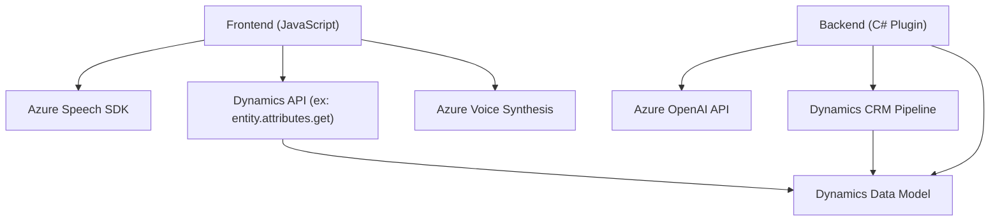

### Análisis técnico del repositorio

---

#### **Breve resumen técnico**
El proyecto es una solución que integra capacidades de reconocimiento de voz, síntesis de texto a voz, y procesamiento avanzado del texto mediante Azure Speech SDK y Azure OpenAI dentro del ecosistema de Microsoft Dynamics 365. Este repositorio mezcla frontend (JavaScript para Dynamics 365), backend (plugin para la extensibilidad del CRM) y APIs externas para gestionar voz y texto de forma eficiente.

---

#### **Descripción de arquitectura**
- **Tipo de solución**: Extensión de Microsoft Dynamics 365 que incluye una API para procesamiento de texto (Azure OpenAI), un frontend en JavaScript para manejar interfaz y voz/síntesis, y plugins para transformar datos en Dynamics 365.
- **Patrón de arquitectura**: 
  - **Hexagonal** (para el plugin `TransformTextWithAzureAI.cs`, dado que separa las capas internas del acceso externo).
  - **Patrón de Integración de Servicios Externos** (Azure Speech SDK y Azure OpenAI).
  - **Modular y basado en funciones** (modularidad aplicada en los scripts JS con funciones específicas).
- **Componentes principales**:
  - **Frontend Dynamics 365**
    - Implementado en JavaScript, se encarga de la interacción con el usuario mediante formulario.
    - Uso extensivo de D365 APIs para acceder a atributos y controles.
    - Integración con Azure Speech SDK para las capacidades de conversión voz-texto-voz.
  - **Plugin Backend**
    - Implementado en C#. Provee funcionalidad adicional en el pipeline de Dynamics 365 al procesar formularios mediante Azure OpenAI.
    - Funciona como punto de integración entre Dynamics 365, Azure OpenAI y posibles extensiones futuras.

---

#### **Tecnologías, frameworks y patrones**
1. **Lenguajes y APIs**:
   - **JavaScript (Frontend)**: Manejo de reconocimiento y síntesis de voz.
   - **Azure Speech SDK**: Para habilitar el reconocimiento y síntesis de voz.
   - **Dynamics 365 Javascript APIs**: Integración con formularios del CRM.
   - **C#**: Para la creación del plugin en Dynamics 365.
   - **Azure OpenAI**: Para procesar texto en el backend usando modelos de lenguaje como GPT.
   
2. **Frameworks y dependencias del backend**:
   - **Microsoft.Xrm.Sdk**: Extensión del modelo Dynamics CRM.
   - **Newtonsoft.Json.Linq** y **System.Text.Json**: Para manejar y manipular datos JSON en el plugin.
   - **System.Net.Http**: Para enviar solicitudes HTTP al servicio de Azure OpenAI.

3. **Patrones de diseño**:
   - Modularidad en las funciones JavaScript.
   - Lazy Loading del SDK de Speech en el frontend.
   - Promesas y asincronía en las llamadas API y la lógica de procesamiento.
   - Hexagonal en el plugin para una adecuada separación de responsabilidades.
   - Integración de servicios externos.

---

#### **Dependencias o componentes externos**
El proyecto tiene una alta dependencia de servicios externos relacionados tanto con servicios de Microsoft como con APIs externas:
- **Azure Speech SDK**: Proporciona soporte para reconocimiento de voz y síntesis de texto a voz.
- **Azure OpenAI**: Provee un endpoint de GPT para el procesamiento del texto en el plugin.
- **Dynamics 365 Framework**:
  - D365 JS APIs: Para manipular los atributos, formularios y controles dentro del CRM.
  - Plugin Framework con `IPlugin`: Para registrar y ejecutar lógica personalizada.
- **Navegador (DOM)**: El SDK de Speech se carga dinámicamente.
- **API personalizada**: `Xrm.WebApi` en Dynamics 365 para manejar solicitudes relacionadas con datos de los formularios.

---

#### **Diagrama Mermaid compatible con GitHub Markdown**

---

### **Conclusión final**
El repositorio representa una solución orientada a la integración de capacidades de voz y procesamiento de texto con funcionalidades específicas para formularios dinámicos de Microsoft Dynamics 365. Utiliza una arquitectura basada en servicios externos con integración modular y adherencia a patrones de diseño como el hexagonal. La solución está construida con tecnologías modernas y comunes en el ecosistema de Dynamics 365 (JavaScript, C#, Microsoft SDKs, y Azure), lo que la hace funcional y extensible en contextos de CRM profesionales. 

Para robustez adicional, se podrían considerar mejoras como no depender de la carga dinámica del SDK de Speech en el frontend, emplear un control más granular de llaves de acceso a servicios externos desde un sistema seguro, y más uso de tecnologías asíncronas en el backend para reducir latencias en las interacciones con Azure OpenAI. 