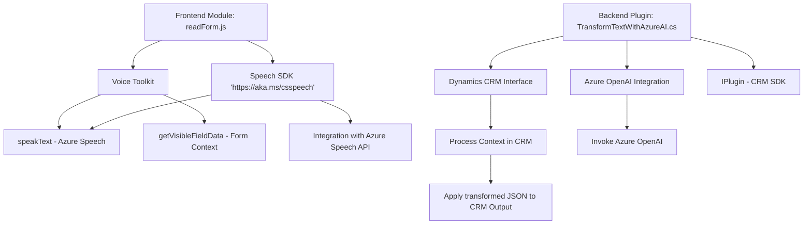

## Breve resumen técnico:

Se tiene un repositorio que combina funcionalidades relacionadas con un sistema enfocado en formularios, entrada de datos por voz y procesamiento mediante servicios externos como **Azure Cognitive Services Speech SDK** y **Azure OpenAI** integrado con Microsoft Dynamics CRM. Los archivos analizados son componentes de diferentes capas en la arquitectura: la capa frontend para interacción del usuario y la capa de backend para procesamiento avanzado de datos integrados con APIs externas.

---

## Descripción de arquitectura:

### Tipo de solución y arquitectura:
1. **Tipo de solución**: Una solución híbrida que combina:
   - Una **interface de usuario (Frontend)** enfocada en gestionar datos con **formularios y entrada por voz**, usando técnicas de reconocimiento y síntesis de voz.
   - Un backend basado en **plugins de Dynamics CRM** que se integran con **Azure OpenAI**, actuando como un microservicio para procesamiento y transformación de texto en objetos JSON.
   - Los componentes exhiben una arquitectura de **n capas**, con separación entre las capas de presentación (Frontend), negocio (plugins) y acceso a datos (CRM API).

2. **Patrones utilizados**:
   - **Modularización funcional** en frontend.
   - **Facade Pattern** para simplificar la interacción con el Azure Speech SDK.
   - Integración con **APIs externas** que implementan procesamiento avanzado mediante Azure AI.
   - En el backend (`TransformTextWithAzureAI`), se utiliza el patrón **plugin architecture** de Dynamics CRM para extender funcionalidad.
   - **Dependency Injection (DI)** y manejo de servicios a través de interfaces definidas en `Microsoft.Xrm.Sdk`.

3. La arquitectura incluye la separación de responsabilidades (SRP), con cada módulo enfocado en tareas individualizadas:
   - **Frontend** gestiona la interacción con el usuario mediante formularios y voz.
   - **Backend/plugin** maneja la lógica de negocio más avanzada al integrar servicios de Azure OpenAI.

---

## Tecnologías usadas:
1. **Frontend**:
   - **JavaScript ES6**: Para la gestión de la lógica de los formularios y el SDK.
   - **Azure Cognitive Services Speech SDK**: Reconocimiento y síntesis de voz.
   - **HTTP APIs**: Para invocar servicios de Azure Speech.

2. **Backend**:
   - **C#**: Lenguaje principal del plugin.
   - **Microsoft Dynamics CRM SDK**:
     - Extensiones de plugins mediante Interfaces (`IPlugin`, etc.).
   - **System.Text.Json**: Para manipulación de objetos JSON.
   - **HTTP Libraries (.NET)**: Para la integración con APIs externas, particularmente Azure OpenAI.

---

## Diagrama **Mermaid** válido para GitHub Markdown:

---

## Conclusión final:
La solución implementada combina múltiples tecnologías para integrar servicios avanzados como **Azure Cognitive Services** y **Azure OpenAI** en una arquitectura de **n capas** orientada a formularios y entrada de datos. Por un lado, un **frontend modular** gestiona la interacción con el usuario, y, por otro, un **backend basado en plugins** extiende la funcionalidad de un sistema CRM robusto como Dynamics. 

El uso de API externas sugiere un enfoque de **servicios integrados**, mientras que la estructura y modularización denotan buenas prácticas de desarrollo alineadas con los principios de **SOLID** y diseño basado en componentes reutilizables.