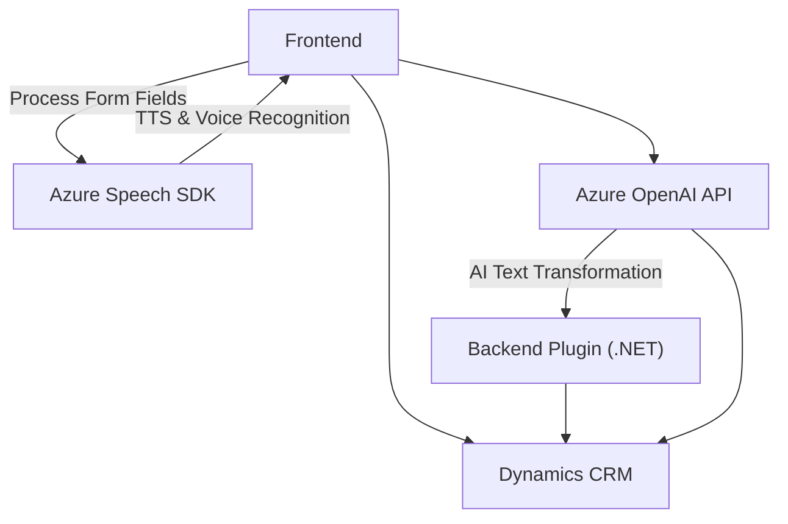

# Análisis técnico de la solución

## **Resumen técnico**
El repositorio parece ser una solución orientada a la integración de voz y texto en formularios dentro del contexto de **Dynamics 365**. Los componentes descritos incluyen un frontal desarrollado en **JavaScript** para interactuar con formularios y **plugins en .NET** que incrementan la funcionalidad de Dynamics CRM. También se aprovechan servicios externos como **Azure Speech SDK** y **Azure OpenAI API** para tareas avanzadas de sintaxis de voz.

---

## **Descripción de arquitectura**
- **Tipo de solución:**
  La solución es una combinación de partes de un **frontend** (manejo de formularios y generación de texto hablado) y una implementación de **plugin back-end**, formando parte de un ecosistema de **cliente-servidor**. Integra APIs y SDK de terceros como servicios para inteligencia artificial y conversión de texto a voz.

- **Arquitectura principal:**
  - **N capas orientado a servicios:**
    1. **Capa de presentación**: Representada por el frontend que interactúa con los formularios de Dynamics 365 (procesamiento de texto hablado y visible).
    2. **Capa de lógica de negocio**: Implementada mediante **plugins** en el contexto CRM que integran servicios externos como **Azure OpenAI** y gestionan operaciones avanzadas.
    3. **Capa de servicios**: Uso de APIs y SDK (Azure Speech y OpenAI) para comunicaciones con servicios externos.
    4. **Base de datos**: Dynamics CRM, como repositorio de datos y esquema.

---

## **Tecnologías, frameworks y patrones identificados**
- **Frontend**:
  - **Tecnologías**: JavaScript para lógica de cliente.
  - **Dependencias externas**: Azure Speech SDK.
  - **Patrones**:
    - Carga dinámica de dependencias (ejemplo con `ensureSpeechSDKLoaded`).
    - Modularización de funciones, separando responsabilidades por contexto.
    - Procesamiento condicional (uso de inteligencia artificial opcional).

- **Backend (plugin)**:
  - **Tecnologías**: .NET Framework utilizando Microsoft Dynamics CRM SDK.
  - **Dependencias externas**:
    - API HTTP de Azure OpenAI para procesamiento de texto.
    - Librerías de .NET como `System.Net.Http` y `System.Text.Json`.
  - **Patrones**:
    - Dependency Injection para contexto del CRM.
    - Orientación a servicios: Integración con API externa.
    - Plugin ERP.

---

## **Dependencias y componentes externos posibles**
1. **Azure Speech SDK** (gestión de voz): Para reconocimiento y síntesis de voz.
   - Carga condicional en cliente (JavaScript).
   - Soporte para funciones de entrada de voz y TTS (Text-to-Speech).

2. **Azure OpenAI API** (procesamiento de texto AI): Para la transformación y manejo de datos de texto en formato JSON.
   - Comunicación HTTP desde el plugin.

3. **Dynamics 365 APIs**:
   - `Xrm.WebApi`: Operaciones CRUD relacionadas con entidades dentro del CRM.
   - Plugin SDK: Ejecución lógica relacionada con eventos del CRM.

---

## **Diagrama Mermaid**
A continuación, se presenta un diagrama que refleja los flujos principales de integración:

---

## **Conclusión final**
La solución integra tecnologías modernas como **Azure Speech SDK**, **Azure OpenAI**, y **Microsoft Dynamics CRM** para implementar funcionalidades avanzadas de entrada y salida de voz, así como la transformación de texto gestionada por Inteligencia Artificial. La arquitectura se organiza en múltiples capas, tomando las mejores prácticas como **orientación a servicios**, **encapsulación funcional**, y uso de **API externas**, lo que la hace robusta y extensible.