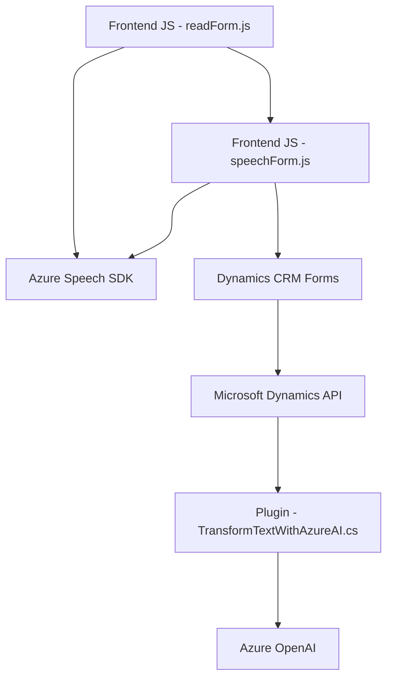

### Breve resumen técnico
 
La solución en este repositorio es una **integración de tecnologías de voz y procesamiento de texto con Microsoft Dynamics CRM**, apoyada en **Azure Speech SDK** y **Azure OpenAI Service**. Consiste en un frontend JavaScript para interacción del usuario y un backend (Microsoft Dynamics plugin) para procesamiento avanzado de información mediante inteligencia artificial.

---

### Descripción de arquitectura

La arquitectura de esta solución puede clasificarse como una **híbrida entre n-capas y basada en servicios de terceros**:
1. **Capa de presentación (Front-End):** Implementada mediante módulos JavaScript que integran el SDK de Azure Speech para síntesis y reconocimiento de voz, así como la gestión de datos de los formularios.
2. **Capa de negocio (Backend/Plugin):** Implementada como plugins de Dynamics CRM, que actúan como intermediarios entre la capa de presentación y la capa de datos.
3. **Capa de integración con servicios externos:** Se conecta al SaaS (PaaS/Cognitive Services) proporcionado por Azure Speech y Azure OpenAI para reconocimiento de voz, síntesis de texto y procesamiento automático basado en inteligencia artificial.

La solución permite una infraestructura basada en **componentización** y **servicios cloud.**

---

### Tecnologías usadas

#### Frontend:
- **Vanilla JavaScript** con un enfoque funcional.
- **Azure Speech SDK** para síntesis y reconocimiento de voz.
- **Microsoft Dynamics Web APIs (`Xrm.WebApi`)** para manipulación del DOM de formularios en Dynamics CRM.

#### Backend:
- **C# .NET Framework** para la creación del plugin que implementa la interfaz `IPlugin`.
- **Microsoft.Xrm.Sdk** para la interacción con el contexto de Dynamics CRM.
- **Azure OpenAI Service** para procesar texto con técnicas de inteligencia artificial (utilizando el modelo GPT-4).
- Librerías para manejo de JSON como `Newtonsoft.Json` y `System.Text.Json`.
- `HttpClient` para realizar peticiones a servicios externos.

---

### Diagrama **Mermaid** válido para GitHub

---

### Conclusión final

La solución es una **voice-enabled integration with Dynamics CRM**, diseñada para mejorar la experiencia del usuario mediante el uso de inteligencia artificial en la entrada, salida y procesamiento de datos de formularios. La arquitectura combina una **estructura típica de n-capas** con **integración mediante servicios externos (Azure Speech SDK y OpenAI Service)**.

#### Ventajas:
1. Uso del **Azure Speech SDK** y **Azure OpenAI Service** para reducir el desarrollo de lógica compleja, delegándola a servicios especializados.
2. Reutilización del ecosistema de Microsoft Dynamics mediante **plugins** y **Web APIs**.

#### Desafíos posibles:
1. Requiere una conexión estable a Internet para el uso de servicios en Azure.
2. La dependencia con servicios externos (Azure) puede ser un punto crítico durante interrupciones del servicio.
3. La desambiguación de transcripciones de voz en varios idiomas puede requerir configuraciones avanzadas para soportar un amplio rango de usuarios.