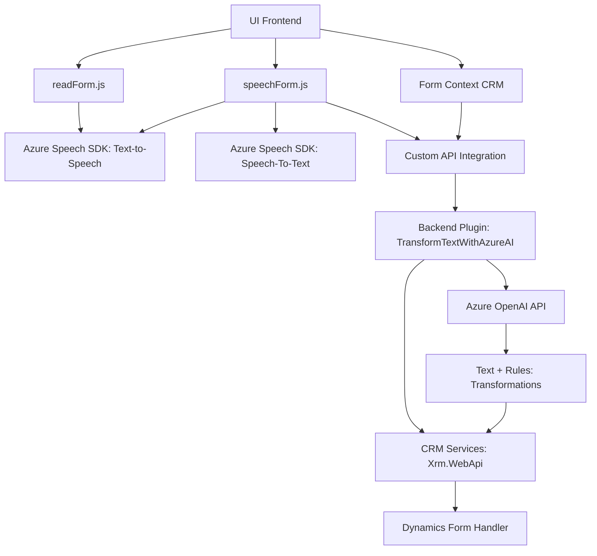

### Breve resumen técnico
El repositorio analiza la interacción entre una interfaz de usuario (UI) basada en JavaScript, mecanismos de voz y APIs integradas con herramientas de inteligencia artificial (Azure OpenAI), específicamente en el contexto de Microsoft Dynamics CRM. Sus componentes principales son:
- **Frontend de tipo Single Page Application (SPA)** en JavaScript para lectura, síntesis y captura por voz.
- **Backend basado en Plugins de Dynamics CRM y llamadas API personalizadas** para procesamiento avanzado de texto.

---

### Descripción de arquitectura
#### 1. **Frontend**
   - **Arquitectura**: Se presenta como una arquitectura en capas simples donde las funciones están organizadas en torno a dos objetivos primordiales: lectura por voz y reconocimiento de voz. Dicho frontend depende del **Azure Speech SDK** para realizar tareas asociadas a síntesis y reconocimiento de voz, redirigiendo posteriormente los datos a APIs definidas en el backend de Dynamics CRM.
   - **Patrones usados**:
       - **Asynchronous Callback Pattern**: Algunas funciones aseguran la carga del Speech SDK antes de cualquier acción (ej. `ensureSpeechSDKLoaded`).
       - **Modularidad limitada**: Las funciones están organizadas por tarea específica, pero no existe una clara separación por clases ni una estructura modular avanzada.
   - **Estructura tipo SPA**: No tiene marcos que puedan sugerir múltiples capas ni frontends divididos por componentes.

#### 2. **Backend**
   - **Arquitectura**: Basada en el **ecosistema de Microsoft Dynamics CRM** con plugins que funcionan como adaptadores específicos para conectar el CRM con Azure OpenAI. El backend sigue un patrón de arquitectura n-capas:
       - **Capa de plugins (TransformTextWithAzureAI.cs)**: Ejecuta logísticas de procesamiento AI y transformación de datos.
       - **Capa de datos**: Utiliza servicios que interactúan con Dynamics CRM.
   - **Patrones usados**:
       - **Plugin Pattern**: Implementación estándar en Dynamics CRM utilizando `IPlugin`.
       - **Adapter Pattern**: Adaptación entre Dynamics CRM y Azure OpenAI para entrada/salida de datos JSON mediante el método `GetOpenAIResponse`.

---

### Tecnologías usadas
1. **Frontend (JavaScript)**
   - **Azure Speech SDK**:
       - Integra función de síntesis (Text-to-Speech: `speakText`) y reconocimiento por voz.
       - Carga mediante scripts dinámicos (`ensureSpeechSDKLoaded`).
   - **JavaScript DOM API**: Manipulación de elementos de formulario y el entorno del navegador.
   - **Microsoft Dynamics form context**: Interacción directa con datos de formularios en el CRM.
   - **Asincronismo**: Uso de promesas, callbacks, y funciones asíncronas con `async/await`.

2. **Backend (C# Plugins)**
   - **Microsoft Dynamics CRM Web API (`Xrm.WebApi`)**: Interacciones directas con CRUD y datos existentes en la plataforma.
   - **Azure OpenAI Service API**: Procesamiento avanzado de texto y reglas con inteligencia artificial.
   - **HttpClient/REST API**: Llamadas HTTP al servicio OpenAI con payloads en JSON.
   - **Framework .NET (C#)**:
       - `System.Text.Json` para serializar y deserializar datos JSON.
       - `Newtonsoft.Json.Linq` para manipulación avanzada de datos estructurados.

---

### Dependencias o componentes externos
1. **Azure Speech SDK**: Utilizada tanto en el frontend para lectura y reconocimiento de voz como en el backend para transformación de texto.
2. **Azure OpenAI API**: Transformación basada en IA para procesar texto según normas específicas.
3. **Dynamics CRM**:
   - Plugins creados usando `Microsoft.Xrm.Sdk` para interactuar con el entorno organizacional CRM.
   - Formularios y mapas de contexto (`executionContext`) utilizados en el frontend.
4. **Microsoft Dynamics Form API (`Xrm.WebApi`)**: Interacción con entidades del CRM y llamadas a servicios vinculados.

---

### Diagrama Mermaid válido para GitHub

---

### Conclusión final
El repositorio implementa una solución híbrida con un frontend SPA ligero y un backend n-capas integrado con Microsoft Dynamics CRM y servicios de Azure. Responde a la necesidad de síntesis y reconocimiento de voz, transformando sus resultados en interacciones enriquecidas mediante inteligencia artificial. Sin embargo, tanto el frontend como el backend presentan áreas de mejora:
- En modularidad y estructura; por ejemplo, el frontend podría optimizarse mediante el uso de frameworks modernos como React o Angular para facilitar mantenibilidad.
- El backend requeriría reforzar su seguridad y manejo de errores para proteger datos sensibles usados en Azure OpenAI y plugins CRM.