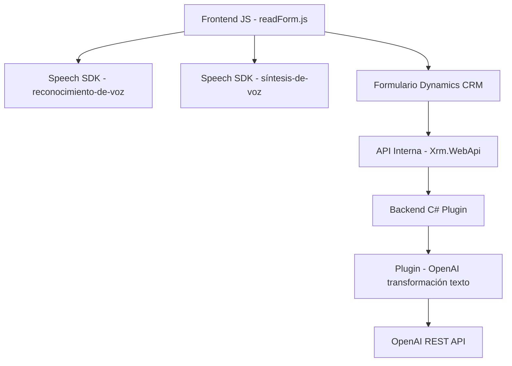

## Breve resumen técnico

El repositorio describe una solución orientada a integrar servicios inteligentes (Azure Speech SDK y Azure OpenAI) en un sistema CRM basado en Microsoft Dynamics 365. Se combina procesamiento de voz, IA y manipulación de datos en formularios, apoyándose fuertemente en la modularidad y servicios externos. El proyecto incluye funcionalidad para síntesis de voz, reconocimiento de comandos hablados, transformación de texto utilizando IA, e interacción directa con formularios CRM.

---

## Descripción de arquitectura

La arquitectura puede clasificarse como híbrida de **capas y servicios externos**, con componentes centralizados en la plataforma Dynamics CRM (monolítica para el core funcional) y elementos integrados como Azure Speech SDK y Azure OpenAI que actúan como microservicios auxiliares. 

Aspectos destacados:
1. **N-capas**:
   - Presentación (formularios Dynamics y lógica asociada en `JS`).
   - Capa de negocio (en `Plugin` con lógica avanzada para texto e IA).
   - Interfaz API externa (Azure Speech SDK y OpenAI).
   
2. **Modularidad en componentes**: Cada archivo tiene funciones específicas (p. ej., procesamiento de comandos por voz, transformación de texto). Uso claro de separación de preocupaciones.

3. **Integración en Dynamics CRM**: Aprovecha plugins y API internas (`Xrm.WebApi`) para extender capacidades en el sistema.

4. **Servicios externos REST/API**: Reconocimiento de voz, síntesis de voz y transformación de mensajes se consumen desde servicios externos de Azure.

---

## Tecnologías usadas

1. **Frontend CRM (JS)**:
   - Azure Speech SDK (carga dinámica, reconocimiento y síntesis de voz).
   - Lógica de formulario basada en Dynamics CRM (`executionContext`, `formContext`).
   - Manipulación asincrónica para llamadas a servicios.

2. **Backend CRM (C#)**:
   - Plugins en Dynamics 365.
   - Uso de Microsoft.Xrm.Sdk para contexto de operaciones en CRM.
   - Azure OpenAI API para transformación de texto con inteligencia artificial.

3. **Dependencias clave**:
   - `Newtonsoft.Json` / `System.Text.Json`: Serialización y deserialización JSON.
   - `HttpClient`: Llamadas HTTP para servicios externos.
   - `SpeechSDK` para reconocimiento/síntesis de voz.
   
---

## Diagrama Mermaid válido para GitHub

---

## Conclusión final

Este proyecto emplea una arquitectura híbrida con una base sobre Dynamics CRM y extensiones que integran servicios en la nube (Azure Speech y OpenAI). Responde al patrón de N-capas con procesamiento modular en el front y operaciones avanzadas en el backend. La solución aprovecha el escalado y capacidades de IA proporcionadas por Azure, además de ser fácilmente extensible mediante nuevas funcionalidades plugin o lógica en el frontend.

Es ideal para escenarios empresariales con interacción directa con usuarios, procesamiento de voz, y transformación dinámica de información según necesidades de negocio. La implementación demuestra un diseño limpio y buenas prácticas como modularidad, separación de responsabilidades, y asincronía en llamadas externas.