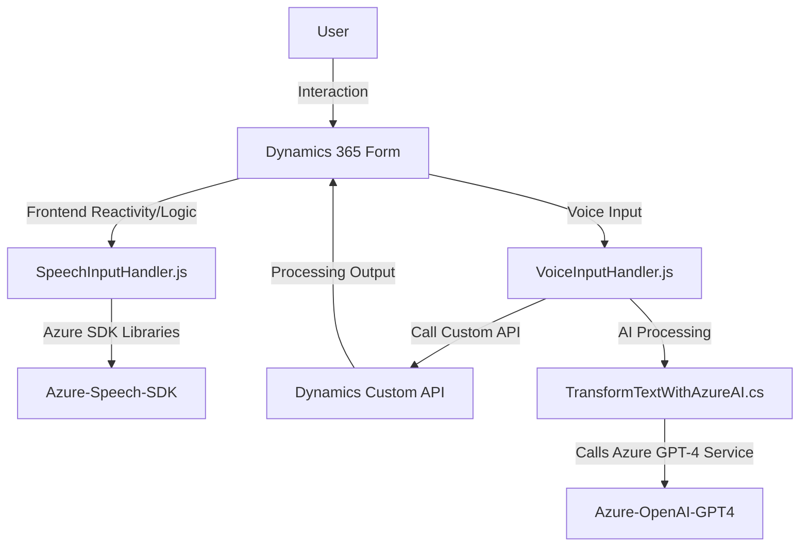

### Resumen Técnico
El repositorio presenta tres componentes relacionados con procesamiento de voz, datos y su integración en aplicaciones basadas en Dynamics 365. Cada archivo tiene una implementación modular que realiza tareas específicas, como síntesis de voz, reconocimiento y procesamiento de texto, y transformación mediante IA.

---

### Descripción de la arquitectura
1. **Tipo de solución:**
   - Es una solución **híbrida** integrada, basada en un **frontend** para Dynamics 365 y la lógica backend implementada como **Plugins** en Dynamics 365. También se usa el **Azure Speech SDK** y el servicio **Azure OpenAI GPT-4** como dependencias clave.

2. **Tipo de arquitectura:**
   - **Capas (n-capas):** El diseño sigue un enfoque de arquitectura por capas. La capa de presentación interactúa con la lógica de negocio en las funciones y luego conecta con servicios externos. Esto permite una separación clara entre frontend, lógica de procesamiento y los servicios integrados externos (Azure Speech y OpenAI).
   - **Integración con servicios externos:** Servicios de Azure como Speech y OpenAI están integrados siguiendo prácticas estándar de API REST y SDKs.
   - **Extensibilidad con plugins:** El código explota el modelo de extensibilidad de Dynamics CRM (registración de plugins en eventos específicos como Create/Update).

---

### Tecnologías y Frameworks Usados
1. **Frontend (JavaScript/HTML):**
   - Azure Speech SDK: Para la transformación de texto en voz (Text-to-Speech) y reconocimiento de voz (Speech-to-Text).
   - Web API de Dynamics 365: Para manipular datos y formularios en la interfaz Dynamics 365.
   
2. **Backend (C#):**
   - Microsoft Dynamics CRM Plugin Framework: Usado para extender la funcionalidad del CRM y manipular datos en eventos específicos.
   - Azure OpenAI GPT-4: Para transformación avanzada de texto basado en IA.
   - System.Net.Http y Newtonsoft.Json: Para realizar peticiones a servicios REST y manipular objetos en formato JSON en C#.

---

### Dependencias o componentes externos
1. **Servicios de Azure:**
   - Azure Speech SDK (Incluye Text-to-Speech y Speech-to-Text).
   - Azure OpenAI GPT-4 Service (para transformación de texto).
   
2. **Integración Dynamics 365:**
   - Contexto del formulario (formContext): Proporciona objetos de interacción y manipulación en el CRM.
   - Plugin API: Se usa para extender funcionalidades de Dynamics CRM.

3. **Librerías de manipulación de datos:**
   - Newtonsoft.Json para el manejo de JSON en el backend.
   - System.Text.Json: Serialización/deserialización de JSON.

4. **Custom API:** En el archivo `speechForm.js`, se indica la integración con una API personalizada (presumiblemente en el contexto de Dynamics 365) para procesar transcripciones.

---

### Diagrama Mermaid (estructura general)

---

### Conclusión Final
El repositorio representa una solución integrada para mejorar la interacción con Dynamics 365 mediante funcionalidades enfocadas en **reconocimiento de voz**, **síntesis de voz** y **procesamiento inteligente mediante IA**. Utiliza un enfoque modular con una arquitectura n capas bien definida que separa presentación, lógica de negocio y servicios externos. La implementación del backend es robusta, aunque presenta oportunidades para mejorar la seguridad de las credenciales y agregar manejo de excepciones en las llamadas a servicios externos.

Si bien la arquitectura es eficaz para el propósito principal de la aplicación, podría evolucionar hacia un enfoque **event-driven** para manejar mejor las interacciones entre el frontend y los servicios externos en aplicaciones más complejas.