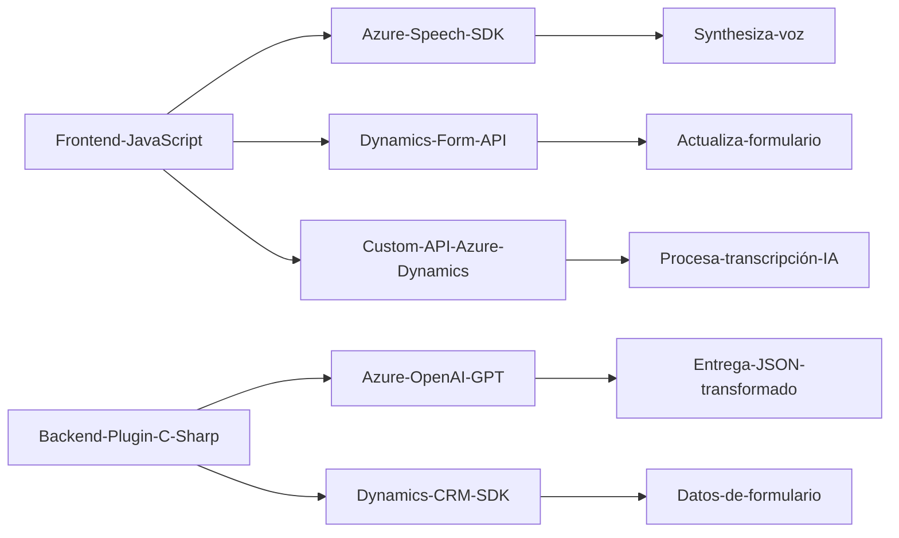

### Breve Resumen Técnico:
El repositorio representa una solución que combina capacidades de accesibilidad, mediante síntesis y reconocimiento de voz, junto a la integración de IA (Azure OpenAI) en una aplicación basada en Microsoft Dynamics CRM. Está compuesto por componentes frontend (formulario interactivo) y backend (plugin integrado). Su propósito principal es mejorar la eficiencia de entrada de datos y proporcionar una experiencia más conversacional mediante el uso de IA y voz.

---

### Descripción de Arquitectura:
La solución tiene una arquitectura híbrida:  
- **Frontend**: Un cliente basado en JavaScript implementa interacciones en tiempo real con el formulario de Dynamics CRM y ofrece procesamiento dinámico mediante voz.  
- **Backend**: Un plugin en C# actúa como middleware que utiliza Azure OpenAI GPT para transformar texto de manera estructurada con normas específicas.  

Podría calificarse como una arquitectura **n capas** debido a la separación entre la capa de interacción del usuario (frontend), capa de lógica de negocio (plugins), y capa de integración con servicios externos (Azure Speech SDK y Azure OpenAI GPT). Además, se observa un patrón de integración centrado en servicios externos.

---

### Tecnologías Usadas:
1. **Frontend**:
   - **JavaScript**: Para manipulación del formulario en Dynamics CRM.
   - **Azure Speech SDK**: Para capacidad de síntesis y reconocimiento de voz.
   - **Dynamics Form APIs**: Para manejar la interacción con los formularios en Dynamics CRM.

2. **Backend**:
   - **C#**: Implementación del plugin y lógica personalizada.
   - **Microsoft Dynamics SDK**: Extensión de la funcionalidad del CRM.
   - **Azure OpenAI GPT API**: Integración con IA para procesamiento de texto.

3. **Dependencias Externas**:
   - **Azure Speech SDK** (se carga dinámicamente).
   - **Azure OpenAI GPT API** para transformar texto.
   - **Custom API** posiblemente alojada en Azure para tareas IA personalizadas.

---

### Diagrama Mermaid válido para GitHub Markdown:
A continuación, se genera un diagrama que describe la interacción entre los componentes y servicios utilizados:

---

### Conclusión Final:
La solución está formada por componentes frontend y backend para abordar necesidades comunes alrededor de accesibilidad y automatización en aplicaciones empresariales. Los puntos fuertes incluyen una sólida integración con tecnologías de Microsoft Azure (Speech SDK, OpenAI GPT) y Dynamics CRM. Su arquitectura basada en n capas facilita la extensibilidad, modularidad y mantenimiento de la solución. Sin embargo, debe considerarse la dependencia de servicios externos como Azure, lo que requiere medidas de mitigación para casos de interrupción o fallas en estas plataformas.