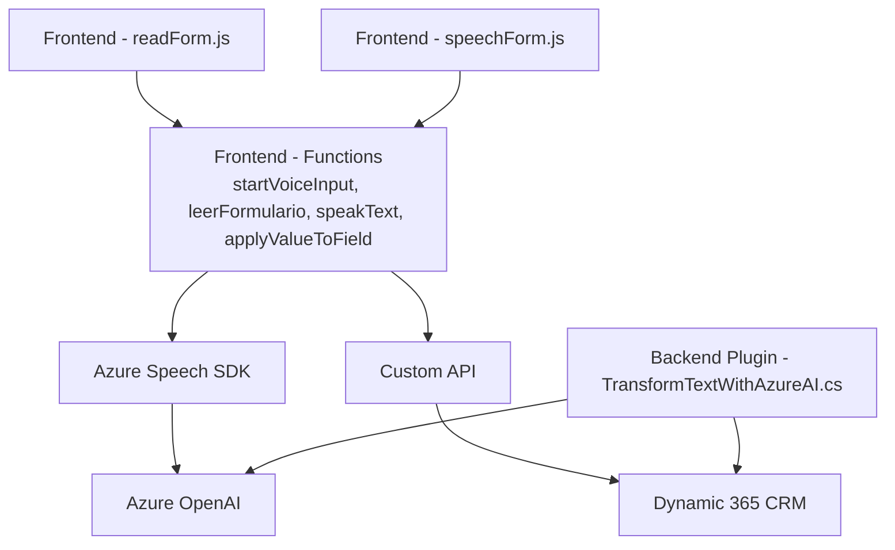

### Breve resumen técnico
Este repositorio combina un frontend basado en JavaScript y un plugin backend en C#. Está diseñado para la integración de servicios de inteligencia artificial y reconocimiento de voz (Azure Speech SDK y Azure OpenAI) en Microsoft Dynamics CRM/Dynamics 365. La solución permite a los usuarios trabajar con formularios dinámicos que utilizan tanto entrada de texto como entrada/salida de voz. También incorpora la capacidad de procesar datos mediante IA y una Custom API.

---

### Descripción de arquitectura
La solución sigue una arquitectura híbrida, donde el frontend se presenta en una estructura modular y posiblemente orientada a eventos (dependiente de la interacción con formularios y eventos activados por usuarios); mientras tanto, el backend implementa una arquitectura de plugins específica de Dynamics CRM. Además, utiliza un Servicio Externo (Azure OpenAI y Azure Speech SDK), con características de una arquitectura de Microservicios para la delegación de tareas de síntesis y enriquecimiento de datos a API externas.

---

### Tecnologías usadas
1. **JavaScript**:
   - Modular programación enfocada en funciones.
   - Uso de Azure Speech JavaScript SDK para la síntesis y procesamiento de voz.
   - Dynamics Web API para la conexión con datos estructurados en formularios y entidades CRM.
   
2. **Plugins de Dynamics 365 (C#)**:
   - Implementación basada en la clase `IPlugin`.
   - Llamadas HTTP mediante `System.Net.Http` para conectar con Azure OpenAI.
   - JSON handling frameworks: `Newtonsoft.Json` y `System.Text.Json`.

3. **Microsoft Dynamics SDK**:
   - Uso de `IOrganizationService` para las interacciones con entidades.
   - Métodos como `Xrm.WebApi.retrieveMultipleRecords` y `Xrm.WebApi.online.execute`.

4. **Azure Cloud Services**:
   - **Azure Speech SDK**: Procesamiento de voz, síntesis de texto a voz y relación con formularios.
   - **Azure OpenAI**: Enriquecimiento de datos de texto mediante inteligencia artificial y generación automática de JSON estructurado.

---

### Diagrama Mermaid válido para GitHub

- La relación entre nodos explica el flujo del sistema:
  - `readForm.js` y `speechForm.js` implementan funcionalidades del frontend.
  - Múltiples funciones convierten datos visuales de formularios en texto hablado, texto en campos, o JSON para enviar a la IA o la Custom API.
  - Azure Speech SDK y Azure OpenAI actúan de forma externa como servicios delegados.
  - Plugins en C# amplían las capacidades del backend, interactuando con Dynamics CRM y ejecutando lógica empresarial personalizada.

---

### Conclusión Final
La solución conecta un frontend que utiliza Azure Speech SDK y Dynamics API con un backend basado en plugins para Dynamics 365, que utiliza Azure OpenAI como un componente de enriquecimiento de datos. La arquitectura es híbrida, con elementos de una arquitectura de n capas en el frontend y plugin-based architecture en el backend. La solución aprovecha tecnologías avanzadas de Microsoft junto con procesamiento modular, interacción con Custom API y servicios AI para proporcionar una experiencia rica en capacidades de entrada y procesamiento de voz y texto.