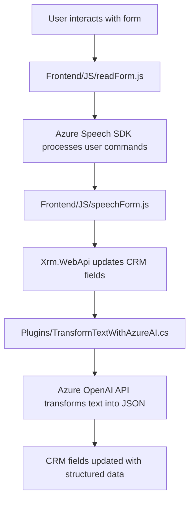

### Breve Resumen Técnico
El repositorio contiene tres archivos que se integran como parte de una solución para habilitar el procesamiento de voz y transformación de datos mediante servicios externos (Azure Speech SDK y Azure OpenAI) en formularios de Dynamics CRM. La arquitectura se basa en una combinación de frontend, módulos de integración y un plugin backend que utiliza patrones de servicio y extensibilidad.

---

### Descripción de Arquitectura
La arquitectura sigue un enfoque modular con varios componentes integrados:
1. **Frontend**: Implementa un sistema interactivo de voz para los formularios mediante el uso del SDK de Azure Speech. Los archivos `readForm.js` y `speechForm.js` actúan como wrappers que permiten cargar dinámicamente el SDK de voz y trabajar con los datos del formulario.
2. **Backend Plugin (Dynamics CRM)**: La solución utiliza un plugin (archivo `TransformTextWithAzureAI.cs`) escrito en .NET para procesar datos, interactuar con API externas (OpenAI), y actualizar registros en Dynamics CRM.
3. **Estilo de integración**:
   - **Eventos del cliente** (frontend) para procesar y manejar reconocimiento de voz en tiempo real.
   - **Servicios externos** (backend plugin) para transformar datos mediante inteligencia artificial.

La solución se conecta a servicios externos (Azure Cognitive Services y OpenAI), mantiene una separación clara entre la lógica del cliente y el servidor, y se adapta a una arquitectura híbrida de microservicios combinados con extensibilidad basada en plugins.

---

### Tecnologías Usadas
1. **Frontend**:
   - JavaScript ES6, modular.
   - Azure Cognitive Services Speech SDK.
   - Microsoft Dynamics CRM client-side API (`Xrm.WebApi`).

2. **Backend**:
   - Microsoft Dynamics SDK (`IPlugin`, `IServiceProvider`).
   - C#, .NET Framework (en el contexto de Dynamics CRM).
   - Azure OpenAI API.
   - JSON serialization/deserialization con `System.Text.Json`.

3. **Patrones Arquitectónicos**:
   - **Wrapper** para SDK de voz (frontend).
   - **Plugin-based architecture** (backend).
   - **Service Integration Pattern** para la comunicación con servicios externos.
   - **Callback architecture** para garantizar cargas dinámicas en el frontend.

---

### Diagrama Mermaid Compatible con GitHub Markdown

---

### Conclusión Final
La solución es una implementación interactiva y modular dentro de formularios de Dynamics CRM para reconocimiento de voz y transformación de datos mediante servicios inteligentes. Los archivos frontend encargan el procesamiento de comandos de voz y actualizan los datos del formulario, mientras que el plugin backend realiza transformaciones profundas utilizando inteligencia artificial. La arquitectura modular y el uso de servicios externos hacen que esta solución sea extensible y adecuada para entornos empresariales que requieren procesamiento dinámico de voz e inteligencia artificial.

Puntos fuertes:
1. Uso efectivo de servicios de Azure (Speech SDK y OpenAI).
2. Modularidad y separación del frontend y backend.
3. Adaptabilidad para nuevos servicios integrados.

Áreas de mejora:
1. La seguridad en el manejo de claves API para servicios de Azure puede ser optimizada (almacenamiento seguro utilizando `Azure Key Vault`).
2. Amplia dependencia de servicios externos (Azure OpenAI y Speech SDK), lo que puede representar un coste adicional y riesgo en caso de fallos del proveedor.
