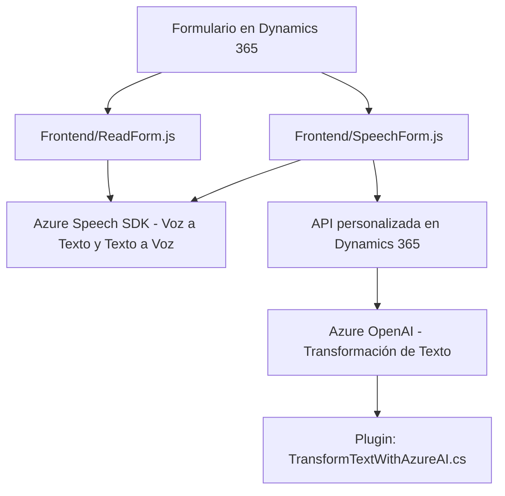

### Breve resumen técnico:

Este repositorio contiene elementos orientados al desarrollo de una solución que integra **servicios de voz y texto basado en Inteligencia Artificial (IA)**. La solución tiene tres componentes destacados:

1. **Frontend/JS/readForm.js:** 
   - Gestor para la síntesis de voz, que convierte los datos visibles de un formulario en texto hablado utilizando el SDK de Azure Speech.
   
2. **Frontend/JS/speechForm.js:** 
   - Funcionalidad para reconocer la voz del usuario y transcribir el texto.
   - Procesa la transcripción realizando llamadas a APIs de IA y Dynamics 365, automatizando el llenado de formularios mediante estas entradas.

3. **Plugins/TransformTextWithAzureAI.cs:** 
   - Plugin desarrollado para Dynamics CRM que transforma texto mediante **Azure OpenAI** en JSON estructurado. Implementa manejo y conexión HTTP con headers y una arquitectura de servicios.

---

### Descripción de la arquitectura:

La solución emplea una **arquitectura híbrida** que combina los siguientes enfoques:
- **Monolito Frontend:** Componentes JavaScript centralizados en el directorio `FRONTEND/JS`.
- **Integración por Plugins:** Dynamics CRM utiliza un **patrón Plugin** para incorporar procesamiento externo (Azure OpenAI).
- **N Capas:** La comunicación entre los diferentes componentes es clara, destacando:
   - **Capa de presentación:** Interacción desde el frontend y entrada de usuario por dispositivos de entrada (voz).
   - **Capa de negocio:** El procesamiento de datos y acceso a contenido dinámico (formularios de Dynamics).
   - **Capa de integración:** Conexión a APIs externas como **Azure OpenAI** y procesamiento de voz (Azure Speech SDK).

---

### Tecnologías usadas:

1. **Frontend:**
   - **JavaScript:** Para lógica de la interfaz y procesamiento interactivo.
   - **Azure Speech SDK:** Síntesis y reconocimiento de voz; carga dinámica desde CDN.
   - **Dynamics 365 Web API (`Xrm.WebApi`)**: Comunicación con manejadores internos de datos.

2. **Backend Plugin (Dynamics CRM):**
   - **C#:** Integración de lógica en el entorno del CRM.
   - **Microsoft Dynamics SDK:** Interacción con objetos y datos de CRM.
   - **Azure OpenAI API:** Servicios externos de inteligencia artificial para procesamiento avanzado de texto.

---

### Diagrama Mermaid:

---

### Conclusión final:

La solución es una implementación avanzada de funciones que integran la síntesis de voz, el reconocimiento de voz, y la IA utilizando servicios en la nube proporcionados por Microsoft Azure. Este enfoque permite la automatización en entornos de Dynamics CRM mediante integración entre frontend, backend y APIs de terceros. La arquitectura beneficia tanto por su modularidad como por el uso de patrones como separación de capas y adaptadores para servicios externos. Sin embargo, las configuraciones sensibles (como las API keys) deben gestionarse de forma más segura con variables de entorno. 

La base es principalmente híbrida, diferenciándose en su estructura al combinar elementos monolíticos en el frontend con micro-integraciones y desarrollo de plugins para CRM en el backend.