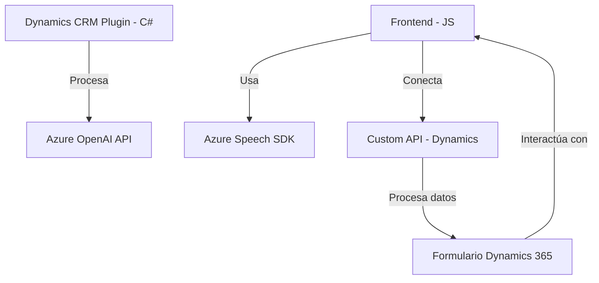

### Breve resumen técnico:

El repositorio parece contener una solución en tres partes: un **frontend (JavaScript)** que interactúa con un formulario y facilita la entrada y síntesis de voz usando **Azure Speech SDK**, y un **plugin backend (C#)** para **Dynamics CRM** que utiliza **Azure OpenAI API** para transformar texto en estructuras JSON. La arquitectura muestra una integración entre servicios externos (Azure), soluciones en el frontend y plugins en el backend.

---

### Descripción de arquitectura:

La arquitectura es **n-capas** con varios componentes:
1. **Frontend**: Una capa en JavaScript que actúa como interfaz interactiva para el usuario. Procesa datos del formulario, utiliza **Azure Speech SDK** para entrada y salida de voz, y realiza llamadas a APIs de Dynamics CRM.
2. **Dynamics CRM Plugin**: Una capa de procesamiento backend en C# que gestiona transformaciones complejas de texto utilizando la integración con **Azure OpenAI API**.
3. **Servicios externos**: Uso extendido de servicios de Microsoft Azure para sintetizar y reconocer voz, y para procesar texto (OpenAI).

---

### Tecnologías usadas:

- **Frontend (JS)**:
  - **Azure Speech SDK**: Para integrar capacidades de síntesis y reconocimiento de voz en tiempo real.
  - **Dynamics CRM (formContext, executionContext)**: Propiedades específicas del sistema CRM para interactuar con formularios.
  - **JavaScript (ES6)**: Para la lógica del frontend y la interactividad.

- **Backend Plugin (C#)**:
  - **Microsoft.Xrm.Sdk**: Para la interacción con Dynamics CRM.
  - **Newtonsoft.Json**: Para manipulación avanzada de objetos JSON.
  - **Azure OpenAI API**: Modelo GPT-4 para transformación de texto en datos estructurados.
  - **System.Net.Http**: Envío de solicitudes HTTP.

---

### Diagrama Mermaid válido para GitHub:

---

### Conclusión final:

El repositorio representa una solución híbrida que integra un frontend basado en **JavaScript con Azure Speech SDK** para interacción vocal y un plugin backend en **C#** para procesamiento avanzado de texto mediante **Azure OpenAI API**. La arquitectura es **n-capas**, distribuida entre el cliente, servidor y servicios externos de Microsoft Azure. Es adecuada para aplicaciones empresariales que requieran procesamiento de voz y transformación inteligente de datos. Sin embargo, debe manejar cuidadosamente las claves de API y garantizar la seguridad de los datos.