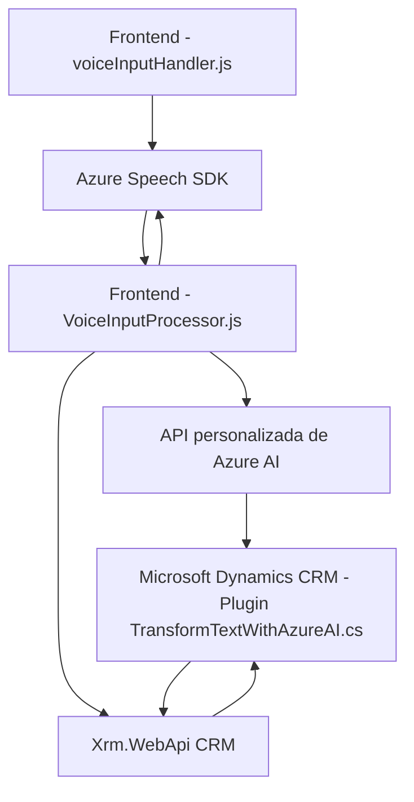

### Resumen técnico
El repositorio describe una solución híbrida compuesta de frontend en JavaScript y backend basado en Microsoft Dynamics 365 (CRM). La funcionalidad principal radica en integrar servicios de Azure Speech SDK y Azure OpenAI para realizar síntesis, reconocimiento de voz y procesamiento de comandos en formularios de CRM. Además, se emplea un plugin de Dynamics CRM para formular reglas específicas de transformación de datos.

---

### Descripción de arquitectura

La solución se basa en una arquitectura de **micro-servicios** y **event-driven design** dado que:
1. El frontend interactúa directamente con el navegador y con servicios de Azure Speech SDK para el reconocimiento y síntesis de voz.
2. El backend ejecuta un patrón basado en **plugins en Dynamics 365 CRM**, procesando eventos específicos de la plataforma y delegando solicitudes a APIs externas (Azure OpenAI Service).
3. Cada componente sigue una separación clara basada en funciones y contextos:
   - Frontend: Manipulación de DOM, extracción de datos dinámicos y en tiempo real del formulario.
   - Backend: Transformación extendida de datos y reglas dentro de Dynamics bajo contexto de eventos.

La arquitectura global puede considerarse **reactiva** y orientada a integrar servicios externos con capas de procesamiento de datos.

---

### Tecnologías empleadas

#### Frontend:
- **JavaScript**: Se utiliza para implementar lógica de extracción y síntesis de datos del formulario HTML.
- **Azure Speech SDK**: Utilizado en módulos como `voiceInputHandler.js` y `VoiceInputProcessor.js` para reconocer y sintetizar voz.
- **Microsoft CRM API (executionContext y Xrm.WebApi)**: Manejo de datos y estructura de formularios en CRM.
- **Dynamic scripting**: Carga dinámica del SDK de Azure Speech cuando es necesario.

#### Backend:
- **C#**: Lenguaje principal del plugin `TransformTextWithAzureAI.cs`.
- **Microsoft Dynamics CRM SDK**: Para manejar eventos del sistema (como disparadores de acciones en formularios).
- **Azure OpenAI API**: Para realizar transformaciones avanzadas de texto, utilizando un modelo de solicitud HTTP REST.
- **System.Text.Json**: Manejo de serialización, deserialización y estructuras JSON en el plugin C#.

#### Patrones empleadas:
- **Fachada**: Implementación de clases que simplifican la interacción con SDKs externos y APIs.
- **Separación e integración de servicios**: Capas de interacción frontend (speech-to-text o text-to-speech) y backend (transformación de datos mediante Azure OpenAI).
- **Modularidad**: Código distribuido en funciones especializadas como síntesis de voz, reconocimiento y manejo de reglas en CRM.
- **Callback pattern**: Usado en llamadas al SDK de Azure para cargar scripts y ejecutar operaciones.

---

### Diagrama **Mermaid** válido para GitHub

---

### Conclusión final
El repositorio aborda una solución orientada a la interacción vocal y el procesamiento dinámico de formularios en CRM con integración de IA basada en servicios de Azure. La arquitectura combina el principio de separación de capas y servicios micromodulares, mientras que los patrones empleados aseguran una correcta integración de datos. La solución está bien diseñada, utiliza herramientas modernas (Azure Speech SDK y Azure OpenAI) y está alineada con las necesidades específicas de automatización en formularios CRM. Sin embargo, podría beneficiarse de optimizaciones en la administración de dependencias y sensibilidad en el manejo de credenciales.