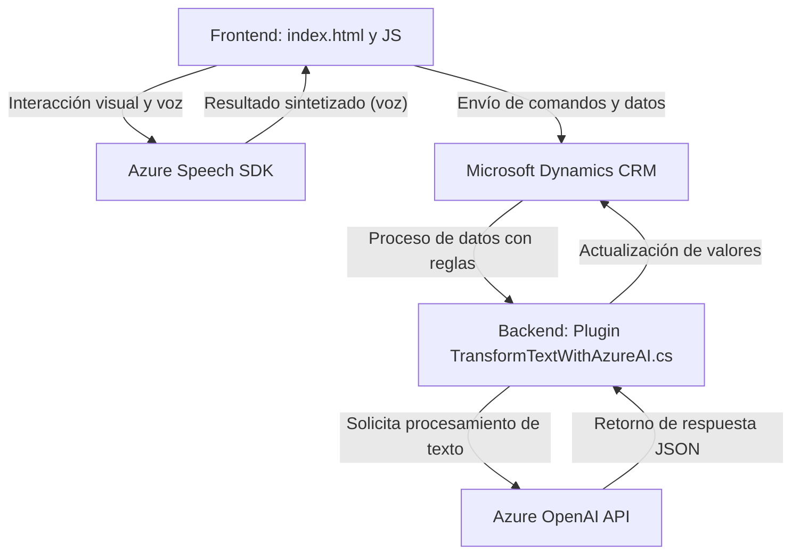

### Breve resumen técnico
El repositorio expuesto parece ser una solución híbrida que combina un **frontend JS** para interacción con usuarios a través de reconocimiento/síntesis de voz y un plugin backend para **Microsoft Dynamics CRM** integrado con APIs externas como **Azure Speech SDK** y **OpenAI**. Los módulos trabajan juntos para procesar datos desde formularios o comandos de voz y transformarlos en respuestas útiles en CRM.

---

### Descripción de la arquitectura
1. **Tipo de solución**: 
   - La solución es un ecosistema integrado:
     - **Frontend**: Proporciona funcionalidades interactivas como entrada y salida por voz usando Azure Speech SDK.
     - **Backend**: Extiende el comportamiento de Dynamics CRM mediante plugins que conectan con Azure OpenAI para procesar datos.
   
2. **Arquitectura general**: 
   - Se observa una **arquitectura híbrida en capas**:
     - Capa de Comunicación (Frontend con JS): Realiza interacciones con el usuario y manipula datos en Dynamics CRM.
     - Capa de Integración (Backend con C#): Extiende Dynamics CRM con plugins que interactúan con APIs externas (Azure OpenAI).
     - Capa de API externa: Conecta con servicios SaaS de Azure para procesamiento de datos (Speech SDK y OpenAI).

3. **Componentes detectados**:
   - **Frontend JS**:
     - Archivos responsables de leer formularios y sintetizar voz.
     - Uso de patrones como "Facade" y modularidad.
   - **Plugin Backend en C#**:
     - Extensión del CRM que procesa información mediante reglas y APIs externas.
   - **Servicios externos**:
     - Azure Speech SDK (sintetización y reconocimiento de voz).
     - Azure OpenAI (procesamiento avanzado de texto).
     - Dynamics CRM SDK para la conexión y manipulación del sistema CRM.

---

### Tecnologías usadas
1. **Frontend**:
   - Vanilla JS para la lógica.
   - Azure Speech SDK para voz.
   - HTML form-context interconectado con Dynamics CRM.

2. **Backend**:
   - Lenguaje: C#.
   - Framework: .NET SDK para desarrollo de plugins en Dynamics CRM.
   - REST API: Interacción con Azure OpenAI.
   - Libraries:
     - Newtonsoft.Json para manipular JSON.
     - HttpClient para HTTP requests.
     - Dynamics SDK (`IPluginExecutionContext`, `IOrganizationServiceFactory`).

3. **Servicios PaaS (Platform as a Service)**:
   - Azure Speech y OpenAI.

---

### Diagrama Mermaid válido en GitHub

---

### Conclusión final
Este repositorio implementa una solución integral para mejorar la interacción basada en voz y texto dentro de Dynamics CRM. Se destaca el uso de tecnologías modernas como **Azure Speech SDK** y **Azure OpenAI** para habilitar comunicaciones avanzadas. La arquitectura híbrida en capas asegura modularidad y escalabilidad, mientras que los patrones detectados facilitan la gestión de dependencias y la extensión futura de funcionalidades. Perfecto para aplicaciones empresariales que requieren alta integración entre frontend, backend y servicios de inteligencia artificial.

