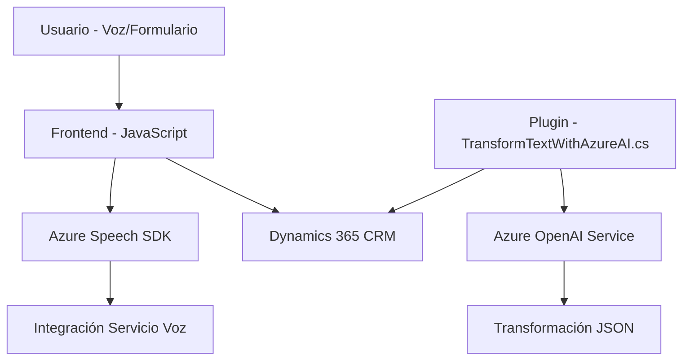

### Breve resumen técnico

Este repositorio combina un conjunto de archivos destinados a integrar capacidades de voz (reconocimiento y síntesis) y procesamiento de datos mediante servicios de Microsoft Dynamics CRM y Azure. La solución forma parte de un ecosistema orientado a agilizar la interacción con formularios y datos empresariales a través de inteligencia artificial y servicios en la nube.

---

### 1. Descripción de arquitectura

Se identifica que esta solución es una **arquitectura híbrida** conformada por:
1. Un **frontend en JavaScript** trabajando en un entorno empresarial (Dynamics CRM). Está acoplado con Azure Speech SDK y hace uso del modelo **event-driven** para reconocimiento de voz y respuesta visual/auditiva.
2. Un plugin C# en Dynamics CRM que coordina la integración con Azure AI para generar resultados transformados en JSON. Este sigue el patrón de **plugin modular** usado en sistemas CRM como Dynamics.
3. La arquitectura en general se alinea más con un estilo **n capas**, donde la capa frontend y las capas plugin/datos están separadas, cada una actuando en base a principios del diseño orientado a servicios (SOA).

---

### 2. Tecnologías, frameworks y patrones usados

#### Tecnologías:
1. **Frontend**:
   - JavaScript: Implementación de lógica en el navegador (comandos y eventos dinámicos basados en Azure).
   - Azure Speech SDK: Integración para reconocimiento y síntesis de voz.
   - Microsoft Dynamics CRM: Contexto del formulario como base de operación.
   - APIs en Dynamics CRM y Azure AI: Usadas para delegar el procesamiento de voz y transformación JSON.

2. **Backend Plugin (.NET Framework)**:
   - C#: Desarrollo de plugins para Dynamics CRM.
   - Azure OpenAI Service: Generación de JSON estructurado basado en modelos de IA.

#### Patrones de diseño:
1. **Callback y Lazy Loading**: El frontend garantiza que el SDK de Azure Speech se cargue cuando sea requerido antes de ejecutar procesos dependientes.
2. **Separation of Concerns**: Cada archivo define funciones o clases con una responsabilidad delimitada (reconocimiento de voz, plugin para transformación de texto, etc.).
3. **Event-driven**: En el frontend, los eventos desencadenan procesos específicos como la captura de voz y la actualización de formularios.
4. **Plugin Pattern**: En Dynamics CRM, el método implementa la interfaz `IPlugin`, respetando el flujo esperado en sistemas CRM.

---

### 3. Tipo de arquitectura

La solución tiene las características de una arquitectura **n capas**, ya que:
1. Se separa la funcionalidad orientada a presentación (frontend JavaScript) del procesamiento de negocio (plugin en Dynamics CRM) y los servicios en la nube.
2. Los módulos interactúan mediante APIs externas y componentes independientes, pero dependen del contexto del entorno Dynamics CRM como núcleo.

Aunque hay integración con servicios externos como Azure, esta solución no ajusta completamente los principios de una arquitectura de microservicios o hexagonal; se mantiene modular, pero no desacoplada por completo.

---

### 4. Dependencias o componentes externos

1. **Azure Speech SDK**:
   - Reconocimiento y síntesis de voz.
   - Es esencial para la integración y operaciones en el frontend.

2. **Azure OpenAI Service**:
   - Transformaciones avanzadas como generación de JSON desde texto sin procesar.

3. **Dynamics 365 Web API**:
   - Métodos como `Xrm.WebApi.retrieveMultipleRecords()` apuntan a interacción con datos empresariales.

4. **Plugins en Dynamics CRM** (C#):
   - Lógica de negocio para la transformación de texto, vinculada directamente al contexto CRM.

5. **Newtonsoft.Json (C#)**:
   - Procesamiento de estructuras JSON que permite extraer y transformar datos en plugin.

---

### 5. Diagrama Mermaid válido para GitHub

---

### Conclusión final

La solución propuesta es una integración avanzada diseñada para entornos empresariales, principalmente Dynamics CRM, centrada en la interacción por voz y procesamiento de datos con inteligencia artificial. Usa servicios de Azure para ofrecer desempeño ágil y eventos sincronizados, aunque podría beneficiarse de mejoras en el manejo de errores y la optimización de tiempos de respuestas. La arquitectura híbrida en capas permite mantener responsabilidades definidas entre presentación, lógica de negocio y servicios.