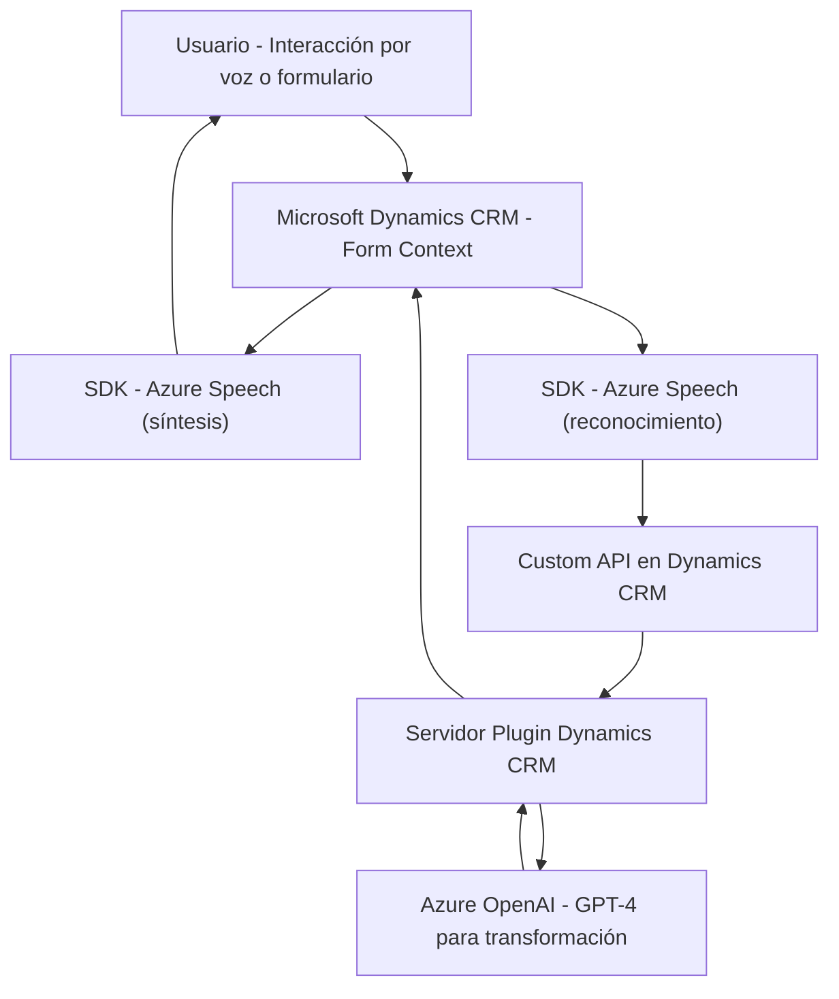

## Breve resumen técnico

El repositorio parece ser un sistema complejo que mezcla varias tecnologías para realizar dos funcionalidades principales relacionadas con **Microsoft Dynamics CRM** y **Azure services**:

1. **Entrada de voz y síntesis de voz**:
   - Utiliza el SDK de Azure Speech para leer y procesar datos de formularios en un entorno CRM que podrían estar diseñados en un front-end (posiblemente integrando JavaScript para interactuar con formularios).
   - Usa una arquitectura "driven-by-event", donde las interacciones del usuario desencadenan un flujo de procesamiento.

2. **Transformación de texto mediante Azure OpenAI**:
   - Implementa un plugin en lenguaje C# en la capa del backend de Dynamics CRM que interactúa con el servicio de Azure OpenAI para transformar textos en objetos estructurados.

En general, la funcionalidad del repositorio se construye alrededor de la integración de soluciones específicas de AI y voz de **Microsoft Azure** dentro de un sistema CRM.

---

## Descripción de arquitectura

Este sistema utiliza una **arquitectura n-capas** que combina diferentes áreas:
- **Capa de presentación (Frontend)**: A través de JavaScript, interactúa con el usuario para la síntesis y el reconocimiento de voz relacionado con los formularios en el sistema CRM.
- **Capa de lógica empresarial**: Contiene la implementación de reglas personalizadas para transformar y procesar los datos ingresados por el usuario.
- **Capa de servicios externos**: Se conecta dinámicamente al SDK de Azure Speech para realizar síntesis de voz y detección de voz. Además, utiliza una API de Dynamics CRM y un modelo de Azure OpenAI para la transformación de texto.
- **Backend/Plugin** (C#): Ejecuta la lógica avanzada en Microsoft Dynamics mediante plugins en eventos específicos, interactuando con el CRM y los servicios externos.

La arquitectura se acerca al patrón de **orquestación**, ya que coordina múltiples servicios para cumplir con las funcionalidades requeridas, manteniendo una estructura modular y reutilizable.

---

## Tecnologías usadas

### **Frontend JavaScript**:
- **Azure Speech SDK (`https://aka.ms/csspeech/jsbrowserpackageraw`)**: Para la síntesis y reconocimiento de voz.
- **Microsoft Dynamics CRM Frontend**: Se menciona la interacción con los objetos de contexto de los formularios visibles. Esto vincula la funcionalidad a Dynamics CRM como sistema.

### **Backend C# Plugin**:
- **Microsoft Dynamics CRM SDK**: Utiliza la interfaz `IPluginExecutionContext` para integrar lógica personalizada en eventos del CRM.
- **Azure OpenAI**: Modelo GPT-4 para la transformación de texto en objetos JSON.
- **System libraries (e.g. HttpClient, JSON processing)**: Para realizar solicitudes HTTP y manejar objetos JSON.

### **Patrones empleados**:
- **Event-driven architecture**: Utilización de eventos del frontend y del CRM para desencadenar procesos en tiempo real.
- **N-layer architecture**: Separación de responsabilidades en presentación, lógica empresarial y servicios externos.
- **Facade Pattern**: Uso de clases y funciones para encapsular la complejidad de las diferentes integraciones.
- **Dynamic Dependency Loading**: Los SDK de terceros se importan dinámicamente desde URLs específicas (ej. Azure Speech SDK).
- **Integration Architecture**: El sistema actúa como una orquestación de diversas APIs y SDKs de Azure.

---

## Diagrama Mermaid válido para GitHub

---

## Conclusión final

Esta solución combina características de un **frontend API-driven** (para síntesis de voz y reconocimiento) conectado dinámicamente a servicios de Azure, con una lógica C# en forma de plugin que extiende las capacidades de **Microsoft Dynamics CRM** mediante inteligencia artificial. Su arquitectura flexible y modular la hace efectiva para automatizar tareas de CRM que involucran recopilación y transformación de datos.

Los patrones utilizados, como la carga dinámica de dependencias y la integración con servicios externos, otorgan robustez y escalabilidad al sistema. Sin embargo, son dependientes de terceros (Microsoft Azure y Dynamics CRM), lo que implica que la solución debe estar preparada para manejar cambios en las APIs externas y garantizar la disponibilidad de estos servicios.

Si se busca extender la solución, se recomienda:
1. Potenciar la capacidad del sistema con un sistema de autenticación adicional para garantizar la seguridad de las llamadas al SDK y a las APIs externas.
2. Implementar pruebas de integración para respaldar la interacción de los diversos componentes.
3. Agregar mecanismos de monitoreo para garantizar el rendimiento y detectar interrupciones en los servicios externos.