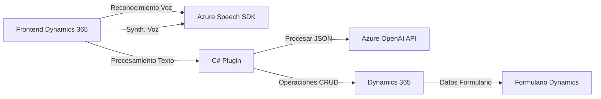

### Breve Resumen Técnico:
Este repositorio implementa una solución para gestionar formularios de Dynamics 365 mediante el uso de reconocimiento de voz, síntesis de voz (Azure Speech SDK), e integración con servicios inteligentes (Azure OpenAI). La solución utiliza **JavaScript** en la capa frontend para las interacciones en el cliente y **C#** para desarrollar un plugin que se ejecuta en el servidor de Dynamics CRM. 

Principales funcionalidades:
- **Frontend:** Procesamiento de voz y texto relacionado con formularios, empleando el SDK de Azure Speech y dinámicas de transcripción y síntesis de voz. Incluye soporte para regla fija y procesamiento basado en IA. 
- **Plugin en C#:** Integración con Azure OpenAI para transformar texto y almacenar automáticamente datos estructurados en Dynamics CRM.

---

### Descripción de la Arquitectura:
La solución sigue un **estilo de arquitectura basada en n capas (multi-layered)** con integración de servicios externos, embebidos en los siguientes niveles:
1. **Frontend**: Interfaz de usuario en Dynamics 365 para interactuar con los formularios y realizar reconocimiento/síntesis de voz mediante **Azure Speech SDK**.
2. **Backend/Plugin para Dynamics CRM**: Procesamiento de textos mediante **Azure OpenAI** que interactúa con el servicio CRM como parte de la lógica de negocio.
3. **Servicios Externos**: Uso de APIs externas (Azure Speech SDK y Azure OpenAI) para tareas específicas como reconocimiento/síntesis de voz y procesamiento avanzado de texto.

La solución apuesta por una **integración client-server**, donde el frontend comunica con el servicio CRM y los servicios Azure están disponibles mediante HTTP invocado desde el backend.

---

### Tecnologías, Frameworks y Patrones:
1. **Tecnologías utilizadas**:
   - **JavaScript (Frontend)** para funcionalidades en el cliente (formulario de Dynamics 365).
   - **C#** para desarrollo de plugins.
   - **Azure Speech SDK** para síntesis y reconocimiento de voz.
   - **Dynamics 365 Web API** (`Xrm.WebApi`) para la integración directa con el sistema CRM.
   - **Azure OpenAI Service API** para transformar texto en JSON estructurado.

2. **Frameworks**:
   - **Dynamics 365 SDK** para interactuar con CRM.
   - **Microsoft Speech SDK for JavaScript** para voz.

3. **Patrones utilizados**:
   - **Modularidad**: Divisiones claras de funciones en el frontend.
   - **Callback Pattern**: Uso en JavaScript para manejar cargas dinámicas del SDK.
   - **Service Integration**: Integraciones con API externas (Azure SDK y OpenAI).
   - **Plugin Pattern**: Desarrollo orientado a extensiones de Dynamics CRM.
   - **Separation of Concerns**: Cada archivo aborda un conjunto único de responsabilidades (voz, transformación textual, interacción entre APIs).

---

### Dependencias o Componentes Externos:
1. **Azure Speech SDK**:
   - Utilizado en el frontend para tareas de reconocimiento y síntesis de voz.
   - Carga dinámica del SDK en el runtime mediante un script externo.
   
2. **Azure OpenAI Service**:
   - Usado en el backend/plugin para transformar texto en estructuras JSON según reglas predefinidas.

3. **Dynamics 365 Web API**:
   - Operaciones CRUD con datos del sistema CRM.

4. **HTTP Client Libraries**:
   - Uso de `HttpClient` (C#) para conectar al servicio de Azure OpenAI.

---

### Diagrama Mermaid:

---

### Conclusión Final:
La solución presentada es un sistema híbrido que integra capacidades avanzadas de procesamiento de voz y texto mediante Azure Speech SDK y Azure OpenAI, respectivamente. Diseñada para funcionar dentro del ecosistema Dynamics 365, la arquitectura se compone principalmente de una colaboración **frontend-backend** bajo un modelo **n capas**. 

Aunque la modularidad es una fortaleza, el sistema presenta algunos inconvenientes como la posible inseguridad asociada a la presencia de configuraciones hardcodeadas (Azure API keys y región). Recomendaciones clave incluyen:
- Centralizar configuraciones sensibles en un sistema seguro (por ejemplo, Azure Key Vault).
- Considerar el uso de OAuth2 para autorizar las conexiones a los servicios de Azure en lugar de una clave de API fija.