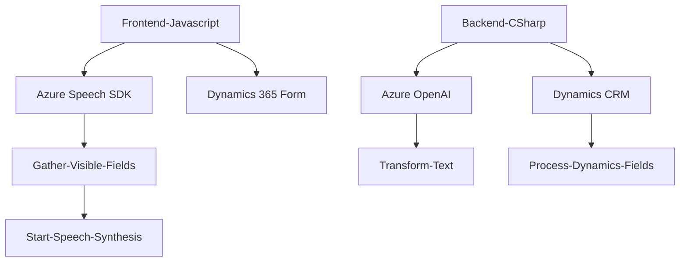

### Breve resumen técnico

El repositorio en cuestión implementa distintas soluciones que ofrecen funcionalidades de reconocimiento de voz, síntesis de voz y procesamiento de texto mediante servicios en la nube proporcionados por Azure. La solución incluye:
- Un **frontend** en JavaScript que trabaja estrechamente con formularios, utilizando el SDK de Azure Speech para convertir texto en voz y realizar transcripciones desde audio.
- Un **plugin en C#** que interactúa con Dynamics CRM y Azure OpenAI para la transformación avanzada de texto.
- Utiliza servicios cloud como Azure AI para procesamiento y Azure Speech SDK para transcripción y síntesis.

Los archivos están organizados de manera modular y aprovechan patrones de diseño como **SDK Wrapper**, **callback/event-driven programming**, y lógica basada en IA.

---

### Descripción de arquitectura

El sistema sigue un enfoque de **arquitectura en capas** con elementos propios de la **arquitectura cliente-servidor**, distribuido entre frontend (JavaScript) y backend (Plugins en C# para Dynamics CRM). La comunicación entre las capas se simplifica mediante el uso de SDKs y APIs personalizadas.

1. **Frontend**:
   - Implementa interacción directa con Azure Speech SDK para la transcripción y la síntesis de voz en el navegador.
   - Manipula datos de formularios contextuales en Dynamics 365.

2. **Backend**:
   - Se define como un plugin en Dynamics CRM.
   - Integra Azure OpenAI con solicitudes HTTP para transformar texto acorde a normas predefinidas.

---

### Tecnologías utilizadas

1. **Frontend**:
   - **Azure Speech SDK**: Para síntesis de voz y transcripción desde audio.
   - **JavaScript**: Manipulación de formularios y lógica de negocio.
   - Dinámica de **callbacks**: Carga y ejecución basada en eventos asíncronos.

2. **Backend**:
   - **Dynamics CRM Plugins** mediante C#.
   - **Azure OpenAI**: Procesamiento avanzado y transformación de texto.
   - **Librerías de C#**:
     - `Microsoft.Xrm.Sdk`
     - `System.Net.Http`
     - `System.Text.Json`
     - `Newtonsoft.Json.Linq`
   - Comunicación cliente-servidor mediante HTTP REST APIs.

---

### Diagrama **Mermaid**

---

### Conclusión final

Este repositorio implementa una solución híbrida entre una aplicación cliente (frontend en JavaScript) y un componente servidor (backend en C# como plugin para Dynamics CRM). La interacción entre estos módulos y servicios de Azure (Azure Speech SDK y Azure OpenAI) permite realizar procesamiento avanzado de datos de formularios, transformaciones de texto y funcionalidades de reconocimiento y síntesis de voz de manera precisa y eficiente.

La arquitectura empleada es extensible y modular, facilitando tanto la integración con nuevos servicios como la expansión de funcionalidad en Dynamics CRM. Además, al estar basada en Azure y APIs, la solución es escalable y apta para entornos empresariales distribuidos.