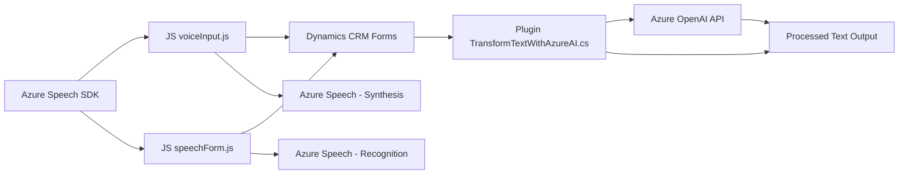

### Breve resumen técnico

El repositorio contiene una mezcla de archivos para frontend en JavaScript, un plugin en C#, y una integración con Azure services, específicamente el Speech SDK y OpenAI API. La solución parece ser enfocada principalmente en funcionalidad complementaria para Microsoft Dynamics CRM, con una oferta de servicios para lectura y entrada de formulario a través de texto o voz, procesamiento con AI, y generación/síntesis de voz en tiempo real.

---

### Descripción de arquitectura

1. **Tipo de solución**:
   - La solución es un híbrido que combina funcionalidad de frontend, integración con APIs externas (Azure Speech SDK y OpenAI), y procesamiento de datos en un plugin compatible con Dynamics CRM. 
   - Puede considerarse una **extensión modular** para Dynamics CRM, con características orientadas hacia reconocimiento de voz, síntesis de voz, y manipulación de datos mediante integración IA.

2. **Arquitectura**:
   - **N-capas**: Se puede observar una lógica de negocio separada (plugins y backend), una capa de presentación (frontend con JS que interactúa con formularios), y una capa de acceso al servicio (Azure OpenAI y Speech SDK).
   - **Modularizada**: Cada archivo tiene responsabilidades específicas y utiliza un enfoque desacoplado para manejar dependencias externas dinámicamente.
   - **Arquitectura orientada a servicios externos**: La integración con Azure OpenAI y Speech SDK permite expandir las funcionalidades del sistema base de Dynamics CRM.

---

### Tecnologías usadas

1. **Frontend**:
   - **JavaScript**: Usado para la manipulación de formularios, integración de SDK externos, y funciones utilitarias (manejo de datos legibles y manipulación del SDK dinámico).
   - **Azure Speech SDK**: Usado para reconocimiento de voz y síntesis de texto a voz.

2. **Backend (Plugins)**:
   - **C#/.NET**: Desarrollo del plugin para Dynamics CRM.
   - **Microsoft Dynamics CRM SDK**: API nativa para manipular formularios y eventos dentro del CRM.
   - **Azure OpenAI API**: Procesamiento de texto con IA.
   - **Newtonsoft.Json**: Manipulación de datos JSON.

3. **Patrones**:
   - **Plugin Pattern**: En el backend (Dynamics CRM).
   - **Builder Pattern**: Configuración de Speech SDK con objetos inicializados dinámicamente.
   - **Proxy Pattern**: Para conectar con OpenAI API desde el plugin.
   - **Carga dinámica**: En frontend para Speech SDK.

---

### Dependencias o componentes externos presentes

1. **Frontend**:
   - Azure Speech SDK (cargado dinámicamente).
   - Dynamics CRM context.
   - APIs proporcionadas por Microsoft para formularios CRM.

2. **Backend**:
   - Dynamics Web API (`Xrm.WebApi`).
   - Azure OpenAI API.
   - HTTP libraries (`HttpClient`).
   - JSON manipulation libraries (`Newtonsoft.Json`).

---

### Diagrama Mermaid

A continuación se genera un diagrama válido para **GitHub Mermaid** que representa la interacción de los componentes y dependencias:

---

### Conclusión final

Este repositorio provee una solución integrada para trabajar con formularios de Dynamics CRM mediante reconocimiento de voz, generación de texto procesado con Azure OpenAI API y síntesis de voz con Azure Speech SDK. La arquitectura es modular y sigue un patrón de integración externa basado en servicios. El uso de cargas dinámicas de SDK y APIs refleja una estrategia eficiente para manejar dependencias externas en sistemas dinámicos como Dynamics CRM.

Hay algunas preocupaciones como el uso de claves de API hardcodeadas en uno de los plugins, algo que debería ser refinado para producción. Sin embargo, el arquitecto del sistema garantiza un diseño desacoplado y bien estructurado, ideal para mantener y extender funcionalidades.