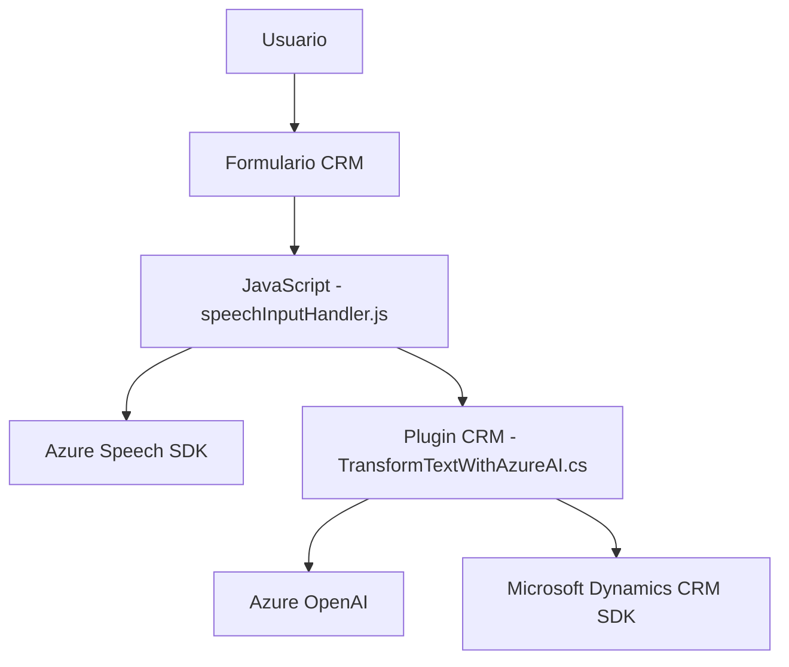

**Breve resumen técnico:**

El repositorio contiene archivos que destacan la integración y extensión de Microsoft Dynamics 365 CRM con capacidades avanzadas de voz (Azure Speech SDK) y procesamiento de texto (Azure OpenAI API). La solución parece tener dos enfoques principales: front-end basado en JavaScript para la captura y síntesis de voz, y un plugin en backend desarrollado en C# que procesa texto con reglas predefinidas utilizando OpenAI, ambos integrados en el contexto de Dynamics CRM.

---

**Descripción de arquitectura:**

La solución tiene una arquitectura **n capas**:
1. **Presentación (Frontend)**: Implementación JavaScript dentro del entorno CRM para capturar y convertir datos de formularios en voz, o para llenar formularios mediante comandos de voz.
2. **Capa de Lógica de Negocio (Backend/Plugins)**: Extiende las funcionalidades de Dynamics CRM con un plugin escrito en C# que realiza transformaciones de texto mediante Azure OpenAI.
3. **Capa de Servicios Externos**: Conexiones hacia Azure Speech SDK y OpenAI para la síntesis y procesamiento de voz y texto.

Este modelo no es monolítico, pero tampoco corresponde completamente a un diseño microservicios; opera como una solución de **integración modular**.

---

**Tecnologías usadas:**

1. **Frontend:**
   - **JavaScript**
   - **Azure Speech SDK**: Para la síntesis y el reconocimiento de voz.
   - **Manipulación DOM**: Lógica de extractores y modificadores de formularios.

2. **Backend (Plugins):**
   - **C#:** Extendiendo Dynamics CRM con el SDK de Microsoft.
   - **Azure OpenAI API**: Para procesamiento avanzado de texto.
   - **System.Net.Http** y **System.Text.Json**: Para llamadas API y manipulación de JSON.

3. **Dependencias y patrones:**
   - **Microsoft Dynamics CRM SDK**: Integración directa con CRM mediante `IPlugin`.
   - **Service-Oriented Architecture (SOA)**: Uso de APIs externas para transformaciones.
   - **Modularidad**: Separación lógica en métodos independientes altamente cohesivos.

---

**Diagrama Mermaid válido para GitHub:**

---

**Conclusión final:**

La solución es un sistema híbrido que emplea una arquitectura n capas modificado para integrar servicios de inteligencia artificial y capacidades de voz dentro del ecosistema Dynamics CRM. Los archivos resaltan la modularidad, integración y aprovechamiento de servicios externos (Azure Speech SDK y OpenAI) para mejorar la accesibilidad y la experiencia del usuario en tareas relacionadas con formularios y datos. El diseño es altamente extensible y encaja bien con entornos empresariales que requieren asistencia accesible basada en tecnologías cloud.