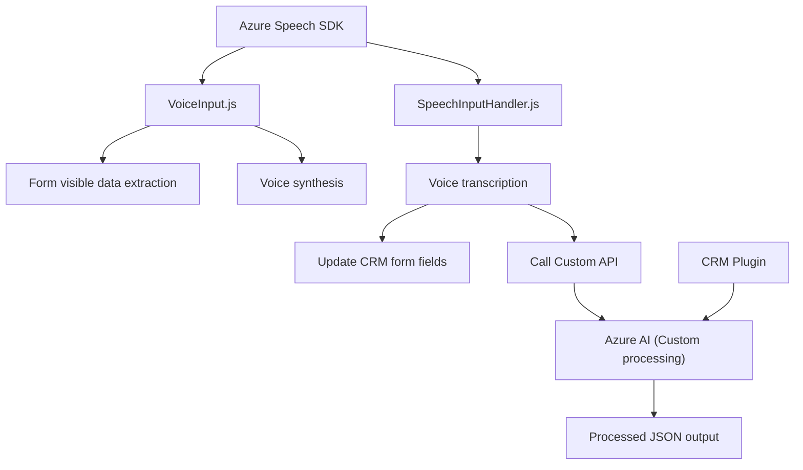

## Breve resumen técnico
El repositorio contiene principalmente archivos para una solución de reconocimiento y síntesis de voz basada en **Azure Speech SDK**. Está orientada a interactuar con formularios de Microsoft Dynamics CRM y, eventualmente, procesar datos mediante **Azure OpenAI**, adoptando una arquitectura funcional modular y conectándose a servicios externos.

---

## Descripción de arquitectura
La solución se divide en tres partes:
1. **Frontend (JS):**
   - Controladores que se integran con formularios del CRM para manejar entrada/salida de voz.
   - Lógica para mapeo de campos y reproducción mediante síntesis de voz.
   - Integración con APIs personalizadas.

2. **Backend (Plugin/C#):**
   - Plugin de Dynamics CRM que transforma texto usando **Azure OpenAI**.
   - Estructuración de datos devueltos en formato JSON limpio.

3. **Servicios externos:**
   - **Azure Speech SDK** para creación/transcripción de voz.
   - API personalizada para el procesamiento contextual del texto.

La arquitectura utiliza un enfoque **n-capas** adaptado al contexto del CRM:
   - **Capa de presentación:** Lo manejan los scripts frontales.
   - **Capa lógica de negocio:** Plugins (backend para Dynamics CRM).
   - **Capa de integración:** Servicios externos como Azure Speech SDK y Azure AI.

---

## Tecnologías, frameworks y patrones usados
1. **En el frontend:**
   - **Azure Speech SDK** para funciones de entrada y síntesis de voz.
   - **JavaScript**: Modularidad con funciones reutilizables y adaptadores para servicios.
   - **Patrones utilizados:**
     - Modularidad funcional (cada función maneja una tarea específica).
     - Integración de servicios externos (Azure Speech y APIs).
     - Validación mediante inicialización condicional (`ensureSpeechSDKLoaded`).

2. **En el backend:**
   - **C# Plugins para Dynamics CRM** integrados con las APIs de Azure.
   - **Azure OpenAI** para transformar y estructurar datos.
   - **Patrones utilizados:**
     - Patrón de adaptador: Transforma datos entre Dynamics CRM y Azure AI.
     - Modificación en capas de negocio CRM.

3. **Dependencias externas:**
   - Azure Speech SDK (`https://aka.ms/csspeech/jsbrowserpackageraw`).
   - Azure OpenAI (texto transformado y estructurado vía JSON).
   - Dynamics CRM (`Xrm.WebApi.online.execute`).

---

## Diagrama Mermaid válido para GitHub

---

## Conclusión final
La solución es un **sistema híbrido n-capas**, conectado dinámicamente con servicios en la nube como Azure Speech SDK y Azure OpenAI, diseñado para mejorar la interacción humano-computadora mediante funcionalidades como reconocimiento y síntesis de voz en formularios de CRM. La arquitectura garantiza modularidad, extensibilidad y permite la integración de inteligencia artificial para procesamiento avanzado.