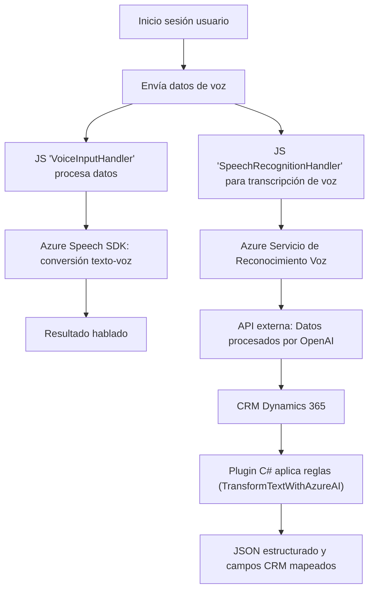

### **Breve Resumen Técnico**

El repositorio parece estar centrado en integrar capacidades de voz y procesamiento de lenguaje natural (entrada de voz, síntesis de voz, transformaciones basadas en IA) con Dynamics 365 y servicios de Azure. Se enfoca en dos principales aspectos:
1. Entrada y salida de voz para formularios usando el SDK de Azure Speech.
2. Transformación avanzada de texto a JSON estructurado mediante Azure OpenAI (GPT-4).

Además, el código refleja una orientación modular y de integración con servicios externos.

---

### **Descripción de Arquitectura**

1. **Tipo de solución:**  
   Este repositorio representa una **plataforma basada en servicios y eventos**. La solución combina **frontend (JavaScript)** y **backend (C# plugin)** para conectar usuarios finales, servicios de voz, y un CRM dinámico (Dynamics 365). 

2. **Arquitectura detectada:**  
   La arquitectura es **n capas** (frontend y backend separados) con integración hacia servicios externos (Azure Speech y OpenAI). Aunque el diseño tiene componentes modulares, no aborda una separación estricta como la arquitectura hexagonal o microservicios. 

3. **Organización del componente:**  
   - **Frontend:** Contiene JavaScript que ejecuta lógica de procesamiento en el navegador (Azure Speech SDK) y realiza integraciones hacia APIs externas.  
   - **Backend:** Basado en C# y Dynamics 365 Plugins, con lógica ejecutable en el servidor CRM y conectada directamente al servicio Azure OpenAI.  
   - **Servicio externo:** Azure Speech SDK y OpenAI para realización de tareas de reconocimiento y transformación de texto.  

4. **Patrones usados:**  
   - **Modularidad:** Cada módulo JavaScript está diseñado para encapsular funciones específicas.  
   - **Integración exógena por servicio:** Hay un fuerte enfoque en la integración con servicios externos y APIs remotas.  
   - **Delegación:** Funciones específicas delegan responsabilidades como carga dinámica del SDK, procesamiento de datos del formulario y mapeo con campos del CRM.  
   - **Plug-in pattern:** Utilizado para personalizar la lógica en Dynamics 365 mediante C#.

5. **Dependencias o componentes externos presentes:**  
   - **Azure Speech SDK:** Reconocimiento y síntesis de voz.  
   - **Azure OpenAI Service:** Procesamiento avanzado de lenguaje natural con GPT-4.  
   - **Dynamics 365 Web API:** Para interacción y acceso a datos del CRM.  
   - **Newtonsoft.Json:** Para manejo de JSON (en C# plugin).  
   - **HTTP Client:** Manejo de solicitudes HTTP hacia APIs externas.

---

### **Tecnologías Usadas**

- **Frontend**:  
  - Lenguaje: JavaScript.  
  - API dinámica: Azure Speech SDK.  
  - Plataforma integrada: Microsoft Dynamics 365 API.  

- **Backend**:  
  - Lenguaje: C# (plugin pattern).  
  - Framework: Dynamics CRM + Azure SDK.  
  - Servicio: Azure OpenAI Service (GPT-4).  

Utilities:  
- JSON handling libraries (**Newtonsoft.Json** y **System.Text.Json**)  
- HTTP client libraries para comunicación directa con APIs externas.  

---

### **Mermaid Diagrama**

---

### **Conclusión Final**

El repositorio presenta una solución centrada en voz e inteligencia artificial con integración para aplicaciones de negocio usando Dynamics 365 y servicios de Azure. La arquitectura es horizontal, basada en **n capas**, con características modulares que facilitan la integración extendida. El uso de servicios externos como **Azure Speech SDK** y **Azure OpenAI** potencia la capacidad de procesamiento, transformación de voz-texto y ejecución de lógica basada en IA.