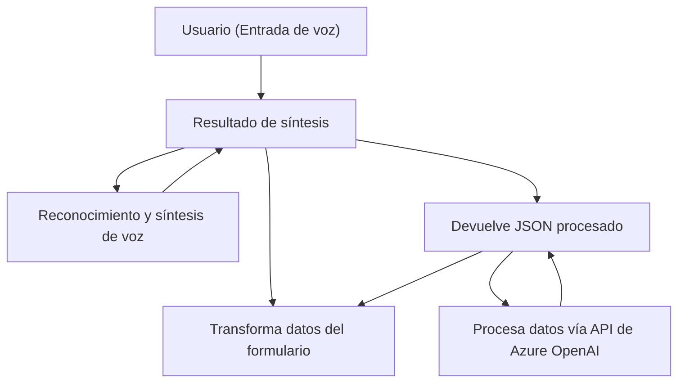

### **Análisis y Explicación Técnica del Repositorio**

#### **Breve Resumen Técnico**
Este repositorio se enfoca en la integración de tecnologías de reconocimiento y síntesis de voz (Azure Speech SDK), procesamiento de lenguaje natural (Azure OpenAI API) y manipulación de datos en formularios integrados dentro de Dynamics 365. Contiene módulos para interactuar con SDKs externos y patrones que promueven modularidad y extensibilidad.

---

### **Descripción de Arquitectura**

#### **Tipo de Solución**
Se trata de una solución híbrida que incluye:
1. **Frontend:** Con funciones desarrolladas en JavaScript que afectan directamente el contexto de las interfaces de usuario en Dynamics 365.
2. **Backend:** Con complementos **(plugins)** basados en C# que interactúan con la infraestructura de CRM y servicios externos en la nube (Azure OpenAI).

#### **Tipo de Arquitectura**
La arquitectura en este repositorio se basa principalmente en un modelo **n capas**:
1. **Capa de presentación (Frontend en JS):** 
   - Proporciona interacción dinámica a través de formularios y voces.
2. **Capa de negocio (Plugins en C#):** 
   - Procesa datos y los transforma mediante algoritmos de IA.
3. **Capa de integración (Servicios externos):**
   - Utiliza servicios de Azure para reconocimiento y síntesis de voz, además de procesamiento avanzado de textos.

---

### **Tecnologías, Frameworks y Patrones Usados**
1. **Tecnologías:**
   - **Dynamics 365:** Plataforma de gestión de relaciones con clientes (CRM).
   - **Azure Speech SDK:** Para reconocimiento de voz y síntesis con soporte multilingüe.
   - **Azure OpenAI API:** Proceso de textos mediante inteligencia artificial generativa.
   - **JavaScript:** Aplicado al frontend en manipulaciones del DOM y llamadas a SDKs.
   - **C#:** Backend para plugins en CRM.

2. **Patrones Observados:**
   - **Plugin-based Architecture:** Los plugins en C# están diseñados para ejecutarse dentro de un ecosistema como Dynamics CRM.
   - **Lógica segregada:** Modulación desde funciones especializadas (tanto frontend como backend).
   - **Cargador dinámico de dependencias:** Uso condicional de SDKs (Azure Speech) mediante métodos como `ensureSpeechSDKLoaded`.
   - **Federación de responsabilidades:** Cada elemento tiene un propósito claro (procesamiento de texto, reconocimiento de voz, cliente-API manejo de formularios).

---

### **Dependencias Externas o Componentes Potenciales**
1. Azure Speech SDK: Para interactuar con servicios de voz otorgados por Azure.
2. Azure OpenAI y su API REST: Para ejecutar tareas de procesamiento de lenguaje natural.
3. Dynamics 365 API para manejo de entidades y contextos como **Xrm.WebApi.online**.
4. HttpClient (uso en plugins C#): Para consumo de servicios externos.
5. Seguridad: Dependencia indirecta de servicios como Azure Key Vault para proteger claves y configuraciones sensibles.

---

### **Diagrama Mermaid**

Este diagrama representa la interacción entre los componentes principales.

---

### **Conclusión Final**
Este repositorio implementa una solución altamente integral que combina reconocimiento de voz, procesamiento de texto e interacción en una plataforma CRM como Dynamics 365. La arquitectura basada en n capas permite un manejo robusto entre diferentes tecnologías (JavaScript, C#, servicios Azure). Sin embargo, incorpora dependencias externas críticas (SDK, OpenAI), lo cual puede influir en la disponibilidad del sistema ante fallos en Azure. **Las prácticas de seguridad deben evaluarse para proteger configuraciones sensibles como claves de API.**