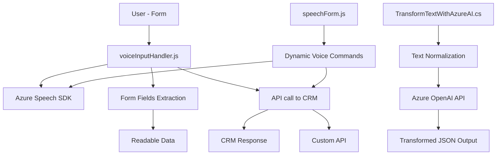

## Breve resumen técnico
El repositorio define un conjunto de archivos en JavaScript (front-end) y C# (back-end) que habilitan funcionalidades avanzadas como reconocimiento de voz, lectura y manipulación de formularios, y transformación de texto mediante servicios como Azure Speech SDK y Azure OpenAI API. Estas funcionalidades parecen ser parte de una solución integrable con plataformas como Dynamics CRM para mejorar la experiencia de usuario dentro de un ecosistema corporativo.

---

## Descripción de arquitectura
La solución utiliza una **arquitectura de cliente-servidor**, donde:

1. **Front-end**: Los archivos JavaScript (`readForm.js`, `speechForm.js`) están diseñados como componentes ligeros para formularios dinámicos interactivos. Utilizan procesamiento local junto con servicios externos (Azure Speech SDK).
2. **Back-end**: El archivo C# (`TransformTextWithAzureAI.cs`) define un plugin extensible para Dynamics CRM que interactúa con la nube (Azure OpenAI API). Este plugin se dispara mediante eventos definidos en la plataforma.

**Patrones**:
- El front-end usa una organización modular simple y programación basada en eventos. Se integra servicios externos como Azure Speech SDK dinámicamente.
- El back-end incorpora patrones de **plugin-based architecture** y **encapsulación** para extensibilidad en Dynamics CRM. También emplea comunicación con API externa para procesar datos.

La arquitectura general podría considerarse híbrida entre **n capas** y **cliente-servidor** debido al enfoque en dividir responsabilidades entre el front-end y el back-end.

---

## Tecnologías usadas
1. **JavaScript Front-end**:
   - Azure Speech SDK: Reconocimiento y síntesis de voz.
   - Web APIs (DOM, `window`, `document`).
   - Microsoft Dynamics CRM API (Xrm.WebApi).

2. **C# Back-end**:
   - Microsoft Dynamics SDK: Integración como plugin en Dynamics CRM.
   - Azure OpenAI API: Procesamiento avanzado de texto.
   - Librerías del sistema:
     - `System.Net.Http` y `System.Text.Json`: Para solicitud HTTP y procesamiento JSON.

3. **Servicios Externos**:
   - Azure Speech SDK: Reconocimiento de voz en el navegador.
   - Azure OpenAI API: Generación de texto basado en normas.

---

## Diagrama Mermaid (modelo conceptual)

---

## Conclusión final
La solución proporcionada está destinada a manejar de manera integral **formulario dinámicos interactivos**, enriquecidos por reconocimiento de voz y procesamiento de texto avanzado. La arquitectura es híbrida, con un front-end modular y base en comunicación cliente-servidor, mientras que el back-end sustenta extensibilidad vía plugins con Dynamics CRM. A nivel tecnológico, se basa en SDK y API de Azure para garantizar interoperabilidad en la nube y escalabilidad. La integración con servicios externos muestra un diseño centrado en micro-interacciones eficientes, pero puede beneficiarse de mecanismos robustos para la seguridad de las credenciales (API keys).