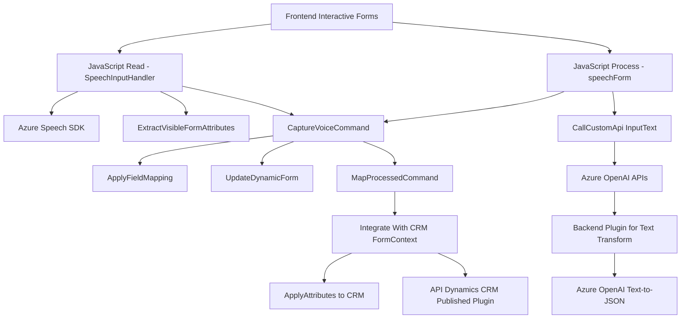

### Breve resumen técnico:
El proyecto parece ser parte de una solución avanzada para formularios dinámicos y procesamiento de voz/texto integrada con servicios en la nube. Combina diversas tecnologías y patrones de diseño para ofrecer interacción con Azure Speech SDK y Azure OpenAI en el contexto de Microsoft Dynamics CRM.

### Descripción de arquitectura:
La solución está construida bajo una **arquitectura de n capas**, con diferentes responsabilidades distribuidas en:
1. **Frontend:** JavaScript que gestiona la interacción del usuario con formularios dinámicos y entradas mediante voz. Utiliza Azure Speech SDK para sintetizar texto y reconocimiento de voz.
2. **Backend:** Un plugin de Dynamics CRM (`TransformTextWithAzureAI.cs`) que procesa texto utilizando Azure OpenAI para transformar datos con reglas específicas.

Esta separación de capas asegura modularidad:
- **Presentación (Frontend):** Manejo de datos visibles, interacción usuario-formulario, Azure Speech SDK.
- **Negocio (Backend):** Procesamiento avanzado de texto, integración con Azure OpenAI, lógica de mapeo y transformación de datos.

La presencia de API externas, plugins y funciones event-driven facilita la escalabilidad e integración con sistemas, pero refleja una estructura más alineada con **arquitectura n capas** que con microservicios.

### Tecnologías usadas:
1. **Azure:**  
   - Azure Speech SDK: Procesamiento de voz.
   - Azure OpenAI: Procesamiento de texto con inteligencia artificial.

2. **Microsoft Dynamics CRM:**  
   - SDK para manipulación de entidades y formularios dinámicos.

3. **Programas/librerías:**
   - **JavaScript:** Manejo dinámico de formularios, integración con SDK de Azure a nivel frontend. 
   - **C#:** Desarrollo del plugin en Dynamics CRM para transformar texto con Azure OpenAI.
   - **JSON:** Serialización/deserialización de datos.
   - **HttpClient API (C#):** Comunicación con servicios externos.

4. **Patrones observados:**
   - Modularidad funcional en JS y backend.
   - Lógica desacoplada: Integración con servicios externos como Azure Speech y OpenAI.
   - Event-driven triggers (carga del SDK, interacción vocal).
   - Repository-style para manejo de datos del formulario y atribuciones.

### Dependencias o componentes externos:
1. Azure services:
   - Azure Speech SDK: Reconocimiento/síntesis de voz.
   - Azure OpenAI: Procesamiento de texto y transformación.
   
2. Microsoft Dynamics CRM:
   - **Plugin** para manipular registros y entidades desde un contexto empresarial integrado.
   
3. APIs externas:
   - Custom APIs para procesamiento extendido de datos.
   
4. Internal dependencies:
   - Contexto de formularios dinámicos (`formContext`).
   - Framework de eventos y triggers basado en SDKs.

### Diagrama Mermaid:

### Conclusión final:
La solución implementa una combinación de frontend dinámico (JavaScript) y backend especializado (C# plugin), orientada a integración avanzada en el contexto de Microsoft Dynamics CRM. Utiliza servicios en la nube como Azure Speech SDK y Azure OpenAI para incorporar funcionalidades de inteligencia artificial y procesamiento de voz/texto. La arquitectura demuestra un enfoque de **n capas**, con modularidad y desacoplamiento al interactuar con API externas.