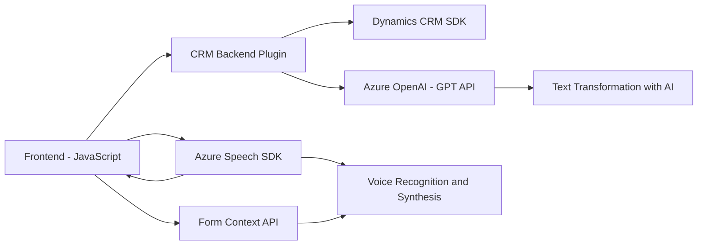

### Breve resumen técnico
El proyecto parece ser una solución híbrida construida en un entorno Dynamics CRM para gestionar formularios y mejorar la interacción entre usuarios y datos utilizando tecnologías cognitivas como Azure Speech SDK y Azure OpenAI.

---

### Descripción de arquitectura
La solución consta principalmente de:
1. **Frontend (JavaScript)**: Proporciona funcionalidades de reconocimiento de voz, lectura de formularios y generación de voz. Este módulo está dividido modularmente por funciones para facilitar su integración y reutilización.
2. **Backend (Plugin en C#)**: Implementado como un plugin en Dynamics CRM, transforma texto en estructuras JSON utilizando Azure OpenAI. Opera como un microservicio que interactúa con APIs externas.
3. **Integraciones externas**: Comunicación directa con Azure Speech y OpenAI para completar procesos de voz y texto.

La arquitectura general parece orientada a un enfoque **n-capas**:
- **Capa de presentación**: Interfaz en JavaScript que interactúa con datos de formularios y APIs.
- **Capa de negocio y servicios**: Plugin de Dynamics CRM que encapsula la lógica empresarial y conecta con servicios Azure externos.
- **Capa de integración**: Manejo de servicios API externos para reconocimiento y síntesis de voz, así como procesamiento de texto (Azure Speech SDK y OpenAI).

---

### Tecnologías usadas
1. **Frontend**:
   - **JavaScript/DOM API**: Para manipulación dinámica del frontend.
   - **Azure Speech SDK**: Reconocimiento y síntesis de voz.
2. **Backend**:
   - **Dynamics CRM SDK (Microsoft.Xrm.Sdk)**: Para ejecutar la lógica del plugin en el ecosistema CRM.
   - **Newtonsoft.Json**, **System.Text.Json**: Procesamiento y manipulación de JSON.
   - **Azure OpenAI**: Procesamiento avanzado de texto mediante IA.
3. **Patrones arquitectónicos**:
   - Service Loader Pattern (para carga dinámica de Azure Speech SDK).
   - SRP (Principio de responsabilidad única) en la segmentación de métodos.

---

### Dependencias
Las dependencias clave identificadas son:
1. **Servicios externos**:
   - **Azure Speech SDK**: Reconocimiento y síntesis de voz.
   - **Azure OpenAI**: Transformación de texto con IA.
2. **Frameworks internos**:
   - **Dynamics CRM SDK**: Integración empresarial.
3. **Librerías JSON**:
   - **Newtonsoft.Json**: Deserialización y manipulación JSON en el plugin.

---

### Diagrama Mermaid (compatible con GitHub Markdown)

---

### Conclusión final
La solución combina la tecnología de reconocimiento y síntesis de voz con la generación de texto estructurado mediante IA, creando un flujo de trabajo moderno y orientado a mejorar la interacción en entornos empresariales basados en formularios. La implementación sigue una arquitectura de n-capas modular y altamente extensible gracias al uso de servicios externos (Azure Speech SDK, Azure OpenAI) y APIs de Dynamics CRM, facilitando su integración en soluciones a gran escala.