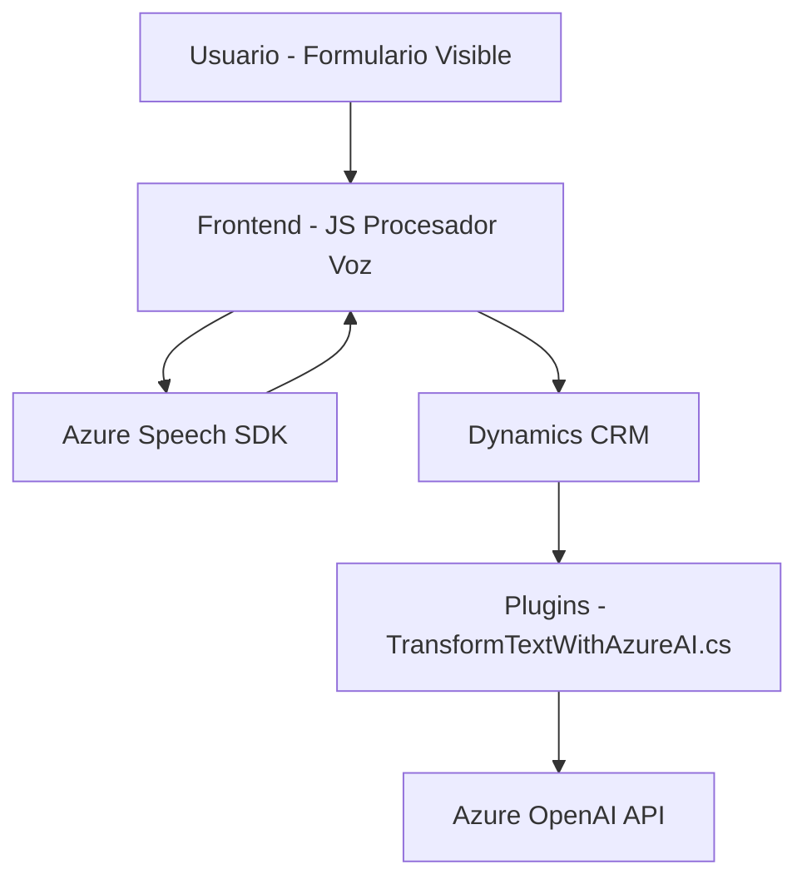

### Análisis Técnico del Repositorio

#### Breve Resumen Técnico
El repositorio parece estar diseñado para integrar un sistema de simplificación y automatización de formularios dinámicos basado en entrada de voz y procesamiento de texto, utilizando tecnologías y servicios de Azure. Está compuesto por tres componentes principales:
1. **Frontend JS:** Permite leer y sintetizar formularios en voz y procesar entradas de voz, integrando el **Azure Speech SDK**.
2. **Plugins (Dynamics CRM):** Procesa textos con reglas específicas usando **Azure OpenAI** y proporciona resultados estructurados.
3. **Integración CRM:** Diseño específico para plataformas como Dynamics, con interacción con formularios y APIs.

---

#### Descripción de Arquitectura
La solución tiene una arquitectura híbrida:
- **Frontend:** Modular con múltiples funciones que actúan como capas dentro del cliente.
- **Plugins:** Siguen el patrón basado en eventos y están diseñados como extensiones a través de la interfaz `IPlugin`, típica de Dynamics CRM.
- **Dependencia de APIs externas (SaaS):** APIs externas como **Azure Speech SDK** y **Azure OpenAI** están integradas.
- **N Capas (CRM):** Los plugins de Dynamics actúan en una arquitectura orientada a datos y reglas, procesando entradas y generando términos semiestructurados que interactúan con el frontend.

---

#### Tecnologías Usadas
1. **Lenguaje de programación:** 
   - **JavaScript:** Para el procesamiento dinámico con integración de Azure Speech.
   - **C#:** Desarrollo del plugin en Dynamics CRM.
   
2. **Frameworks y SDKs:** 
   - **Azure Speech SDK:** Para síntesis y reconocimiento de voz.
   - **Azure OpenAI:** Para procesamiento avanzado con reglas y prompt dinámico.
   - **Dynamics CRM SDK:** Interacción con parámetros contextuales en CRM.

3. **Patrones utilizados:**
   - **Modularidad:** Código organizado con funciones independientes para diferentes responsabilidades.
   - **Integración con APIs externas:** Uso del patron API-Driven para servicios externos (Azure y Dynamics).
   - **Plugin Pattern:** Clases que operan bajo el patrón basado en eventos de Dynamics.
   - **Separación de responsabilidades:** Funciones especializadas según la tarea enfocada.

---

#### Dependencias y Componentes Externos
1. **Dependencias del Frontend:**
   - **Azure Speech SDK:** Usado para entrada y salida de voz (Síntesis y transcripción).
   - **Browser-based CSP script loader:** Descarga de elementos necesarios desde fuentes externas.

2. **Dependencias del Plugin:**
   - **Microsoft Dynamics SDK:** Manejo de contexto y datos dentro del CRM.
   - **Azure OpenAI:** Procesamiento de texto basado en prompts y generación de JSON estructurado.
   - **System.Net.Http** y **System.Text.Json:** Para operaciones HTTP y serialización JSON.
   - **Newtonsoft.Json.Linq:** Manejo avanzado de contenido JSON deserializado.

---

#### Diagrama **Mermaid** Válido para GitHub Markdown

---

#### Conclusión Final
La solución está compuesta por un frontend modular que interactúa directamente con formularios y servicios de voz para potenciar la experiencia del usuario, vinculado con una capa backend que usa plugins y APIs de Dynamics CRM y Azure. Esta arquitectura híbrida **N-Capas SaaS Integrada** está orientada a maximizar la eficiencia mediante la automatización y uso de IA. Además, fomenta la escalabilidad y la modularidad al delegar roles específicos a cada componente.