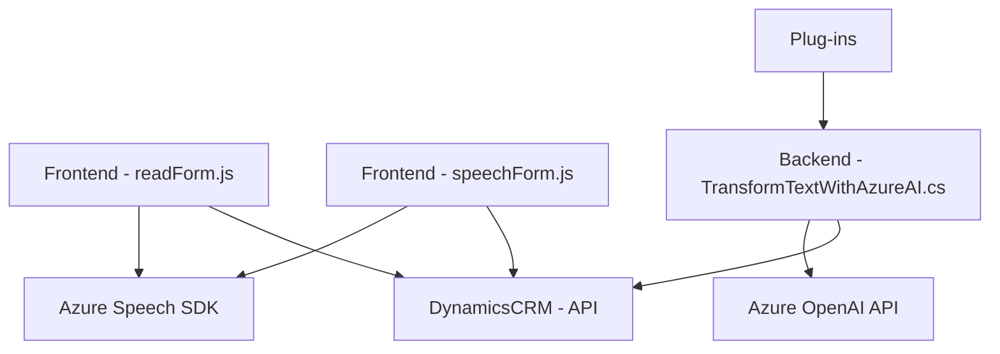

### Resumen técnico
El repositorio parece ser una solución de software orientada a la integración entre un sistema Dynamics CRM y servicios de voz e inteligencia artificial proporcionados por Microsoft Azure. Contiene componentes front-end basados en JavaScript y plugins backend hechos en .NET, específicamente para Microsoft Dynamics CRM. La solución aplica diversas funcionalidades como lectura de voz desde formularios, conversión de texto a voz, transcripción mediante la API Azure Speech SDK, y transformación avanzada de texto con el soporte de Azure OpenAI.

---

### Descripción de arquitectura
Este sistema combina una arquitectura multicapa, donde cada capa tiene una responsabilidad específica:
1. **Frontend (Capas de presentación y lógica de negocio):**
   - Implementa funciones directamente en JavaScript para trabajar con formularios (extracción de datos, asignación, transcripción de voz, etc.).
   - Se encarga de la interacción usuario/interfaz mediante la sintetización de voz para mejorar la accesibilidad.
2. **Backend (Capa de integración):**
   - Contiene plugins diseñados para interceptar eventos de Dynamics CRM.
   - Utiliza APIs externas (Azure Speech SDK y Azure OpenAI) para extender funcionalidad empresarial, procesando datos y regresándolos como respuesta en tiempo real.
3. **Servicios externos (capas de integración):**
   - Azure Speech SDK para sintetización y transcripción de voz.
   - Azure OpenAI API para procesamiento avanzado de texto e inteligencia artificial.

El diseño global muestra una arquitectura **por capas**, con enfoques claramente separados para presentación, lógica de negocio, integración y datos. Sin embargo, ciertas funciones redundantes en los componentes front-end podrían optimizarse para cumplir completamente con principios de modularidad y bajo acoplamiento.

---

### Tecnologías usadas
1. **Frontend:**
   - **JavaScript**: Utilizado para construir lógica de negocio en los archivos `readForm.js` y `speechForm.js`.
   - **Azure Speech SDK**: Integrado dinámicamente desde un endpoint en tiempo de ejecución para sintetización de voz y transcripción.
   - **Dynamics CRM API**: Permite insertar datos en formularios y realizar llamadas CRUD.

2. **Backend:**
   - **C# (Plugins CRM)**: Utiliza `Microsoft.Xrm.Sdk` para interactuar con Dynamics CRM.
   - **Azure OpenAI API**: Integra GPT-based AI para manipulación avanzada de texto.
   - **Newtonsoft.Json**: Para procesar y manejar datos JSON en interacciones API.

3. **Patrones de arquitectura/fundamentos:**
   - Modularización funcional.
   - Adapter Pattern para el llamado a servicios externos.
   - Integración basada en eventos, usando `IPlugin`.

---

### Diagrama Mermaid válido para GitHub

---

### Conclusión final
La solución presentada en el repositorio está diseñada para abordar tareas relacionadas con la accesibilidad y la interacción humano-máquina mediante la integración de APIs avanzadas de Microsoft Azure. La combinación de funcionalidades front-end (mejora de UX con voz, procesamiento de formularios) y back-end (plugins CRM, AI/ML integrados) sugiere una aplicación de arquitectura **n-capas** y de servicio extensible. Aunque la estructura es modular en términos generales, podría ser optimizada al reducir redundancias en los métodos empleados, especialmente en la capa de presentación. Sin embargo, cumple con los standares de software moderno para integrar datos dinámicos y comunicación con sistemas externos.