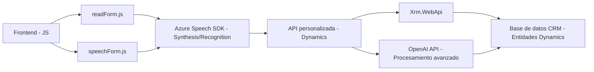

### Breve Resumen Técnico:
El repositorio contiene una solución centrada en la integración entre entradas de voz/formularios y procesamiento basado en inteligencia artificial (IA) dentro del contexto de una plataforma CRM (Dynamics 365). La solución incluye funcionalidades de síntesis de voz, reconocimiento de voz, mapeo dinámico de atributos en formularios, y procesamiento avanzado de lenguaje natural mediante Azure OpenAI.

---

### Descripción de la Arquitectura:
La solución tiene una arquitectura **orientada a servicios (SOA)** con elementos que podrían expandirse hacia **microservicios**. Se integra fuertemente:
1. **Frontend basado en procesamiento dinámico del DOM** para manejar formularios y entradas de voz con SDK externo (Azure Speech SDK).
2. **Backend como extensiones/plugin de Dynamics 365**, usando un patrón de arquitectura de ***Gateway/Orquestador*** que delega la transformación avanzada de texto a Azure OpenAI, procesado desde un contexto CRM.
3. Funciona como **multi-capa**, separando las responsabilidades: elementos del cliente (Frontend/JS) y procesos del servidor en Dynamics CRM (Plugins). Sin embargo, muestra un enfoque modular y adherencia al **patrón de desacoplamiento**.

---

### Tecnologías Usadas:
1. **Frontend**:
   - **JavaScript** para manejo dinámico de formularios y entrada de voz.
   - **Azure Speech SDK** para reconocimiento y síntesis de voz.
   - **Browser APIs** para manipulación del DOM y eventos.
   
2. **Backend**:
   - **Plugins de Dynamics 365** en .NET.
   - **Azure OpenAI** para procesamiento de lenguaje natural.
   - **Microsoft.Xrm.Sdk** y **Newtonsoft.Json** para interacción con entidades Dynamics y manejo de datos estructurados.
   - **System.Net.Http** para interacción HTTP con servicios externos.

3. **Patrones**:
   - Modularidad funcional: Las funciones están organizadas con objetivos concretos.
   - Plugin-based architecture: Extensiones de Dynamics CRM con un contexto event-driven.
   - Service integration pattern: APIs externas para funcionalidades específicas (Azure Speech y OpenAI).
   - Data transformation: Manejo flexible de datos en JSON para formularios dinámicos.

---

### Diagrama Mermaid **válido para GitHub**:
Representación de la solución y dependencias. Se enfoca en relaciones de los componentes clave del sistema.

---

### Conclusión Final:
La solución aquí descrita combina procesamiento de voz avanzado, lectura dinámica de formularios y capacidades de inteligencia artificial dentro de un ecosistema de Microsoft Dynamics 365. Al integrar servicios externos como Azure Speech SDK y Azure OpenAI, se logra una arquitectura flexible, modular, y extensible, enfocada en automatización y enriquecimiento del UX (experiencia del usuario). La arquitectónica es típicamente **multi-capa**, mostrando una progresión hacia **orientación de microservicios** dada la integración de varios servicios externos y la separación de responsabilidades en cliente (JS) y servidor (Plugins).