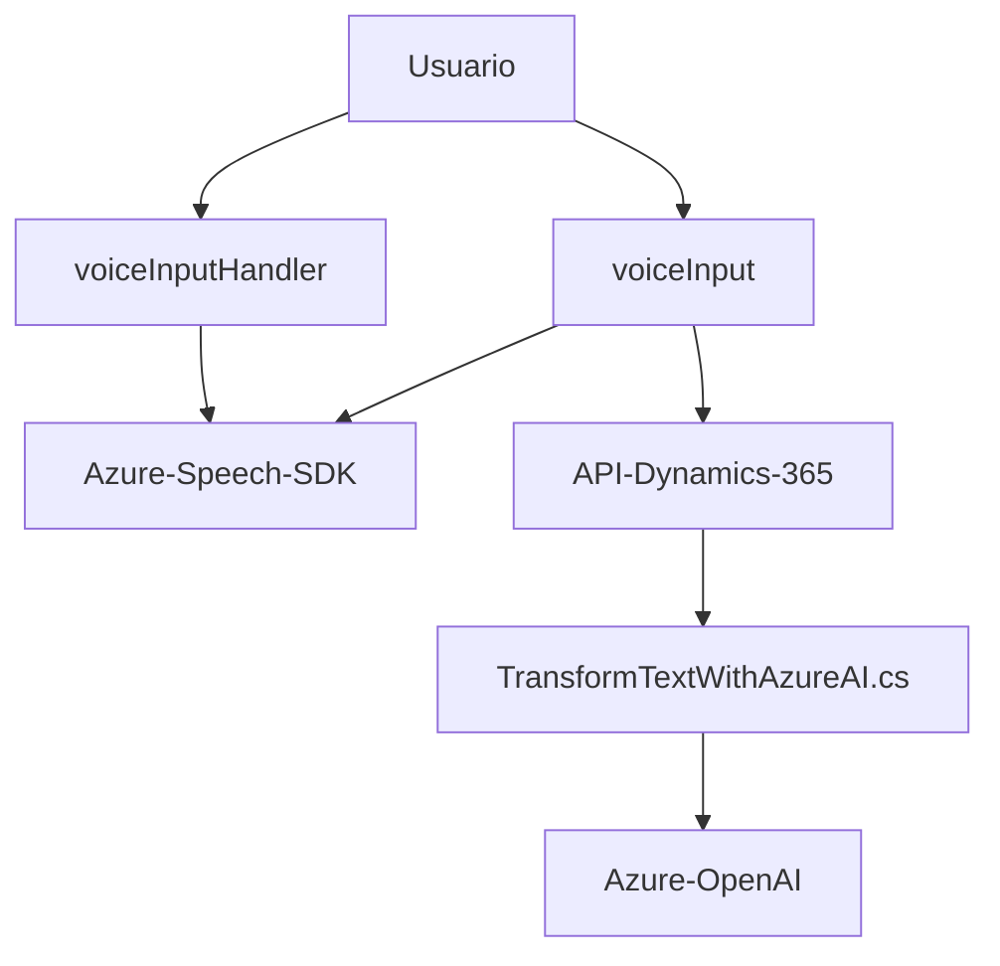

### Resumen técnico
El repositorio contiene principalmente una solución que integra funcionalidades de frontend y backend para operar con datos de formularios y servicios externos. Consiste en tres componentes principales:
1. **Frontend/scripts**: Manejo de formularios dinámicos, procesamiento de datos visible y entrada/síntesis de voz con Azure Speech SDK.
2. **Backend/plugin**: Transformación de textos usando el modelo Azure OpenAI dentro de Dynamics CRM.
3. **Integración con APIs externas**: Comunicación con Azure Speech y OpenAI para entrada de voz, síntesis de texto y transformación avanzada de datos.

---

### Descripción de la arquitectura
La arquitectura combina elementos de diseño de **integración basada en servicios** y **n-capas**:
- En el lado frontend, las funcionalidades están estructuradas en módulos pequeños con responsabilidades bien definidas que interactúan con un formulario dinámico.
- En el backend, los plugins adoptan una capa lógico-procesal de Dynamics CRM para manipular información estructurada y comunicarse con APIs como Azure OpenAI.
- El uso de tecnologías como Azure y Dynamics 365 refuerza el carácter cloud-based orientado a la integración con third-party services.

---

### Tecnologías usadas
1. **Frontend**:
   - **JavaScript**: Implementado usando módulos de scripts.
   - **Azure Speech SDK**: Para entrada de voz y síntesis en el navegador.
   - **Dynamics 365 APIs**: Para manipulación del contexto del formulario.

2. **Backend**:
   - **Microsoft Dynamics CRM SDK**: Interfaz de plugins y acceso a APIs del CRM.
   - **System.Net.Http**: Comunicación vía HTTP con Azure OpenAI.
   - **Azure OpenAI API**: Para procesamiento y transformación avanzada de texto.

3. **Patrones arquitectónicos**:
   - Callback Pattern en frontend.
   - Plugin Pattern en backend.
   - Service-Oriented Integration con APIs de terceros (Azure Speech SDK, Azure OpenAI, Dynamics CRM).
   - Modularización: separación funcional en módulos compensando diversas responsabilidades del sistema.
---

### Diagrama Mermaid válido para GitHub

---

### Conclusión final
Este repositorio implementa una solución que conecta un interfaz de usuario dinámico con habilidad de entrada y conversación por voz, junto con lógica backend avanzada para transformar datos mediante la integración altamente acoplada de APIs externas. La combinación de integración con servicios de terceros, diseño modular, y estructura típica de frontend-backend lo sitúan como una solución **n-capas basada en servicios**, altamente adecuada para entornos como Dynamics 365. Además, refuerza el uso de servicios cloud como Azure Speech y OpenAI para realizar cálculos externos clave. 

Sin embargo, las dependencias muy específicas como Dynamics y Azure podrían limitar su adaptabilidad a entornos diferentes sin extensiva personalización.