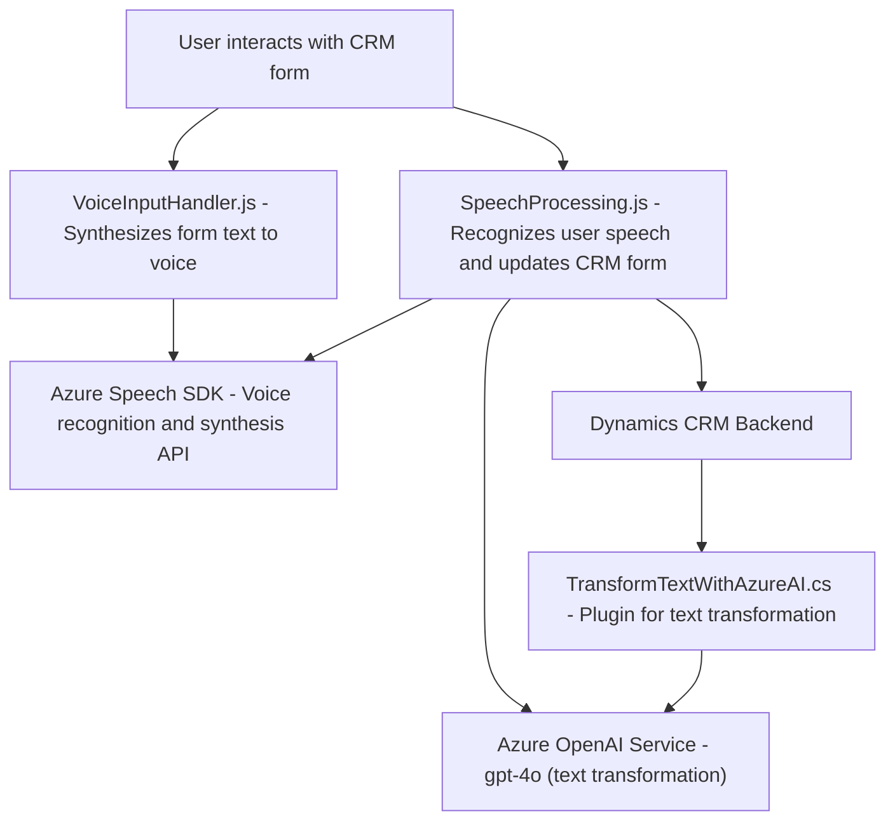

## Breve resumen técnico
El repositorio contiene funcionalidades para la integración con servicios externos, en particular **Azure Speech SDK** y **Azure OpenAI**, que permiten la entrada de voz, síntesis de texto hablado y transformación de texto automatizada. Está diseñado principalmente para complementar un sistema CRM como Dynamics con capacidades avanzadas de reconocimiento de voz, procesamiento de datos por IA y manipulación de formularios.

---

## Descripción de arquitectura
### General
La solución combina tres componentes principales:
1. **Frontend (JavaScript)**: Gestiona la interacción de los usuarios con formularios mediante entrada de voz y síntesis, y actualiza campos en tiempo real.
2. **Backend (Plugins C#)**: Procesa transformación de entrada textual mediante **Azure OpenAI** y lo integra directamente con el sistema CRM.
3. **APIs Externas (Azure SDK)**: Se encargan de tareas específicas como reconocimiento/síntesis de voz y transformación de texto en estructuras JSON.

### Tipo de arquitectura:
- **Modular con integración externa**: No utiliza microservicios, pero la modularidad es clave. Los módulos trabajan bajo un esquema de separación claro (frontend para interacción usuario, backend para lógica avanzada, y SDKs externos para tareas específicas).
- **Integración n-capas con plugins**: Mantiene una arquitectura complementaria a sistemas CRM en la forma de **plugins y SDKs externos**, lo cual permite separar responsabilidades, como entrada de datos, procesamiento y respuesta.
- **No monolítica, pero acoplada a Dynamics CRM**: Los módulos dependen fuertemente del contexto del sistema al que integran (CRM), pero aprovechan APIs para garantizar ciertas separaciones.

---

## Tecnologías usadas
1. **Frontend:**
   - **JavaScript**: Código modular para manejar entrada y salida de voz, procesamiento de formularios.
   - **Azure Speech SDK**: Usado para sintetizar texto a voz y para reconocimiento de voz en tiempo real.

2. **Backend:**
   - **C# (.NET Framework)**: Implementa plugins de Dynamics CRM.
   - **Microsoft Dynamics CRM SDK**: Para eventos y manejo de contexto de datos relacionados.
   - **Azure OpenAI Service**: Para transformación avanzada de texto con modelos de IA como gpt-4o.
   - **HTTP Client Libraries**: Utiliza `System.Net.Http` y `Newtonsoft.Json` para integrar servicios externos (Azure OpenAI).

3. **Patrones de diseño:**
   - Modularización: Funciones y métodos bien segmentados para tareas específicas.
   - Carga condicional de dependencias: El SDK de Azure Speech se carga dinámicamente cuando se necesita.
   - Integración con APIs externas: Azure SDK como backend especializado para capacidades avanzadas.
   - Separation of Concerns (SoC): División clara del manejo de front-end, back-end y dependencias externas.

---

## Dependencias o componentes externos
- **Azure Speech SDK:** Necesario para reconocimiento de voz y generación de audio hablado basado en texto.
- **Azure OpenAI Service:** Para la transformación de texto avanzado con procesamiento mediante IA.
- **Microsoft Dynamics CRM SDK:** Integración con el backend y manipulación de formularios.
- **Hosting**: Una plataforma capaz de alojar los scripts y plugins, como el backend accesible desde Dynamics CRM.
- **System.Net.Http**: Para realizar llamadas a APIs externas.
- **Newtonsoft.Json/Json.NET**: Manejo de estructura y parsing de JSON.
- **gpt-4o Azure OpenAI Deployment**: Modelo usado para realizar transformaciones complejas de input.

---

## Diagrama Mermaid válido para GitHub

---

## Conclusión final
La solución presentada está diseñada para expandir las capacidades de un sistema CRM con interacciones avanzadas de voz y de inteligencia artificial. El enfoque modular asegura que cada funcionalidad (input de voz, síntesis, y procesamiento de datos) esté suficientemente desacoplada, aunque el diseño sigue siendo dependiente del sistema CRM (Dynamics).

El uso exclusivo de tecnologías de Microsoft, como **Azure Speech SDK**, **Azure OpenAI** y **Dynamics CRM SDK**, refuerza la propuesta para entornos empresariales donde las integraciones con productos de la suite de Microsoft son críticas. Sin embargo, el alto acoplamiento con APIs específicas, la falta de herramientas para la abstracción de la lógica del negocio y la dependencia en credenciales para servicios externos representan posibles áreas de mejora en términos de escalabilidad y portabilidad.