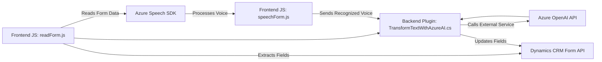

### Breve resumen técnico
El repositorio está compuesto por tres módulos que representan partes de un sistema de integración entre Dynamics CRM y Azure para facilitar el procesamiento de voz y texto. Se observa interacción con APIs externas como Azure Speech SDK y Azure OpenAI, así como una dependencia directa en Dynamics CRM para manipulación de formularios, entradas, y plugin personalizado.

---

### Descripción de arquitectura
La arquitectura corresponde a **n capas**, con la sistematización de la lógica en diferentes niveles:
1. **Presentación**: Los archivos relacionados al frontend (`readForm.js` y `speechForm.js`) implementan lógica de interacción con formularios y tratamiento de datos.
2. **Negocio**: El plugin de Dynamics CRM (`TransformTextWithAzureAI.cs`) encapsula la lógica que interactúa con el servicio Azure OpenAI y procesa datos complejos para enviarlos al CRM.
3. **Integración**: Comunicación con servicios externos como Azure Speech SDK y Azure OpenAI.

Se identifica una **arquitectura de integración en n capas** orientada a event-driven y plugin pattern.

---

### Tecnologías usadas
1. **Frontend (JavaScript)**:
   - JavaScript: Procesos client-side para formularios y síntesis de voz.
   - Azure Speech SDK: SDK de Azure para reconocimiento de voz y síntesis.
2. **Backend/Negocio (C#/.NET)**:
   - Microsoft Dynamics CRM Platform API.
   - Azure OpenAI for Natural Language processing, using `System.Net.Http`.
   - JSON manipulation: `System.Text.Json` y `Newtonsoft.Json`.

---

### Diagrama Mermaid

---

### Conclusión final
Este repositorio implementa un enfoque modular basado en **n capas**, utilizando **Azure services** para habilitar la integración del procesamiento de voz y texto con Dynamics CRM. Con una separación clara entre la capa de presentación (frontend), procesamiento de lógica de negocio (plugin), y capas de integración con servicios externos, el proyecto resalta por su robustez y versatilidad.

Aunque no estamos analizando la implementación completa del sistema (estamos limitados al análisis de algunos archivos), las dependencias externas ya sugieren un fuerte enfoque hacia soluciones basadas en servicios en la nube, especialmente mediante el uso de Azure.

