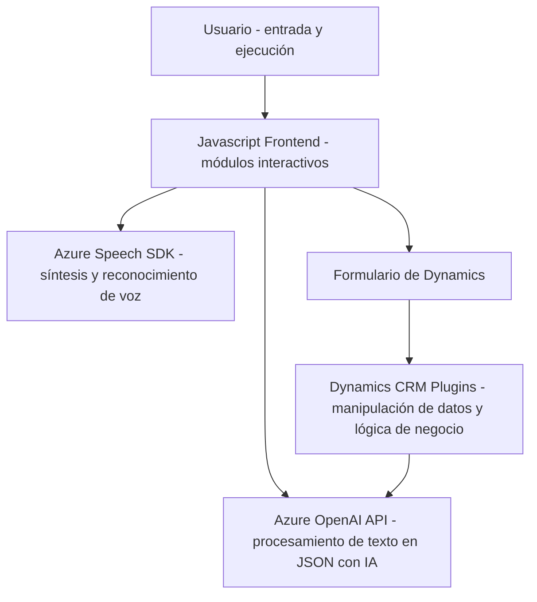

### Breve resumen técnico

El repositorio contiene componentes de una solución híbrida que utiliza capacidades de Azure Speech SDK y Azure AI para integrar funciones de reconocimiento y síntesis de voz dentro de formularios, probablemente pertenecientes a Dynamics 365. Adicionalmente, un plugin en .NET (C#) hace uso de la API de OpenAI para realizar configuraciones específicas basadas en texto transformado. La solución general integra un frontend basado en JavaScript con funcionalidades inteligentes, una API externa de Azure OpenAI y plugins de Dynamics CRM.

---

### Descripción de arquitectura

**Tipo de solución:**  
La solución combina varios componentes para implementar funcionalidades inteligentes en un producto vinculado a Dynamics CRM. Entre ellas, incluye:

1. **Frontend interactivo con Javascript**: Módulos para reconocimiento y síntesis de voz con integración directa a Dynamics CRM.
2. **Plugin de backend asociado a Dynamics CRM**: Encapsulación de servicios usando API externas, enfocados en una arquitectura orientada a servicios.
3. **Integración con APIs externas**: Usa servicios de Azure Speech SDK para síntesis y reconocimiento de voz, junto con Azure OpenAI para procesamiento avanzado de texto.

**Arquitectura general:**  
La solución combina una arquitectura orientada a eventos en el frontend y arquitectura de complementos (plugin-based) típicos de Dynamics CRM en el backend. En su conjunto, esta estructura asemeja una forma híbrida de arquitectura basada en servicios, con comunicación hacia APIs externas, por lo que podría considerarse una solución monolítica extendida con patrones de consumo de microservicios.

---

### Tecnologías usadas

1. **Frontend (JavaScript)**:
   - **Frameworks/Librerías**:
     - Azure Speech SDK (para síntesis y reconocimiento de voz).
   - **Patrones**:
     - Event-driven programming: Uso de eventos y manejo de callbacks.
     - Helpers y modularidad: Las funciones se organizan en bloques manejables y reutilizables.
     - Facade Pattern: Funciones como `startVoiceInput` son puertas de enlace para gestionar múltiples operaciones.

2. **Backend (C# Plugin)**:
   - **Frameworks y Servicios**:
     - Dynamics CRM SDK (`Microsoft.Xrm.Sdk`) para manejos de eventos y manipulación de datos en el CRM.
     - Azure OpenAI (GPT-4): Inteligencia artificial para la transformación de texto.
   - **Otras bibliotecas**:
     - `Newtonsoft.Json` para trabajar con JSON.
     - `System.Net.Http` para realizar solicitudes a APIs externas.
   - **Patrones**:
     - Plugin-Based Architecture: Integra funcionalidades en eventos del CRM.
     - API Consumer: Comunicación con servicios de Azure AI mediante HTTP.
     - Inyección de dependencias: Uso de `IServiceProvider`.

3. **Dependencias Externas**:
   - Azure Speech SDK.
   - Microsoft Dynamics CRM SDK (interno del sistema).
   - Azure OpenAI API (GPT-4-o).
   - Dynamics 365 Web API para acceso a datos de formularios.

---

### Diagrama **Mermaid** compatible con **GitHub Markdown**

---

### Conclusión final

La solución en el repositorio parece ser un sistema híbrido y especializado para extender la funcionalidad de un sistema corporativo basado en Dynamics CRM. Combina el uso del frontend interactivo con capacidades del Azure Speech SDK (síntesis y reconocimiento de voz), mientras que el backend proporciona la integración de reglas de negocio e inteligencia artificial para transformar y completar formularios automáticamente. El diseño está basado en una arquitectura modular de plugins y APIs, lo que facilita la interacción entre el sistema base de Dynamics CRM y los servicios externos de Azure.

Entre las sugerencias de mejora:
- Explorar cómo almacenar claves API en un entorno seguro (por ejemplo, Azure Key Vault).
- Considerar un enfoque de microservicios en lugar de una solución monolítica, especialmente para desacoplar funcionalidades clave como IA y síntesis de voz.

La solución es robusta y parece ajustarse bien al problema planteado, permitiendo automatizar el procesamiento de formularios e integrar tecnologías avanzadas de Microsoft Azure y Dynamics CRM.