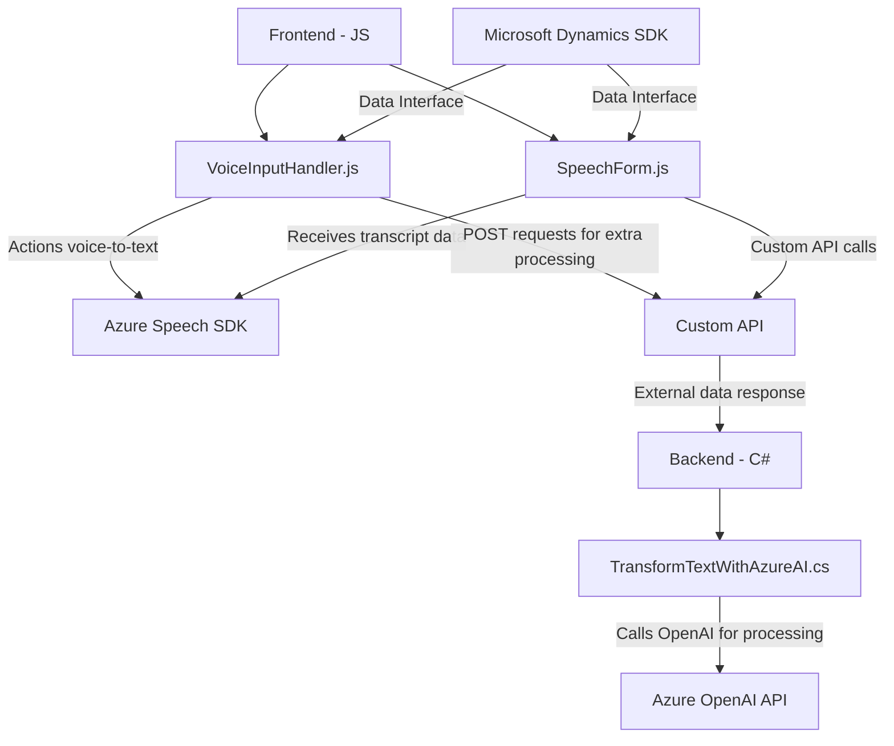

### Breve Resumen Técnico
El repositorio refleja una solución orientada a la integración de tecnologías de voz y procesamiento de lenguaje natural en un entorno CRM, probablemente **Microsoft Dynamics CRM**. La estructura incluye archivos dedicados a la entrada/salida de voz en formularios, el reconocimiento de comandos mediante Azure Speech SDK, y plugins para transformar datos con Azure OpenAI.

---

### Descripción de Arquitectura
1. **Tipo de solución:**  
   - Es una solución híbrida que combina funcionalidades de frontend (archivos `.js`) y plugins que operan en un backend (archivo `.cs`) en un entorno CRM, integrando servicios basados en inteligencia artificial (Azure Speech SDK y OpenAI).

2. **Arquitectura:**  
   - Basada en una arquitectura de **n capas**.  
   - Los archivos de JavaScript gestionan la interacción en la capa **front-end**, mientras que el plugin en C# se encuentra en la **capa de backend** en Microsoft Dynamics.  
   - Se integra con Microsoft Azure (Speech y OpenAI) como un servicio externo (**API Gateway Pattern**) para reconocimiento de voz y transformación de texto.  
   - Utiliza patrones como **Facade**, **Data Transformation Layer**, **Adapter** y **Modular Design**.

---

### Tecnologías Usadas
1. **Frontend:**
   - **JavaScript** (Vanilla JS).
   - **Azure Speech SDK** para reconocimiento y síntesis de voz.
   - **Microsoft Dynamics CRM API** (`Xrm.WebApi`) para interacción con formularios y datos.
   - Azure-associated SDKs (`SpeechSDK`).

2. **Backend:**
   - **Microsoft Dynamics CRM SDK**, incluyendo:
     - `Microsoft.Xrm.Sdk` y `Microsoft.Xrm.Sdk.Query`.
     - Plugin-oriented architecture (`IPlugin interface`).
   - **Azure Cognitive Services**:
     - Speech SDK (Reconocimiento de voz).
     - Azure OpenAI API (Procesamiento avanzado de texto).
   - **C# .NET Framework/Core**.
   - Libraries:
     - JSON handling (`System.Text.Json` and `Newtonsoft.Json`).
     - HTTP client (`System.Net.Http`).
3. **External Dependencies:**
   - **Azure Speech SDK** for text-to-speech and voice recognition.
   - **Custom API endpoint** for extending functionalities and interfacing with external systems.
   - **Azure OpenAI API** for text transformation.

---

### Diagrama Mermaid (Válido para GitHub Markdown)

---

### Conclusión Final
Esta solución arquitectónica es adecuada para entornos empresariales que desean integrar capacidades de IA en una plataforma CRM. La división modular entre los componentes frontend (`JS`), backend (`C# Plugin`), y la integración con servicios avanzados como el **Azure Speech SDK** y **Azure OpenAI** asegura una arquitectura escalable y adaptable. 

Además, los patrones como **Modular Design**, **API Gateway**, y **Data Transformation** permiten gestionar formularios con voz/IA de manera eficiente y clara, manteniendo una buena separación de responsabilidades entre los distintos servicios y capas.