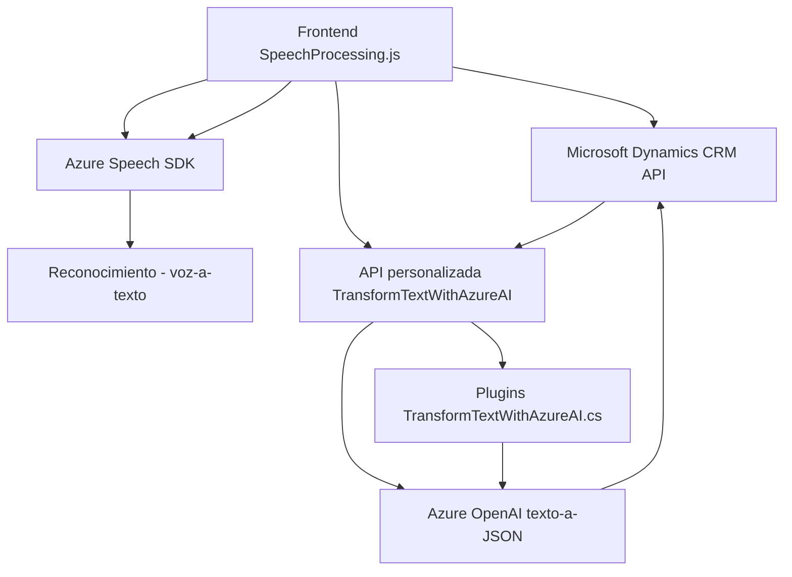

### Breve Resumen Técnico
El repositorio contiene una solución orientada a mejorar la interacción entre usuarios y formularios de Microsoft Dynamics CRM mediante Azure Speech SDK y Azure OpenAI. La arquitectura está distribuida con integración de servicios SaaS, implementando reconocimiento y síntesis de voz, así como procesamiento de texto estructurado. Los archivos analizados incluyen tanto frontend en JavaScript con Azure SDK como un plugin backend en C# para Microsoft Dynamics CRM.

---

### Descripción de la Arquitectura
La solución tiene una **arquitectura de n capas** (frontend, lógica backend y servicios externos), donde:
- **Frontend JS** actúa como una capa de interfaz para el reconocimiento/síntesis de voz y la interacción con formularios.
- **Capa intermedia (Plugins en Dynamics CRM)** convierte el texto y realiza el procesamiento lógico con Azure AI, entregando contenido estructurado que actualiza dinámicamente los formularios.
- **Servicios externos (Azure SDK y Azure OpenAI)** proporcionan capacidades avanzadas como reconocimiento de voz, síntesis de voz e inteligencia artificial para procesamiento de texto.

Patrones destacados:
- **Modularidad**: Cada función en el frontend y método en el backend está diseñada para cumplir roles específicos.
- **Adaptador para SDK externo**: Incluye lógica para interactuar con Azure SDK y garantizar la carga condicional en tiempo de ejecución.
- **Plugin Pattern** (en Dynamics CRM): Proporciona una forma estándar de extender funcionalidades del CRM.
- Uso de **APIs externas** para conectar la solución con servicios SaaS.

---

### Tecnologías Usadas
1. **Frontend**
   - Lenguaje: JavaScript.
   - SDK: Azure Speech SDK.
   - Framework/Formato relacionado: Dynamics CRM Web API.
2. **Backend**
   - Lenguaje: C#.
   - Framework: Microsoft Dynamics CRM SDK.
   - Librerías:
     - Newtonsoft.Json.Linq (procesamiento JSON).
     - System.Net.Http (solicitudes HTTP).
     - System.Text.Json (serialización/deserialización).
   - Servicios externos: Azure OpenAI.

---

### Dependencias o Componentes Externos
1. **Azure Speech SDK**: Reconocimiento y síntesis de voz.
2. **Azure OpenAI**: Transformación y procesamiento de texto con IA.
3. **Microsoft Dynamics CRM**: Sistema integrado que actúa como contexto principal.
4. **Custom APIs en Dynamics CRM**: Integración con APIs personalizadas que gestionan transformaciones específicas de datos.

---

### Diagrama **Mermaid**
A continuación, se genera un diagrama basado en la interacción general entre componentes y servicios:

---

### Conclusión Final
La solución en este repositorio está diseñada para mejorar la interacción entre usuarios y formularios en Dynamics CRM utilizando capacidades modernas como síntesis/reconocimiento de voz e inteligencia artificial. Se adopta un enfoque modular con componentes separados tanto en el frontend (JavaScript) como en el backend (C#), siendo complementados por servicios externos. La integración con Azure garantiza una alta escalabilidad y potencia en las funciones IA y procesamiento lingüístico.