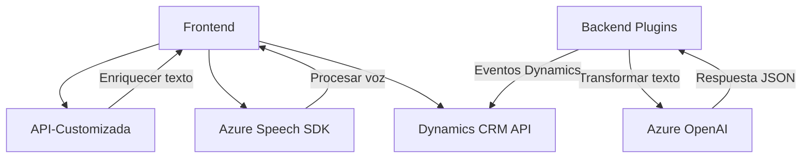

### Breve resumen técnico
El repositorio implementa funcionalidades orientadas a tecnología Azure y Dynamics CRM/Dataverse. Se centra en la entrada y síntesis de voz mediante el **Azure Speech SDK** y en la transformación de datos con **Azure OpenAI** a través de plugins en Dynamics CRM. Los componentes muestran modularidad y integración de APIs externas.

---

### Descripción de arquitectura
1. **Tipo de solución**: Sistema híbrido que combina **frontend** basado en JavaScript (para interacción con el usuario en un contexto web o CRM) y un **backend** con plugins de Dynamics CRM conectados a **Azure OpenAI** para procesamiento avanzado de datos.
2. **Arquitectura empleada**:
   - **N capas**: El frontend (JavaScript) interactúa con el usuario en formularios web dinámicos, mientras los plugins en el backend responden a eventos del sistema CRM y procesan datos.
   - **Orientación a servicios externos**: Interacción con APIs, como Azure Speech SDK y Azure OpenAI. 
   - **Desacople mediante API externalizada**: Uso del patrón de integración para llamar a sistemas externos como Dynamics CRM, Azure, y APIs personalizadas.

---

### Tecnologías usadas
1. **Frontend**: 
   - **JavaScript** aplicado en la gestión de formularios y la interacción dinámica con usuarios.
   - **Azure Speech SDK** para entrada y salida de voz.
   - **Dynamics CRM API (Xrm.WebApi)** para garantizar la conexión entre el frontend y la plataforma CRM/Dataverse.
   - **Modularidad** mediante funciones por responsabilidad.

2. **Backend (Plugins)**:
   - **C#** como lenguaje base para los plugins.
   - **Microsoft.Xrm.Sdk** para la integración y operación dentro del ecosistema Dynamics.
   - **Azure OpenAI API** para procesamiento avanzado de texto mediante inteligencia artificial (GPT-4).
   - Manejo de JSON con **Newtonsoft.Json** y **System.Text.Json**.
   - **HTTP client pattern** para el consumo de APIs externas.

---

### Dependencias o componentes externos
1. **Azure Speech SDK**: Utilizado en el frontend para la entrada y salida de voz. Carga dinámica en el navegador mediante un script remoto.
2. **Azure OpenAI**: Utilizado en los plugins para procesar el texto con IA avanzada.
3. **Dynamics CRM API**: Para el manejo de datos en el contexto del formulario, incluyendo mapeos, búsqueda en lookups, etc.
4. **APIs personalizadas**: Servicios adicionales de Dynamics CRM para mejora de datos.
5. **Otras dependencias**: 
   - Librerías .NET como `Microsoft.Xrm.Sdk` para desarrollo de plugins.  
   - Herramientas de manejo de JSON incluyendo **Newtonsoft.Json** y **System.Text.Json**.  

---

### Diagrama **Mermaid**
El siguiente diagrama muestra los componentes principales del sistema y su interacción:

---

### Conclusión final
Este repositorio implementa una solución integral para formularios dinámicos en Dynamics CRM que aprovecha capacidades de reconocimiento y síntesis de voz, junto con procesamiento textualmente avanzado mediante IA. Se caracteriza por una arquitectura modular e integrada con servicios como Azure Speech y OpenAI, siguiendo patrones de diseño comúnmente aceptados en sistemas modernos. Entre las posibles mejoras se recomienda:
1. **Desacoplar credenciales y configuraciones sensibles** de las implementaciones de código fuente y utilizar secretos seguros.
2. **Optimizar carga dinámica del Speech SDK** para adaptarse a distintos navegadores y mejorar la compatibilidad.
3. Revisar y contemplar la portabilidad de los componentes, para favorecer una arquitectura más desacoplada (microservicios).

El diseño actual es adecuado para robustas aplicaciones de CRM y sistemas de IA dinámica, aunque facilitaría mantenimiento emplear mejores prácticas de desacoplamiento.