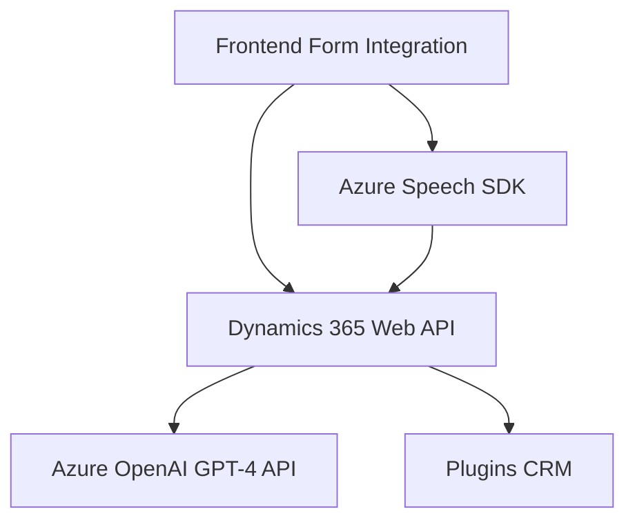

### Breve resumen técnico:
El repositorio analiza y gestiona integración entre formularios dinámicos (Dynamics 365), servicios de voz y procesamiento AI mediante Azure Speech SDK y Azure OpenAI. Los archivos exhiben una solución orientada a integrar módulos de frontend con procesamiento externo (speech-to-text, text-to-speech y AI). El objetivo primario es capturar datos del usuario mediante voz, procesarlos en formulación estructurada y sintetizarlos o almacenarlos en sistemas como Dynamics CRM.

---

### Descripción de arquitectura:
La solución utiliza una arquitectura **n-capas**, separando claramente los módulos de frontend, servicios externos (speech/AI) y lógica correspondiente a los plugins CRM. Los componentes son desacoplados, delegando funciones críticas a SDKs externos de Azure. Cada funcionalidad está organizada modularmente mediante patrones como delegación y eventos, asumiendo un estilo cercano al diseño de servicios distribuidos para usar API junto a Dynamics 365.

---

### Tecnologías usadas:
1. **Frontend:**
   - **JavaScript:** Para manejar eventos del formulario, cargar SDKs, y procesar datos en tiempo real.
   - **Azure Speech SDK:** Para síntesis y reconocimiento de voz en tiempo real.
   - **Dynamics 365 Web API:** Facilitando actualizaciones dinámicas de formularios en contexto.

2. **Backend (Plugins):**
   - **C# con .NET Framework:** Desarrollando extensiones sobre Dynamics CRM mediante la interfaz `IPlugin`.
   - **Azure OpenAI API (GPT-4):** Procesando texto con reglas específicas y transformándolo en JSON.

3. **Patrones arquitectónicos:** 
   - **Desacoplamiento modular:** Funciones independientes para síntesis, transcripción y procesamiento.
   - **Uso de API Gateway:** Los plugins CRM actúan como intermediarios entre Dynamics y servicios externos.
   - **Patrón Plugin:** En el archivo C# para extender funciones de Dynamics CRM con el modelo de lenguaje.

---

### Diagrama Mermaid válido para GitHub:

---

### Conclusión final:
El código muestra una arquitectura enfocada en **servicios distribuidos**, combinando capacidades de frontend y procesamiento externo con Dynamics CRM. La solución aprovecha eficientemente los **SDK de Azure** para la síntesis y transformación de datos y utiliza prácticas modernas como desacoplamiento modular, delegación y eventos asincrónicos. Esto resulta esencial para el diseño de una solución escalable que simplifique la interacción entre servicios cloud y sistemas empresariales locales (Dynamics).