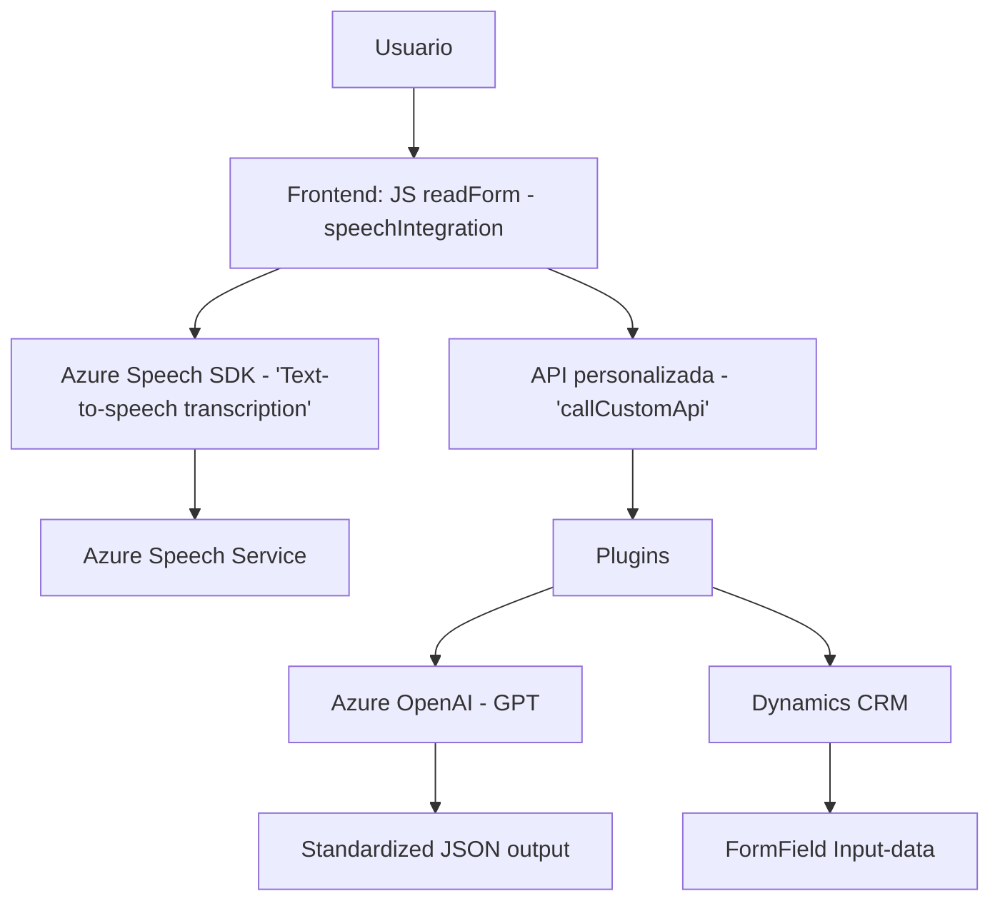

### Análisis del repositorio

#### Breve Resumen Técnico
El repositorio parece ser una solución que integra capacidades de procesamiento de voz e inteligencia artificial con el ecosistema **Microsoft Dynamics CRM**. Los archivos detallan funcionalidades que convierten texto en voz y viceversa, utilizando el SDK de **Azure Speech**, y también ejecutan transformaciones avanzadas de texto mediante el servicio **Azure OpenAI GPT** para enriquecer o estandarizar datos en formularios almacenados en Dynamics CRM.

---

### Descripción de Arquitectura
Este sistema sigue una arquitectura **modular distribuida híbrida**. Parte del frontend interactúa directamente con los usuarios para entrada y síntesis de voz, mientras que el backend implementa un **plugin-oriented development pattern** en Dynamics CRM, con extensiones que procesan datos y enriquecen su contexto utilizando integraciones con **Azure services**.  
Los patrones destacados incluyen:
1. **Modular**: Cada archivo muestra agrupación de funcionalidades en funciones autocontenidas.
2. **Service-oriented Architecture (SOA)**: Comunicación y uso de servicios externos, con una clara separación entre lógica del frontend, integración con APIs (como `callCustomApi`), y backend por medio de un plugin.
3. **N Capas**:
   - **Capa de presentación**: Código cliente en frontend para interacción con usuarios.
   - **Capa de servicios**: SDK/Integración con APIs de Azure.
   - **Capa de datos**: Interacción con el contexto de formularios y Xrm.WebApi (Dynamics CRM).
   - **Capa de plugin (backend)**: Extensión del CRM con el servicio Azure OpenAI.

En el backend (plugin para Dynamics CRM), observamos una arquitectura de **hexágono adaptado**, que permite la interacción con múltiples servicios externos y utiliza un núcleo abstracto (modelo de datos JSON) enfocado en asegurar la extensibilidad y compatibilidad.

---

### Tecnologías Usadas
1. **Frontend**:
   - JavaScript: Manipulación de DOM y lógica de cliente.
   - Azure Speech SDK: Para procesamiento de voz (síntesis y transcripción) desde el frontend.
   
2. **Backend Plugins**:
   - **C# (.NET Framework)**: Para la implementación del plugin en Microsoft Dynamics CRM.
   - **Azure OpenAI API**: Para transformación avanzada y enriquecimiento de texto.
   - **Newtonsoft.Json**: Manejo de estructuras JSON.

3. **Frameworks y Servicios**:
   - Dynamics CRM (Xrm.WebApi): Para integraciones y manipulación de datos del formulario.
   - Azure ecosystem: Speech SDK y OpenAI API como servicios principales.

4. **Patrones de Diseño**:
   - Modular.
   - Lazy-loading (carga dinámica del SDK).
   - Event-driven programming.
   - Facade Pattern para gestionar lógica de acceso a APIs.
   - Service Integration para incorporar servicios de Azure en múltiples capas.
   - REST API consumption para llamadas a servicios externos.
   
---

### Dependencias o Componentes Externos
El sistema parece depender de las siguientes bibliotecas y servicios externos:
1. **Azure Speech SDK**: Cargado desde CDN para síntesis de voz y transcripción.
2. **Microsoft Dynamics CRM**: Contexto de formularios y APIs (`Xrm.WebApi`).
3. **Azure OpenAI API**: Para usar modelos GPT en la transformación y enriquecimiento del texto.
4. **Newtonsoft.Json**: Manipulación avanzada de objetos JSON.
5. **System.Text.Json**: Serialización/deserialización de JSON (en el backend plugin).

---

### Diagrama Mermaid válido para GitHub

---

### Conclusión Final
Este repositorio representa un sistema que integra la potencia de **Azure Speech SDK**, Azure OpenAI, y Microsoft Dynamics CRM para brindar una solución avanzada de entrada inteligente y enriquecimiento de datos en formularios. Su diseño modular y orientado a servicios lo hace altamente extensible, aprovechando patrones como SOA y n capas para ofrecer una experiencia optimizada en entornos corporativos. El enfoque elegido asegura una clara separación de responsabilidades entre frontend, API, y lógica del backend, maximizando la compatibilidad y la mantenibilidad de la solución a largo plazo.