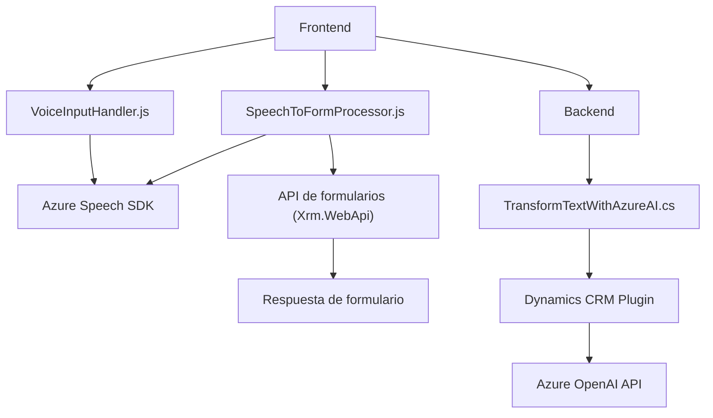

## Análisis Técnico

### Breve resumen técnico
El repositorio contiene distintos archivos que implementan funcionalidades relacionadas al procesamiento de voz, formularios, y transformación de texto usando servicios de Microsoft Azure y Dynamics CRM. Parecen formar parte de una solución integrada para interacción y procesamiento de datos en entornos CRM, usando voz como mecanismo de entrada y salida.

---

### Descripción de la arquitectura
La arquitectura adoptada mezcla varios patrones:
1. **Frontend con integración al backend vía SDK/API**:
   - Los archivos `VoiceInputHandler.js` y `SpeechToFormProcessor.js` funcionan como la capa de cliente para manejar la interacción de voz (entrada y salida usando Azure Speech SDK).
   - Dependencias del frontend cargan dinámicamente recursos y hacen llamados asíncronos a APIs externas.
2. **Plugin de procesamiento basado en eventos** (backend con Dynamics CRM):
   - El archivo `TransformTextWithAzureAI.cs` actúa como plugin de Dynamics CRM que interactúa con Azure OpenAI para procesar datos textuales y transformar información con IA.
3. **Capa de servicios**:
   - Se observa una separación lógica entre operaciones específicas de formulario, integración con APIs externas, y procesamiento inteligente de datos usando IA en los plugins.

La solución utiliza una arquitectura de **n capas** con separación visible entre:
- Capa de presentación (Frontend),
- Capa de lógica aplicada y procesamiento (JavaScript y plugins en Dynamics),
- Capa externa de servicios (Azure APIs: Speech SDK y OpenAI).

---

### Tecnologías usadas
1. **Frontend:**
   - Lenguaje: JavaScript.
   - SDKs/Bibliotecas:
     - Azure Speech SDK: Procesamiento de voz (entrada y salida).
     - DOM API: Manipulación dinámica de scripts en el navegador.
     - CRM APIs (Xrm.WebApi): Manejo de datos dinámicos en formularios.

2. **Backend:**
   - Lenguaje: C#.
   - Frameworks/Bibliotecas:
     - Microsoft.Xrm.Sdk: Para interacción con Dynamics CRM.
     - System.Net.Http: Cliente HTTP para enviar solicitudes a Azure OpenAI.
     - System.Text.Json/Newtonsoft.Json: Para crear y manipular JSON.

3. **Servicios Externos:**
   - **Azure Speech SDK:** Reconocimiento de voz y síntesis.
   - **Azure OpenAI API:** Transformación de texto mediante modelos GPT.

---

### Posibles dependencias externas
- **Azure Speech SDK:** En el frontend, para gestionar entrada/salida de voz.
- **Azure OpenAI API:** En el backend/plugin de Dynamics, para transformación de datos textuales.
- **Dynamics CRM Web API:** Para operaciones CRUD y trabajo en formularios dinámicos.
- **HttpClient:** Para manejar las solicitudes a APIs externas.
- **Variables externas (e.g., claves de API, región y configuración de servicios).**

---

### Diagrama Mermaid (GitHub Markdown compatible)

---

### Conclusión Final
La solución parece ser una integración completa para un sistema CRM basado en Dynamics que utiliza tecnologías avanzadas como el procesamiento de voz (Azure Speech SDK) y modelos de transformación de texto (Azure OpenAI API). La arquitectura maneja una estructura escalable de **n capas**, dividiendo responsabilidades entre frontend, backend y servicios externos como parte de un ecosistema híbrido.

Sin embargo, se observan áreas de mejora como:
- **Seguridad de las claves de API**: Actualmente, las claves de Azure parecen estar codificadas, lo cual no es seguro.
- **Desacoplamiento de normas de procesamiento:** En `TransformTextWithAzureAI.cs`, sería ideal utilizar una configuración dinámica para las reglas de procesamiento en lugar de tenerlas como cadenas estáticas.

La implementación general está alineada para manejar interacciones dinámicas entre voz, formularios y procesamiento de datos, haciendo un uso eficiente de herramientas de Microsoft Azure y soporte para APIs modernas.