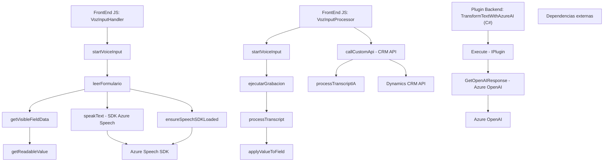

### Breve resumen técnico
El repositorio parece ser parte de un sistema híbrido que combina lógica frontend basada en JavaScript para formularios y procesamiento de voz, un backend basado en C# que utiliza Dynamics CRM, además de integración con servicios externos como Azure Speech SDK y Azure OpenAI. La solución está enfocada en la manipulación dinámica de datos por medio de interacción de voz (frontend) y transformación avanzada (backend).

---

### Descripción de arquitectura
El sistema combina un esquema **n-capas**:
1. **Frontend (JS)**:
   - Contiene lógica de procesamiento de voz y manipulación de formularios.
   - Accede a SDKs externos, interactúa con APIs de CRM, y realiza procesamiento modular.
2. **Backend (C#)**:
   - Implementa plugins para el sistema CRM Dynamics para transformar datos utilizando Azure OpenAI.
   - Utiliza patrones de arquitectura orientados a servicios y complementado por el patrón de plugins.
3. **Integración externa**:
   - **Azure Speech SDK**: Reconocimiento y síntesis de voz.
   - **Azure OpenAI**: Procesamiento avanzado de texto.
   - **Dynamics CRM WebAPI**: Interacción con datos del CRM.

Por sus componentes esenciales y separación funcional, la arquitectura puede clasificarse como **orientada a servicios y n-capas**, con modularidad en frontend y backend.

---

### Tecnologías usadas
- **Frontend (JavaScript)**:
  - **Azure Speech SDK**: Para entrada/síntesis de voz.
  - **Web API del navegador**: Manipulación de DOM y llamadas HTTP.
  - **Framework CRM Dynamics**: Procesamiento de formularios.
  
- **Backend (C#)**:
  - **Dynamics CRM SDK**: Implementación del plugin.
  - **Azure OpenAI**: Transformación de texto con IA.
  - **Newtonsoft.JSON**: Manejo de datos JSON.
  - **Microsoft.SqlServer.Server** (aunque no usado explícitamente).

- **Patrones**:
  - Carga dinámica de dependencias.
  - Modularidad funcional.
  - Comunicación asincrónica.
  - Plugin Pattern (Dynamics).

---

### Diagrama Mermaid

---

### Conclusión final
El repositorio implementa una solución orientada a servicios con funcionalidades para interacción de voz y procesamiento de texto mediante AI, compatible con plataformas CRM. La arquitectura se clasifica como **n-capas orientada a servicios**, donde cada capa se integra modularmente con SDKs externos como Azure Speech, Azure OpenAI, y Dynamics CRM. Aunque es eficaz en términos de separación de responsabilidades, sería recomendable analizar la posibilidad de expandir este modelo hacia una arquitectura **hexagonal** para desacoplar aún más las dependencias externas y fortalecer la interoperabilidad entre las componentes.