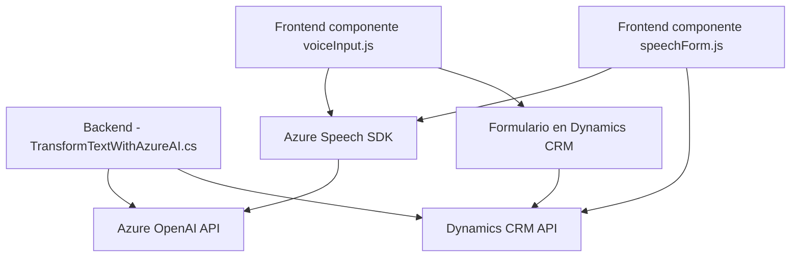

### Breve resumen técnico
El repositorio contiene componentes de una solución que integra servicios de Azure (Speech SDK y OpenAI) para realizar síntesis y reconocimiento de texto hablado, integrando la funcionalidad con formularios en una aplicación CRM basada en Dynamics 365. También incluye un plugin para transformar texto utilizando Azure OpenAI, permitiendo una interacción avanzada basada en inteligencia artificial para personalizar y enriquecer los datos del usuario.

---

### Descripción de arquitectura
La solución implementa una arquitectura que combina **Microfrontend** (para la creación de componentes de entrada/salida de voz en lado cliente) y **Service-Oriented Architecture (SOA)** (integración con servicios externos, como Azure AI y Dynamics CRM API). Aunque se apoya en un sistema centralizado (Dynamics CRM), utiliza servicios o microservicios externos para procesar entradas (Azure Speech SDK y OpenAI). Esto sugiere un ecosistema híbrido donde cada componente cumple un rol específico y puede evolucionar independientemente.

---

### Tecnologías usadas
La solución utiliza las siguientes tecnologías y frameworks:
1. **Frontend (JavaScript):**
   - **Vanilla JavaScript**: Lógica orientada al manejo de elementos de formulario y la moderación de datos.
   - **Azure Speech SDK**: Para síntesis de texto a voz y reconocimiento de voz.
   - **Web APIs**: Manejo de DOM y eventos a través de la API del navegador.
   - **Dynamics CRM API**: Comunicación con el CRM a través de `Xrm.WebApi`.

2. **Backend (C#):**
   - **Dynamics CRM SDK**: Desarrollo de plugins personalizados para interactuar con el CRM y ejecutar acciones post-evento, como la transformación de texto.
   - **Azure OpenAI API**: Consumo del servicio de IA para transformar texto según reglas predefinidas.
   - **Newtonsoft.Json** y **System.Text.Json**: Manejo de JSON para serialización y deserialización.

3. **Componente externo:**
   - Carga dinámica de scripts SDK desde URLs como `https://aka.ms/csspeech/jsbrowserpackageraw`.
   - Comunicación entre cliente y backend para confirmación de datos procesados por APIs externas.

---

### Diagrama Mermaid

---

### Conclusión final
La solución mostrada combina un enfoque altamente modular, basado en integraciones con servicios de Azure y Dynamics CRM, con componentes que utilizan patrones arquitectónicos claros:
- **Microfrontend**: Separación de funcionalidades en archivos para síntesis y reconocimiento de voz.
- **SOA (Service-Oriented Architecture)**: Uso de servicios externos (Azure Speech SDK y OpenAI API) y APIs internas (Dynamics CRM) para transformar el texto y manejar datos formularios.
- **Plugin Dynamics CRM**: Extensión personalizada que implementa lógica avanzada y delega la inteligencia artificial a un servicio desacoplado.

Esto la convierte en una solución flexible, escalable y adecuada para sistemas CRM avanzados donde la interacción por voz, AI y datos en tiempo real son fundamentales.