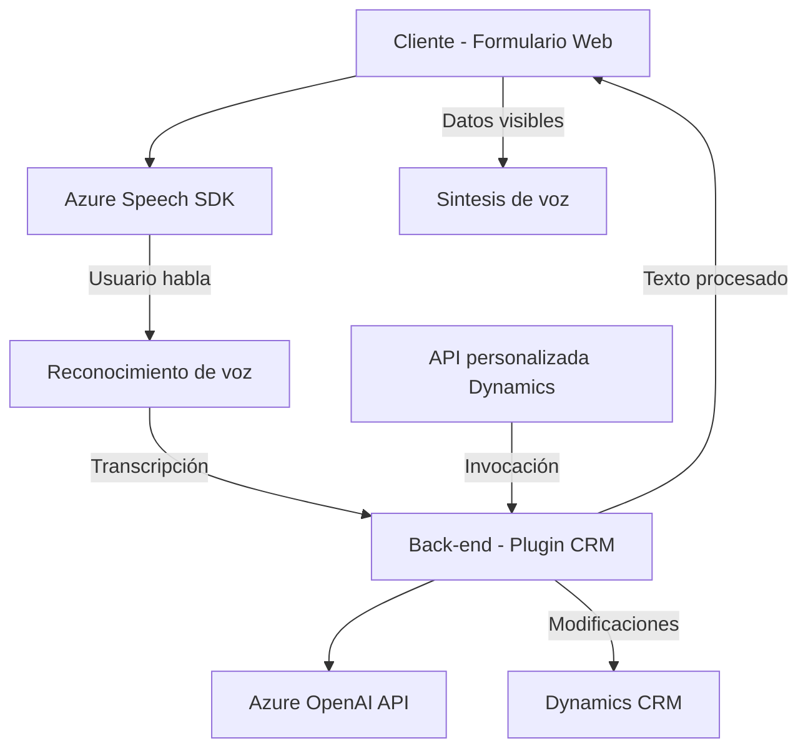

# Breve resumen técnico

El repositorio implementa una solución para interactuar con formularios, procesarlos mediante voz (entrada y salida) y realizar transformaciones utilizando servicios de Azure como Speech SDK y OpenAI. Hay tres componentes principales: una parte frontend manejada por JavaScript para interacción con clientes, otra que proporciona una funcionalidad de captura y síntesis de voz, y un plugin backend desarrollado en C# para Dynamics CRM, que utiliza el servicio Azure OpenAI.

---

# Descripción de arquitectura

1. **Frontend (JS)**: La responsabilidad del frontend es integrar voz y datos provenientes de formularios con servicios de reconocimiento y síntesis de voz a través de Azure Speech SDK.
2. **Integración dinámica**: La carga de dependencias como Azure Speech SDK se gestiona dinámicamente, asegurando que el sistema solo cargue lo necesario.
3. **CRM Backend Plugin (C#)**: En el backend se implementa un plugin de Dynamics CRM basado en operaciones de datos. Este interactúa con una API externa (Azure OpenAI) para realizar transformaciones de texto avanzadas.
4. **Modelo híbrido de arquitectura**:
   - **N capas**: Existe separación entre las partes principales: frontend (cliente) y backend (Dynamics CRM y plugin con Azure OpenAI).
   - **Integración de microservicios**: La arquitectura promueve el uso de servicios específicos (Azure Speech SDK, OpenAI API) para tareas separadas como reconocimiento/síntesis de voz y procesamiento de contenido.

---

# Tecnologías usadas

1. **Frontend (JS)**:
   - `Azure Speech SDK`: Reconocimiento y síntesis de voz.
   - `Dynamics CRM context API`: Manipulación de los formularios.
   - JavaScript.

2. **Backend (C#)**:
   - Microsoft Dynamics SDK (`IPlugin` y `IOrganizationService`).
   - Azure OpenAI service (GPT-4).
   - `Newtonsoft.Json` y `System.Text.Json`: Procesamiento de objetos JSON.
   - `HttpClient` de .NET: Llamadas a APIs externas.

---

# Diagrama Mermaid

---

# Conclusión final

El repositorio implementa una solución basada en una arquitectura híbrida de n capas que combina frontend dinámico (voz y formularios) con un backend extensible en Dynamics CRM mediante un plugin que transforma texto con GPT-4. Utiliza patrones de carga dinámica, integración de microservicios (Azure Speech SDK y OpenAI) y encapsulación funcional en sus módulos. Puede ser mejorado mediante una mayor segmentación de responsabilidades en el backend y una abstracción más clara en el frontend.