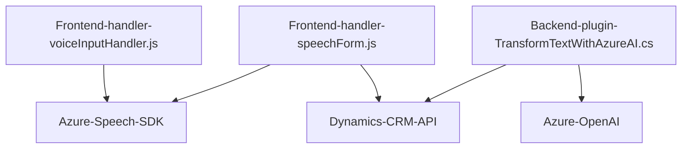

**Breve resumen técnico:**

El proyecto combina múltiples archivos que implementan un sistema interactivo de voz y texto, con fuerte integración de servicios externos como Azure Speech SDK, Microsoft Dynamics CRM API y Azure OpenAI. Consta de un frontend para la gestión de formularios y captura de voz, y plugins orientados a la transformación de datos.

---

### **Descripción de la arquitectura**

La arquitectura del sistema parece seguir un modelo **modular con integraciones SOA (Service-Oriented Architecture)**. El frontend utiliza **microservicios de voz** integrados aparte que procesan datos en conjunto con servicios en la nube (Azure Speech SDK y Dynamics CRM). Además, un plugin en el backend (escrito en C#) opera bajo el contexto de Dynamics CRM y Azure OpenAI para transformar texto en JSON estructurado.

1. **Frontend (Interfaz cliente):**
   - Maneja interacciones de voz y formularios, procesando datos en paralelo con el Azure Speech SDK.
   - Proporciona soporte condicional para lógica basada en inteligencia artificial o manual.

2. **Backend:**
   - Plugins en Dynamics CRM operan para transformar mensajes en objetos estructurados (usando la API de Azure OpenAI).

---

### **Tecnologías usadas**

1. **Frontend:**
   - **Lenguajes/Framewoks:** JavaScript/HTML y Azure Speech SDK.
   - **Plataforma:** APIs y contextos de Microsoft Dynamics CRM.
   - **Observaciones:** Uso de promesas y callbacks para procesamiento asíncrono.
   
2. **Backend:**
   - **Lenguaje:** C# (.NET Framework para Dynamics CRM).
   - **Librerías externas:** Newtonsoft.Json, System.Net.Http, System.Text.Json.
   - **Servicios:** Azure OpenAI (para procesamiento de texto inteligente).

---

### **Diagrama Mermaid**

---

### **Conclusión final**

El proyecto tiene una arquitectura semidistribuida con **integración modular** y servicios externos. La combinación de plugins backend con API externas (Azure Speech y Azure OpenAI) y un frontend que manipula datos de formularios apunta a una solución híbrida basada en **n-capas** y **SOA**. Esta arquitectura es efectiva para aplicaciones CRM avanzadas que requieren funcionalidad enriquecida como voice-to-text y procesamiento automatizado de datos.