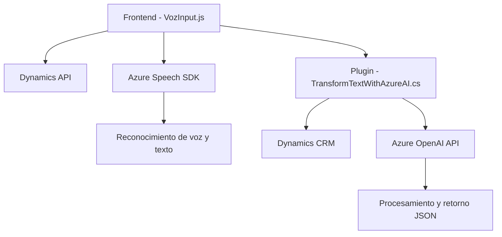

### Breve resumen técnico
El repositorio contiene una solución combinada que utiliza varias tecnologías para procesar datos de formularios en una aplicación Dynamics CRM mediante interacciones basadas en voz y texto procesado con Azure AI.

### Descripción de arquitectura
La arquitectura de la solución es híbrida, combinando **n capas** y patrones de **arquitectura de integración con microservicios**:
  - **Frontend (JavaScript)**: Implementa lógica de cliente para manipular formularios y realizar reconocimiento de voz con Azure Speech.
  - **Plugin Backend (C#)**: Funciona como un plugin en Dynamics CRM, interactuando con Azure OpenAI mediante un patrón cliente-servidor. A través de llamadas REST hacia la API externa, transforma texto según reglas específicas.
  - **Integración con servicios externos**: Comunicación recurrente con Azure Speech y Azure OpenAI para el reconocimiento y procesamiento de datos de voz.

### Tecnologías usadas
1. **Frontend:**
   - **JavaScript**: Implementa la lógica de entrada asistida por voz y la manipulación del formulario en Dynamics CRM.
   - **Azure Speech SDK**: Reconocimiento y síntesis de voz. Asincrónico mediante `Promise` y `Callback`.
   - **DOM API**: Dinámica para manejar formularios.

2. **Backend:**
   - **C# (Microsoft Dynamics CRM SDK)**: Utilizado para responder a eventos en el sistema CRM.
   - **Azure OpenAI**: Sintetiza y procesa texto con lenguaje natural (GPT).
   - **HTTP Client (.NET)**: Para llamadas REST a servicios Azure.
   - **Newtonsoft.Json.LINQ**: Procesamiento avanzado de JSON.

3. **General:**
   - **REST APIs**: Comunicación con servicios externos en Azure.
   - **Promesas/Callbacks**: Resolución asincrónica para carga dinámica de SDKs.

### Dependencias o componentes externos
1. **Azure Speech SDK**: Reconocimiento y síntesis de voz.
2. **Azure OpenAI API**: Procesamiento avanzado de texto a través de OpenAI GPT.
3. **Dynamics Web API**: Interacción directa con campos y datos dentro de Microsoft Dynamics CRM.
4. **Newtonsoft.Json**: Deserialización JSON en backend.
5. **Xrm Namespace**: Extensión del objeto Dynamics para manejar eventos y lógica del cliente.

---

### Diagrama Mermaid válido para GitHub

---

### Conclusión final
Esta solución combina Frontend (JavaScript) y Backend (C# plugin para Dynamics CRM) con integración de APIs y servicios avanzados de inteligencia artificial. Utiliza una arquitectura modular y orientada a servicio. Los patrones de diseño reflejados incluyen modularidad, uso de callbacks/promesas asincrónicas para SDKs y una interacción híbrida entre sistemas cliente y servicios externos. Aunque la solución está bien estructurada, el manejo potencialmente directo de claves de API en código podría ser un riesgo para la seguridad y puede optimizarse usando servicios especializados como **Azure Key Vault**.