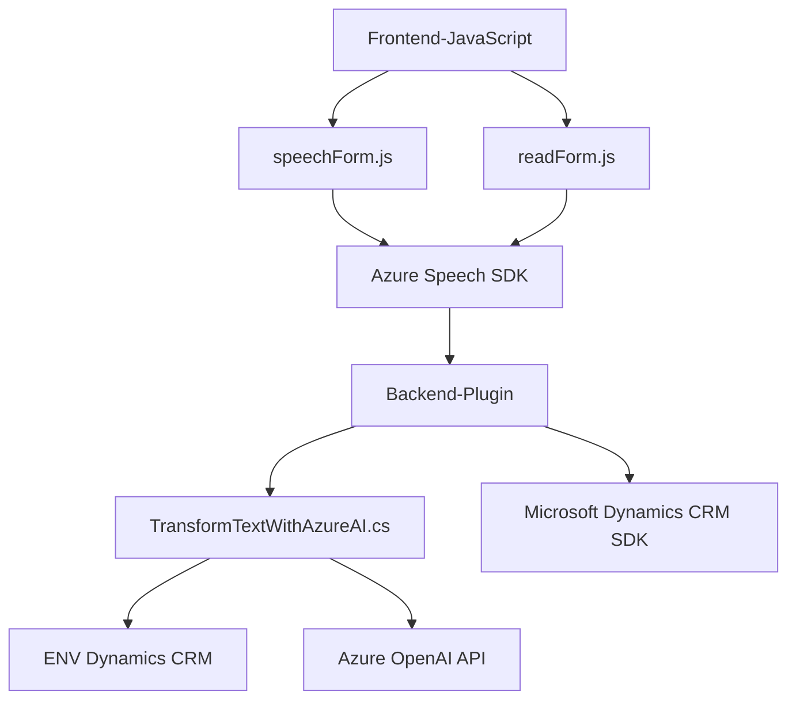

### Breve resumen técnico

El repositorio define una solución para integración de voz y procesamiento de datos en aplicaciones orientadas a formularios (probablemente en el ámbito de Microsoft Dynamics CRM). Incluye tres bloques funcionales:
1. **Frontend de voz:** Archivos JavaScript (`readForm.js`, `speechForm.js`) que manejan la interacción de voz mediante Azure Speech SDK.
2. **Backend/form plugins:** Código C# (`TransformTextWithAzureAI.cs`) implementado como un plugin en Dynamics CRM para procesar texto con Azure OpenAI API.
3. **Integración con servicios externos:** Azure Speech SDK y Azure OpenAI conforman los componentes principales de la solución.

---

### Descripción de arquitectura

La solución tiene una arquitectura **híbrida de n capas** con interacción entre un frontend (JavaScript) encargado de obtener/transcribir/transformar datos y un backend (C# plugin) orientado a interacción con APIs externas (Azure) y Dynamics CRM. Los elementos del frontend y backend están organizados en múltiples capas:
- **Frontend**: Lógica modular encargada de síntesis y reconocimiento de voz, captura de datos de formularios y envío de requests al backend.
- **Backend**: Plugins diseñados para ser ejecutados dentro del entorno CRM, permitiendo manejar solicitudes externas (Azure OpenAI) y devolver respuestas procesadas.

---

### Tecnologías usadas

1. **Frontend**:
   - **JavaScript:** Lenguaje base para manejar síntesis y reconocimiento de voz, manipulación DOM, y envío de datos.
   - **Azure Speech SDK:** Biblioteca para sintetizar voz en tiempo real y reconocer audio en texto.
   - **DOM API:** Se usa para gestionar interactividad entre la aplicación y el navegador.

2. **Backend**:
   - **Microsoft Dynamics CRM SDK:** Framework para desarrollo de plugins en el entorno de Dynamics.
   - **C# (.NET):** Lenguaje y runtime base para el desarrollo backend.
   - **Azure OpenAI API:** Servicio externo de inteligencia artificial usado para transformar datos de texto.
   - **Newtonsoft.Json:** Librería para manejar objetos JSON con facilidad.
   - **System.Net.Http:** Realiza solicitudes HTTP para integrar servicios externos.

3. **External integrations**:
   - **Azure Speech SDK and Azure OpenAI API**: Crucial para funcionalidad de voz, análisis y transformación inteligente de datos.

---

### Dependencias o componentes externos

1. **Azure Speech SDK**: Para síntesis y reconocimiento de voz en el frontend.
2. **Azure OpenAI**: Para procesamiento avanzado de texto en el backend.
3. **Newtonsoft.Json**: Gestión JSON en el plugin.
4. **Microsoft Dynamics CRM SDK**: Framework oficial de Microsoft para plugins.
5. **Microsoft Xrm.WebApi**: Usado en JavaScript para enviar datos desde el frontend a Dynamics CRM.

---

### Diagrama Mermaid válido para GitHub

---

### Conclusión final

La solución combina funcionalidades de frontend con integración de voz y backend diseñado para procesamiento avanzado de texto mediante inteligencia artificial. Su arquitectura de **n capas híbridas** está bien segmentada, lo que facilita mantenimiento y extensibilidad. Sin embargo, podría beneficiarse de una abstracción más robusta entre lógica de integración (APIs externas) y capas de negocio.