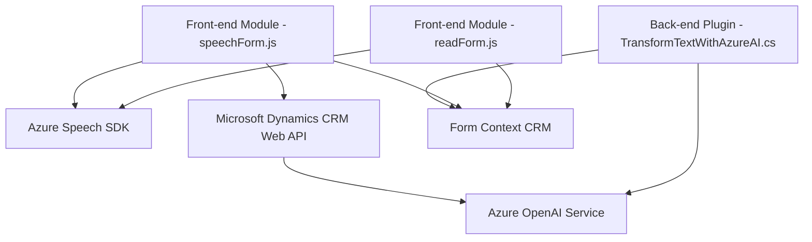

### Breve resumen técnico
El repositorio contiene archivos relacionados con una solución que integra la gestión de datos en formularios y servicios de voz y texto a través de Azure Speech SDK y Azure OpenAI. Los módulos se centran en la interacción con formularios CRM y en la transformación de datos mediante servicios externos.

---

### Descripción de la arquitectura
La solución parece emplear una arquitectura **modular de alta cohesión**, donde distintas partes cumplen roles específicos. Dentro del repositorio:
1. **Arquitectura plugin para CRM**: Usada en el archivo `TransformTextWithAzureAI.cs`, asociada con Microsoft Dynamics CRM, emplea patrones como `Event-driven Plugin` para manejar eventos específicos dentro de la plataforma CRM.
2. **Patrón cliente-servidor**: Ambos archivos de frontend `readForm.js` y `speechForm.js` trabajan como cliente interactivo, invocando servicios externos y actualizando dinámicamente la interfaz del usuario.
3. **Patrones de integración API**: Se destacan por el uso de servicios Azure Speech SDK y Azure OpenAI para síntesis de voz, transcripción y transformación de texto.

En general, la solución combina **event-driven architecture** en el frontend, **plugin-based architecture** en el backend CRM y **service integration** para interactuar con APIs externas.

---

### Tecnologías utilizadas
1. **Frontend (JavaScript):**
   - **Azure Speech SDK**: Para la síntesis y transcripción de voz.
   - **Microsoft Dynamics CRM Web API**: Para las interacciones con el sistema CRM.
   - **ES6+**: Uso de `async/await`, promesas y funcionalidades modernas de JS para programación asincrónica.
   - **DOM API**: Para gestión dinámica de la interfaz de usuario.

2. **Backend (C# Plugin):**
   - **Microsoft Dynamics CRM SDK**: Proporciona extensibilidad en los sistemas CRM.
   - **Azure OpenAI Service**: Modelo GPT-4 para transformación de texto.
   - **Newtonsoft.Json** y **System.Text.Json**: Manejo de objetos JSON.
   - **System.Net.Http**: Realización de llamadas a servicios externos.
 
3. **Plataforma**:
   - **Microsoft Dynamics CRM**: Marco principal donde se integra el plugin.

---

### Diagrama Mermaid válido para GitHub

---

### Conclusión final
La solución presentada tiene un diseño orientado a una integración fluida entre frontend, backend y servicios externos. Los módulos están organizados con una responsabilidad clara:
- **Frontend:** Maneja interacciones con el usuario y servicios como reconocimiento de voz y síntesis.
- **Backend:** Extiende capacidades del CRM, integrando servicios avanzados como Azure OpenAI para transformación de datos.

El uso de servicios basados en una plataforma de nube refleja una arquitectura que prioriza desacoplamiento, modularidad y escalabilidad. Aunque podría beneficiarse de una documentación más robusta, la organización de los archivos y su alineación con Dynamics CRM son apropiadas para aplicaciones empresariales.