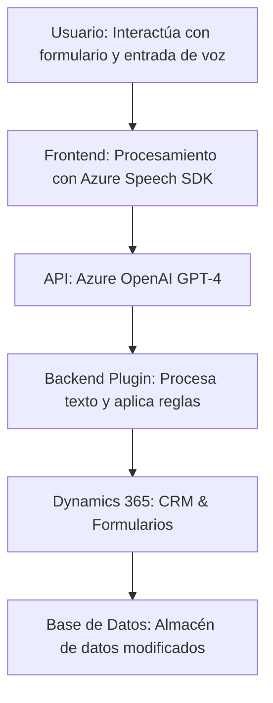

### Análisis del repositorio y código proporcionado

#### Breve resumen técnico

El repositorio presentado parece ser un sistema integrado que conecta una interfaz con formularios dinámicos (probablemente de **Dynamics 365**) con reconocimiento de voz, síntesis de voz y procesamiento de texto avanzado mediante **Azure Speech SDK** y **Azure OpenAI**. Este sistema facilita la interacción hombre-máquina en aplicaciones orientadas a CRM o sistemas empresariales, mejorando la accesibilidad y eficiencia en el manejo de formularios.

---

#### Descripción de arquitectura

1. **Tipo de solución**: El repositorio corresponde a una solución **híbrida**, que consiste en:
   - Parte **frontend** en JavaScript.
   - Integración con un servicio en la nube (Azure Speech SDK y Azure OpenAI).
   - Complemento backend como **plugin** implementado en C# para transformar texto mediante la API de Azure OpenAI.

2. **Arquitectura**: Se observa una arquitectura de **n capas**, con las siguientes características:
   - Parte cliente: Interfaz frontend que interactúa directamente con el usuario.
   - Capa de servicio: Procesamiento de voz y texto mediante servicios externos (Azure Speech SDK y Azure OpenAI).
   - Backend plugin: Implementación en C# que actúa como intermediario entre Dynamics 365 y los datos procesados.

3. **Flujo del sistema**:
   - El `frontend` maneja la captura y transmisión de voz y eventos del formulario.
   - El SDK procesa la voz o texto y llama a APIs remotas cuando es necesario (Dynamics 365 y Azure OpenAI).
   - El plugin en .NET se encarga de transformar el texto generado en salida estructurada.

---

#### Tecnologías, frameworks y patrones usados

1. **Tecnologías y frameworks**:
   - **Frontend**:
     - JavaScript (procesamiento de eventos y datos del formulario).
     - SDK de Azure Speech (sintetizar voz y transcribir audio).
   - **Backend**:
     - .NET Framework (plugin en C# integrado con Dynamics 365).
     - Azure OpenAI (GPT-4 para transformación de texto).
   - **Servicios externos**:
     - Dynamics CRM y WebApi (procesamiento y almacenamiento de formularios).
     - Azure Speech SDK para recopilación de voz y síntesis.

2. **Patrones aplicados**:
   - **Modularidad**: Tanto en el frontend como en el backend, se observa separación clara de funciones por su propósito único.
   - **Patrón asincrónico**: Uso intensivo de `Promise` y `callback` para tareas que dependen de servicios externos como Azure Speech SDK y API REST.
   - **Delegate Integration Pattern**: Lógica delegada a los servicios de Azure disminuye el acoplamiento.
   - **Plugin-based Architecture**: En el backend, los plugins permiten extensibilidad dentro de Dynamics CRM.

---

#### Dependencias o componentes externos

El funcionamiento del sistema depende principalmente de:
1. **Azure Speech SDK**:
   - Sintetiza voz y transcribe audio.
   - Carga dinámica del SDK mediante el navegador para reducir sobrecarga inicial.
2. **Azure OpenAI**:
   - Procesamiento avanzado de texto con GPT-4, transformando el input en JSON estructurado según reglas definidas.
3. **Dynamic 365 Web APIs**:
   - CRUD de formularios y manejo del contexto del producto.
   - Integración directa mediante plugins `.NET`.
4. **Plugins en C# con acceso a Dynamics CRM**:
   - Define acciones personalizadas, incluyendo el uso de Azure OpenAI para el procesamiento de texto.

---

#### Diagrama Mermaid

---

#### Conclusión Final

La solución mostrada utiliza una arquitectura en capas, donde cada componente tiene una responsabilidad bien definida: un frontend basado en JavaScript con Azure Speech SDK para la interacción y procesamiento inicial, una capa externa de servicios en la nube (Azure Speech y OpenAI) para tareas avanzadas de IA, y un complemento backend en C# para integrar reglas de negocio y almacenamiento en Dynamics 365.

Este diseño tiene las ventajas de ser modular, escalable y extensible gracias al desacoplamiento de lógicas principales en las capas del sistema y la integración de servicios especializados. Sin embargo, es importante garantizar la seguridad y validación de las claves y datos transmitidos entre servicios.