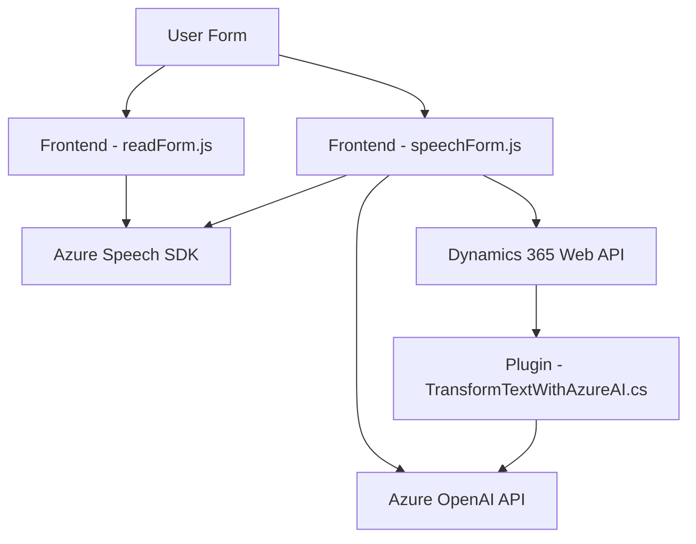

### Análisis Arquitectónico y Técnico del Repositorio

#### 1. **Tipo de solución**
Este repositorio parece implementar una solución **integrada a Dynamics CRM** con funcionalidades específicas relacionadas con reconocimiento de voz, síntesis de texto a voz, y procesamiento de texto usando inteligencia artificial. La solución incluye diferentes componentes: 
- **Frontend**: Archivos JavaScript para interacción del usuario con formularios dinámicos (e.g., procesamiento de voz y síntesis de texto).
- **Backend o Plugins**: Implementación de plugins en Dynamics CRM que integran servicios como Azure OpenAI API.

#### 2. **Tecnologías, frameworks y patrones utilizados**
##### **Tecnologías:**
- **Frontend:** 
  - JavaScript
  - Azure Speech SDK (JavaScript SDK for browser applications)
- **Backend:**
  - Microsoft Dynamics CRM: framework empresarial orientado a gestión de relaciones con clientes.
  - Azure OpenAI API: utilizada para la transformación de texto.
  - .NET Framework: Desarrollo de plugins en C#.
  - Newtonsoft.Json: Librería para manipulación de datos JSON.

##### **Frameworks:**
- Dynamics 365 CRM SDK: Utilizado para el desarrollo de plugins y APIs personalizadas dentro de Dynamics.
- Azure Speech SDK y OpenAI, integrados como servicios externos para reconocimiento de voz, síntesis de texto y transformación.

##### **Patrones:**
- **Modularización:** El código se segmenta en diferentes módulos (archivos), cada uno responsable de una funcionalidad específica.
- **External API Integration:** Integración con herramientas potentes como Azure Speech SDK y OpenAI mediante REST APIs.
- **Facade Pattern:** En los archivos frontend, se encapsula la interacción con el SDK en métodos reutilizables y simplificados.
- **Plugin-Based Architecture:** En los plugins, se sigue el modelo extensible de Dynamics CRM.
- **Event-driven design:** Uso de eventos, callbacks, y promesas para manejar flujos asincrónicos.
- **Factory Pattern:** Implementado en el backend para instanciar servicios CRM.

#### 3. **Arquitectura**
La solución utiliza una arquitectura **híbrida**:
- **Frontend**: Forma parte de una capa cliente diseñada para interactuar con los usuarios, capturando y procesando datos de formularios en Dynamics CRM.
- **Backend (Plugins)**: Sigue el modelo **plugin-based**, típico de Dynamics CRM, actuando como extensiones al sistema.
- **Integración con servicios externos**: Usa APIs externas (Azure Speech SDK, Azure OpenAI API) para realizar tareas avanzadas como reconocimiento de voz y procesamiento de texto.

En términos de arquitectura general, combina elementos de una arquitectura **n-tier** (front-back) y de un **diseño basado en eventos** en el frontend. El uso de plugins y servicios externos añade cierta separación de responsabilidades al modelo.

#### 4. **Dependencias y componentes externos**
- **Azure Speech SDK**: Librería para tareas de reconocimiento de voz y síntesis de texto.
- **Azure OpenAI API**: Servicio RESTful para transformar texto basado en IA.
- **Dynamics 365 Web API**: Interacción directa con los datos y lógica del CRM.
- **Frontend frameworks:** No menciona un framework específico como React o Angular, por lo tanto, parece una implementación en **vanilla JavaScript**.
- **Newtonsoft.Json:** Usada en los plugins para manejo de JSON.
- **Dynamics SDK Components:** Uso predefinido de interfaces como `IPluginExecutionContext` y `IOrganizationService`.

---

### Diagrama Mermaid válido para **GitHub Markdown**

---

### Conclusión Final
Este repositorio constituye un excelente ejemplo de integración entre herramientas de reconocimiento de voz, inteligencia artificial y gestión de relaciones con clientes. La arquitectura combinada permite aprovechar servicios de terceros como Azure Speech SDK y Azure OpenAI para mejorar funcionalidades accesibles en Dynamics CRM. La elección de patrones y librerías parece adecuada para los propósitos del proyecto, proporcionando una solución flexible y extensible en el ámbito CRM.