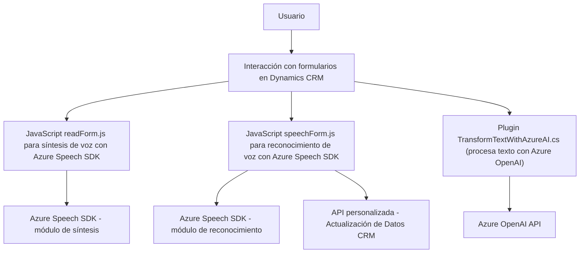

### Breve resumen técnico:
El repositorio contiene una solución que integra reconocimiento de voz, síntesis de texto a voz y procesamiento avanzado de datos mediante Azure Speech SDK y Azure OpenAI. Parece diseñado para mejorar la accesibilidad y funcionalidad de formularios en un sistema CRM, probablemente Dynamics CRM. La arquitectura combina frontend (JavaScript) con capacidades de backend mediante plugins en C#.

---

### Descripción de arquitectura:
La arquitectura sigue un diseño **de capas y modular**, con las siguientes características:
1. **Frontend**: Archivos JavaScript (e.g., `readForm.js`, `speechForm.js`) que controlan las interacciones visuales y la integración del SDK de Azure Speech para síntesis y reconocimiento de voz.
2. **Backend (Plugins)**: Plugins en C# alojados en Dynamics CRM que manejan lógica más abstracta, como procesamiento de texto con Azure OpenAI.
3. **Servicios externos**:
   - Azure Speech SDK: En frontend, utilizado para síntesis de voz y reconocimiento.
   - Azure OpenAI: En backend, utilizado para procesamiento avanzado de texto.

La arquitectura es híbrida y combina un modelo de **event-driven programming** en el frontend con una **orientación a servicios** en el backend. Los plugins actúan como intermediarios entre el CRM y los servicios de IA remotos.

---

### Tecnologías usadas:
1. **Frontend**:
   - **JavaScript ES6+**: Implementación de funcionalidades clave para la interacción con usuarios.
   - **Azure Speech SDK**: Reconocimiento de voz y síntesis de texto a voz.
   - **Web APIs de Dynamics CRM**: Interacciones con el modelo de datos del CRM.

2. **Backend (C#)**:
   - **Microsoft Dynamics CRM SDK**: Interacción con el modelo de datos CRM.
   - **Azure OpenAI API**: Usada en los plugins para transformación avanzada de texto.
   - **.NET (C#)**: Desarrollo de plugins siguiendo la interfaz `IPlugin`.

---

### Dependencias externas y componentes:
1. **Azure Speech SDK**:
   - API manejada dinámicamente en frontend mediante el cargado del script remoto.
   - Funciones: reconocimiento de voz y síntesis de texto a voz.

2. **Azure OpenAI API**:
   - Proceso avanzado del texto mediante IA en el backend.

3. **Dynamics CRM SDK**:
   - Necesaria para interactuar con los datos y ejecutar lógicas específicas.

4. **Web APIs**:
   - Usadas para comunicación entre el frontend y el CRM/otros servicios externos.

---

### Diagrama Mermaid:

---

### Conclusión final:
La solución es una arquitectura híbrida compuesta de **capas frontend y backend**, conectada mediante **eventos** y **servicios externos**. Su funcionalidad está enfocada en mejorar la accesibilidad y productividad en el uso de formularios en un entorno Dynamics CRM, permitiendo interacciones por voz, síntesis de texto y procesamiento avanzado mediante IA. 

Es una solución bien modular y diseñada para implementar **procesos inteligentes y accesibles** con mínimos cambios en el sistema CRM existente. 