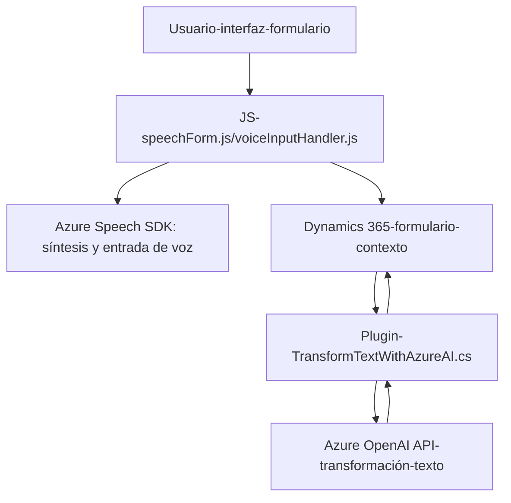

## Breve resumen técnico:

Este repositorio contiene múltiples archivos con funcionalidades orientadas al reconocimiento y síntesis de voz, junto a un plugin en C#. La solución parece integrar una capa de presentación (Frontend) que interactúa con usuarios a través de un formulario, funcionalidades de entrada/salida por voz (mediante el Azure Speech SDK), y un complemento backend implementado en el entorno de Dynamics CRM que realiza el procesamiento del texto con la API de Azure OpenAI.

---

## Descripción de arquitectura:

La arquitectura general parece estar compuesta de **n capas**, donde el frontend se encarga de la interacción con el usuario y el backend integrado al Microsoft Dynamics CRM maneja la lógica de negocio. El repositorio utiliza API externas (Azure Speech SDK y Azure OpenAI API) para implementar funcionalidades clave de reconocimiento de voz y procesamiento de texto.

Elementos principales:
1. **Frontend (JavaScript):** Permite la extracción de datos de campos visibles en formularios y su síntesis de voz, además de realizar entrada por voz para rellenar automáticamente los campos de formularios dinámicos.
2. **Plugin Backend (C#):** Implementado como un plugin en Dynamics CRM que transforma texto mediante Azure OpenAI API y vincula los resultados al contexto del CRM.
3. **Integración con servicios externos:** Usa Azure Speech SDK para lectura/entrada de voz y Azure OpenAI para procesamiento de texto.

---

## Tecnologías usadas:

### **Frontend**:
- **JavaScript**: Lógica de extracción y transformación de datos.
- **Azure Speech SDK**: Para síntesis y reconocimiento de voz mediante APIs.
- **Dynamics 365 SDK**: Para manipulación de formularios dinámicos del entorno CRM.

### **Backend**:
- **C#** y **.NET Framework** (Posiblemente .NET 4.6 o superior compatible con Dynamics plugins).
- **Microsoft.Xrm.Sdk**: Manejo del contexto del plugin y operaciones en Dynamics CRM. 
- **Newtonsoft.Json / System.Text.Json**: Manipulación eficiente de JSON en C#.
- **Azure OpenAI API**: Llamadas REST para procesamiento del texto a formato JSON según reglas predefinidas.

---

## Diagrama Mermaid:

El diagrama muestra la interacción general entre las capas de esta solución. Evita detalles específicos, pero ilustra los flujos principales desde usuario hasta procesamiento.

---

## Conclusión final:

Esta solución implementa una arquitectura en **n capas** integrada con servicios de Azure (Speech SDK y OpenAI API) para crear funcionalidades de entrada y salida por voz. Su estructura favorece un diseño **modular**, donde cada componente se enfoca en una tarea distinta. La solución parece diseñada para entornos como **Microsoft Dynamics CRM** y se integra fuertemente con su contexto de trabajo.

**Fortalezas:**
- Aprovecha APIs líderes como Azure Speech SDK y OpenAI.
- Utiliza patrones de diseño desacoplados y respetan la responsabilidad única de los métodos.
- La carga dinámica del SDK de Speech minimiza el impacto inicial sobre los tiempos de carga.

**Recomendaciones:**
1. Documentar en profundidad el uso de Azure Speech SDK y la configuración de claves/regiones.
2. Considerar más pruebas para el manejo de errores en caso de fallos con las APIs externas.
3. Modernizar el backend empleando .NET Core o .NET 7 para mejor rendimiento y soporte futuro.